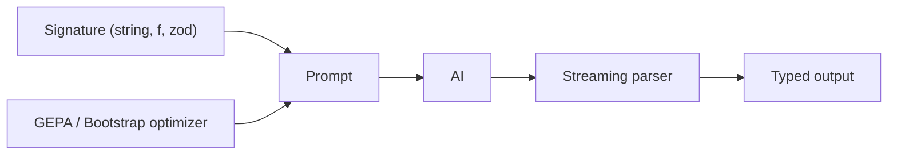
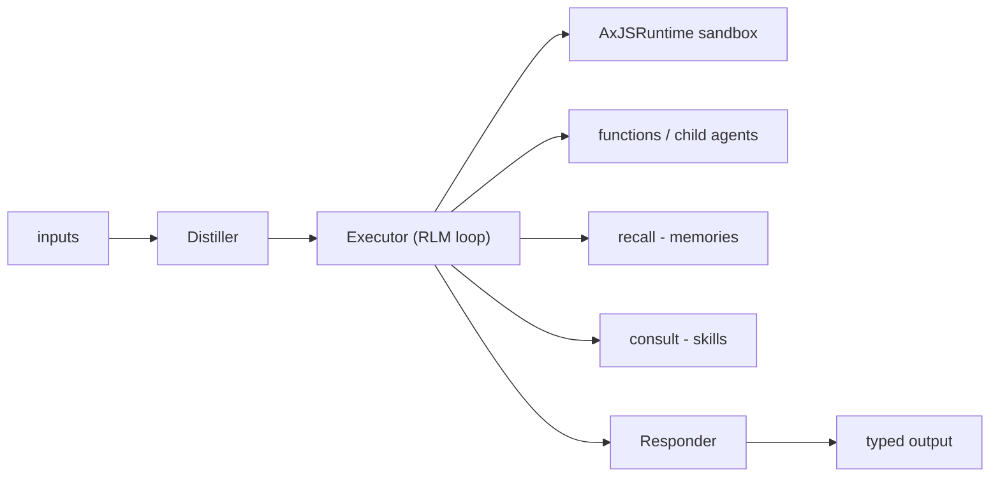

# Ax — DSPy for TypeScript

Automatic prompt generation, RLM agents, and a single API across model-lab providers. Production-tested.

[](https://www.npmjs.com/package/@ax-llm/ax)
[](https://discord.gg/DSHg3dU7dW)
[](https://twitter.com/dosco)

## What Ax is

- A small, dependency-free TypeScript library that brings the **DSPy** programming model to JS/TS runtimes.
- You declare a **signature** (string DSL, fluent `f()` builder, or any **Standard Schema v1** validator — Zod, Valibot, ArkType). Ax compiles it to a prompt at runtime, runs the call, parses the output, and gives you back a fully typed value.
- The same signatures plug into agents, workflows, optimizers, and a sandboxed JS runtime — without rewriting prompts.
- Works in NodeJS, Bun, Deno and in all browsers.



## 30 seconds

```typescript
import { ai, ax } from "@ax-llm/ax";

const llm = ai({ name: "openai", apiKey: process.env.OPENAI_APIKEY });

const classify = ax(
  'review:string -> sentiment:class "positive, negative, neutral"',
);

const { sentiment } = await classify.forward(llm, {
  review: "This product is amazing!",
});
// sentiment: "positive" — typed as the literal union
```

No prompt engineering. Switch `name: "openai"` to `"anthropic"`, `"google-gemini"`, `"mistral"`, `"deepseek"`, `"grok"`, etc. — same signature, same code.

## Provider-Native Speed

Ax is designed to stay in the same latency class as direct provider calls while adding typed outputs, validation, retries, tools, tracing, and memory. The hot path is intentionally thin: render the signature, call the provider, parse the result, and return a typed value.

Streaming is the default because it lets Ax do useful work before the model finishes: parse fields as they arrive, run streaming assertions, fail early, cancel the in-flight stream, and start correction without spending tokens on an output that is already known to be invalid. When you only want a final object, `forward()` still gives you one; when you want live output, `streamingForward()` exposes the stream directly.

The repo includes a live benchmark for checking overhead on your own providers and models:

```bash
AX_STREAM_BENCH_PROVIDER=anthropic AX_STREAM_BENCH_MODEL=claude-sonnet-4-5-20250929 AX_STREAM_BENCH_RUNS=2 AX_STREAM_BENCH_WARMUP_RUNS=0 npm run tsx src/examples/streaming-latency.ts
AX_STREAM_BENCH_PROVIDER=google-gemini AX_STREAM_BENCH_MODEL=gemini-2.5-flash AX_STREAM_BENCH_RUNS=2 AX_STREAM_BENCH_WARMUP_RUNS=0 npm run tsx src/examples/streaming-latency.ts
```

Recent runs on Claude Haiku/Sonnet and Gemini Flash/Flash Lite show provider queueing and model generation dominate total latency; AxGen stays close to the raw `ai.chat()` path while providing the structured-output control loop that direct SDK calls leave to application code.

## Examples

### Structured extraction

```typescript
const extract = ax(`
  customerEmail:string, currentDate:datetime ->
  priority:class "high, normal, low",
  sentiment:class "positive, negative, neutral",
  ticketNumber?:number,
  nextSteps:string[],
  estimatedResponseTime:string
`);

const result = await extract.forward(llm, {
  customerEmail: "Order #12345 hasn't arrived. Need this resolved immediately!",
  currentDate: new Date(),
});
```

### Nested objects with `f()`

```typescript
import { ax, f } from "@ax-llm/ax";

const productExtractor = f()
  .input("productPage", f.string())
  .output("product", f.object({
    name: f.string(),
    price: f.number(),
    specs: f.object({
      dimensions: f.object({ width: f.number(), height: f.number() }),
      materials: f.array(f.string()),
    }),
    reviews: f.array(f.object({ rating: f.number(), comment: f.string() })),
  }))
  .build();

const gen = ax(productExtractor);
const { product } = await gen.forward(llm, { productPage: "..." });
// product.specs.dimensions.width is typed end-to-end
```

### Standard Schema v1 (Zod / Valibot / ArkType)

Any Standard Schema v1 validator works wherever `f.*` is accepted — at field level, whole-object level, or on a `fn()` tool. Same retry pipeline, same type inference, no adapter.

```typescript
import { z } from "zod";
import { ax, f, fn } from "@ax-llm/ax";

// (1) Per-field zod — mix freely with f.* fields
const reviewSentiment = ax(
  f()
    .input("productName", z.string().describe("Reviewed product"))
    .input("reviewText", z.string().min(10))
    .output("sentiment", z.enum(["positive", "neutral", "negative"]))
    .output("score", z.number().min(1).max(10))
    .output("keyPoints", z.array(z.string()))
    .build(),
);

// (2) Whole-object zod — declare once, decomposed into ordered fields
const productSummary = ax(
  f()
    .input(z.object({ productName: z.string(), buyerProfile: z.string() }))
    .output(z.object({
      headline: z.string(),
      pros: z.array(z.string()),
      cons: z.array(z.string()),
      recommendation: z.enum(["buy", "wait", "skip"]),
    }))
    .build(),
);

// (3) Whole-object zod on fn() — typed tool definition
const lookupProduct = fn("lookupProduct")
  .description("Look up a product by name")
  .arg(z.object({ productName: z.string().min(1), includeSpecs: z.boolean().optional() }))
  .returns(z.object({ price: z.number(), inStock: z.boolean(), rating: z.number().min(1).max(5) }))
  .handler(async ({ productName }) => ({ price: 79.99, inStock: true, rating: 4.3 }))
  .build();
```

`.min()`, `.max()`, `.email()`, `.url()`, `.regex()` feed the normal retry pipeline; `.refine()`, `.transform()`, and `.superRefine()` execute at parse time on complete field values, in both streaming and non-streaming. Cache breakpoints and internal reasoning fields use companion options: `{ cache: true }`, `{ internal: true }`. Multimodal inputs (`image`, `audio`, `file`) still use `f.*`.

Runnable: [`src/examples/standard-schema.ts`](src/examples/standard-schema.ts).

### Tools (ReAct)

```typescript
const assistant = ax("question:string -> answer:string", {
  functions: [
    { name: "getCurrentWeather", func: weatherAPI },
    { name: "searchNews", func: newsAPI },
  ],
});

const { answer } = await assistant.forward(llm, {
  question: "What's the weather in Tokyo and any news about it?",
});
```

### Multi-modal

```typescript
const analyze = ax(`
  image:image, question:string ->
  description:string,
  mainColors:string[],
  category:class "electronics, clothing, food, other",
  estimatedPrice:string
`);
```

### Audio

Batch speech APIs live on AI services: `ai.transcribe({ audio })` turns audio into text, and `ai.speak({ text })` turns text into an audio artifact. Signature audio outputs are scripted artifacts: the model writes the text for `speech:audio`, then Ax synthesizes it after parsing.

```typescript
const say = ax("question:string -> speech:audio, summary:string");
const res = await say.forward(llm, { question: "Greet the team." }, {
  speech: { speak: { voice: "alloy", format: "mp3" } },
});

console.log(res.speech.data);       // base64 audio
console.log(res.speech.transcript); // generated script
```

Agents transcribe `:audio` inputs before the planner/executor/responder stages, so tools and memory receive stable text rather than base64 payloads. Native conversational audio is still available through `.chat()`.

OpenAI supports both request-based audio chat (`gpt-audio`, `gpt-audio-mini`) and realtime voice/transcription models (`gpt-realtime-2`, `gpt-realtime-whisper`). Gemini native audio uses the Live API under the same `.chat()` shape; Grok Voice uses the realtime voice endpoint.

```typescript
import WebSocket from "ws";
import {
  ai,
  axAIOpenAIRealtimeDefaultConfig,
  axAIOpenAIRealtimeTranscriptionDefaultConfig,
} from "@ax-llm/ax";

const voice = ai({
  name: "openai",
  apiKey: process.env.OPENAI_APIKEY!,
  config: axAIOpenAIRealtimeDefaultConfig(), // gpt-realtime-2
});

const stream = await voice.chat(
  { chatPrompt: [{ role: "user", content: "Say hello out loud." }] },
  { stream: true, webSocket: WebSocket },
);

for await (const chunk of stream) {
  const audio = chunk.results[0]?.audio;
  if (audio?.isDelta) {
    // base64 pcm16 audio bytes
    process.stdout.write(".");
  }
}

const transcriber = ai({
  name: "openai",
  apiKey: process.env.OPENAI_APIKEY!,
  config: axAIOpenAIRealtimeTranscriptionDefaultConfig(), // gpt-realtime-whisper
});
```

Runnable: [`src/examples/audio-chat.ts`](src/examples/audio-chat.ts) streams realtime audio, saves a WAV, and plays it when a local player is available. [`src/examples/audio-batch-and-agent.ts`](src/examples/audio-batch-and-agent.ts) writes generated MP3 artifacts under `src/examples/output/` and plays them immediately.

## AxAgent

`AxAgent` is a three-stage pipeline that turns a signature into a long-running, tool-using actor. Each `forward()` call runs distiller → executor → responder.



```typescript
import { agent, AxJSRuntime } from "@ax-llm/ax";

const analyzer = agent(
  "context:string, query:string -> answer:string, evidence:string[]",
  {
    agentIdentity: {
      name: "documentAnalyzer",
      description: "Analyze long documents with iterative code + sub-queries",
    },
    contextFields: ["context"],
    runtime: new AxJSRuntime(),
    maxTurns: 20,
    maxRuntimeChars: 2_000,
    contextPolicy: { preset: "checkpointed", budget: "balanced" },
    executorOptions: { model: "gpt-4o-mini" },
  },
);

const result = await analyzer.forward(llm, {
  context: veryLongDocument,
  query: "What are the main arguments and supporting evidence?",
});
```

The **recursive runtime** (RLM) keeps long context out of the root prompt: the executor runs JS in a persistent sandboxed session, narrows context with `llmQuery(...)` sub-calls, and uses checkpointed replay so older turns collapse into summaries instead of growing the prompt unbounded.

Runnable: [`src/examples/rlm-agent-controlled.ts`](src/examples/rlm-agent-controlled.ts), [`src/examples/rlm-discovery.ts`](src/examples/rlm-discovery.ts).

### Context map, memories, skills, sandboxed runtime

Four orthogonal options on `agent(...)`. Opt in to what the task needs.

**Context map** — a small persistent orientation cache for repeated questions over the same long context. When configured, Ax shows it to the distiller and updates it once after each successful completed run. By default the map keeps evolving forever; set `infiniteEvolve: false` with `evolveSteps` on the map object to do a finite warmup and then reuse a frozen map. Use `onUpdate` to save the new snapshot wherever your app stores state.

```typescript
import { agent, AxAgentContextMap } from "@ax-llm/ax";

const map = new AxAgentContextMap(savedSnapshot, {
  maxChars: 4000,
  infiniteEvolve: false,
  evolveSteps: 10,
});

const analyzer = agent("context:string, query:string -> answer:string", {
  contextFields: ["context"],
  contextMap: {
    map,
    onUpdate: ({ map }) => saveSnapshot(map.snapshot()),
  },
});
```

**Memories** — vector / BM25 / KV lookup the actor controls via `await recall([...])`. Results land on `inputs.memories` for the next turn. Lifetime is one `.forward()`; persist externally to carry across calls.

```typescript
const myAgent = agent("task:string -> plan:string", {
  onMemoriesSearch: async (searches, alreadyLoaded) => {
    const skip = new Set(alreadyLoaded.map((m) => m.id));
    return (await myVectorDB.searchBatch(searches, { topK: 3 }))
      .filter((m) => !skip.has(m.id));
  },
  onUsedMemories: (results) => console.log("[memories]", results.map((r) => r.id)),
});
```

**Skills** — guidance / runbook bodies the actor pulls in on demand via `await consult([...])`. Loaded skills render under "Loaded Skills" in the executor system prompt and persist across `.forward()` calls.

```typescript
const myAgent = agent("task:string -> plan:string", {
  onSkillsSearch: async (searches) =>
    mySkillStore.searchBatch(searches, { topK: 2 }),
  // Or preload statically — `consult()` not required:
  skills: [{ name: "release-checklist", content: "1. Bump version\n2. ..." }],
});
```

**Sandboxed JS runtime** — `AxJSRuntime` is the default; it is hardened by default and portable across Node, Bun (`smol: true` workers), Deno, and the browser. Capabilities are opt-in via permissions.

```typescript
import { AxJSRuntime, AxJSRuntimePermission } from "@ax-llm/ax";

const runtime = new AxJSRuntime({
  permissions: [AxJSRuntimePermission.NETWORK], // grant fetch only
});
```

Defaults: `import()` blocked, intrinsics frozen, `ShadowRealm` locked, worker IPC locked, and on Node 20+ the OS Permission Model auto-engages as a second defense layer. Add `FILESYSTEM`, `STORAGE`, `CHILD_PROCESS`, etc. only as the task requires.

Runnable: [`src/examples/rlm-memories-and-skills.ts`](src/examples/rlm-memories-and-skills.ts).

## AxFlow + optimization

`AxFlow` is a typed, chainable workflow runner — define nodes, wire state through `execute`, and finalize outputs with `returns`. State types evolve as you add nodes, so the final output mapper is fully type-checked. Independent node executes are planned as a safe DAG optimization when their metadata reads and writes do not conflict.

```typescript
import { ai, AxAIOpenAIModel, AxGEPA, flow } from "@ax-llm/ax";

const emailFlow = flow<{ emailText: string }>()
  .description("Email Priority", "Classify priority and write a one-line rationale.")
  .n("classifier", 'emailText:string -> priority:class "high, normal, low"')
  .n("rationale", "emailText:string, priority:string -> rationale:string")
  .e("classifier", (s) => ({ emailText: s.emailText }))
  .e("rationale", (s) => ({ emailText: s.emailText, priority: s.classifierResult.priority }))
  .r((s) => ({
    priority: s.classifierResult.priority,
    rationale: s.rationaleResult.rationale,
  }));
```

Tune the whole flow with **GEPA** (multi-objective Pareto optimizer). Define a metric that returns one or more named scores; GEPA explores the prompt space and returns a Pareto front.

```typescript
const student = ai({ name: "openai", apiKey: process.env.OPENAI_APIKEY!,
  config: { model: AxAIOpenAIModel.GPT4OMini } });
const teacher = ai({ name: "openai", apiKey: process.env.OPENAI_APIKEY!,
  config: { model: AxAIOpenAIModel.GPT4O } });

const optimizer = new AxGEPA({
  studentAI: student,
  teacherAI: teacher,
  numTrials: 16,
  minibatch: true,
  minibatchSize: 6,
  seed: 42,
});

const result = await optimizer.compile(
  emailFlow,
  trainSet,
  async ({ prediction, example }) => ({
    accuracy: prediction.priority === example.priority ? 1 : 0,
    brevity: (prediction.rationale?.length ?? 0) <= 60 ? 1 : 0.4,
  }),
  { auto: "medium", validationExamples: valSet, maxMetricCalls: 240 },
);
// result.paretoFront, result.hypervolume, result.paretoFrontSize
```

## Capabilities

| Capability | Entrypoint | Notes |
|---|---|---|
| String signature DSL | `ax`, `s` | `'review:string -> sentiment:class "..."'` |
| Fluent signature builder | `f` | typed nesting, constraints, retry on validation error |
| Standard Schema v1 | `f`, `fn` | Zod, Valibot, ArkType — per-field or whole-object |
| Tools / function calling | `fn`, `functions:` option | typed args, typed return, async handler |
| Streaming + validation | `.streamingForward()` | parses at field boundaries |
| Multi-modal | `f.image`, `f.audio`, `.chat({ audio })` | OpenAI, Gemini, Anthropic |
| Batch STT/TTS | `ai.transcribe`, `ai.speak` | OpenAI, xAI, Gemini, Mistral where provider endpoints exist |
| Signature audio artifacts | `speech:audio` outputs + `speech` options | model emits script text, Ax synthesizes audio after parsing |
| Conversational audio | `.chat()` + `result.audio` | OpenAI `gpt-audio*`, `gpt-realtime-2`, `gpt-realtime-whisper`; Gemini Live native audio; Grok Voice |
| Workflows | `flow` | typed DAG, parallelism, branching, sub-contexts |
| Optimization | `AxGEPA`, `AxBootstrapFewShot` | Pareto front, few-shot |
| Agent loop | `agent`, `AxAgent` | distiller → executor → responder |
| Context map | `contextMap`, `AxAgentContextMap` | persistent orientation cache for recurring long context |
| Memories | `onMemoriesSearch`, `recall(...)` | vector/BM25-backed context loader |
| Skills | `onSkillsSearch`, `consult(...)` | on-demand prompt-section loader |
| Sandboxed JS | `AxJSRuntime`, `AxJSRuntimePermission` | Node, Bun, Deno, browser |
| Recursive runtime (RLM) | `agent({ runtime, contextFields })` | long-context REPL with checkpointed replay |
| Providers | `ai({ name: ... })` | OpenAI, OpenAI Responses, Azure OpenAI, Anthropic, Gemini, Mistral, Cohere, Reka, DeepSeek, Grok/xAI, HuggingFace, Bedrock (separate pkg) |
| OpenAI-compatible endpoints | `ai({ name: "openai", apiURL, apiKey, models })` | one path for custom OpenAI-compatible gateways |
| Observability | OpenTelemetry, `actorTurnCallback`, `onFunctionCall` | per-turn telemetry, tool-call tracing |
| MCP | `AxMCPClient`, `AxMCPHTTPSSETransport`, `AxMCPStreambleHTTPTransport` | use any MCP server as a tool source |

## Install

```bash
npm install @ax-llm/ax
```

Optional packages:

```bash
npm install @ax-llm/ax-ai-aws-bedrock     # AWS Bedrock provider
npm install @ax-llm/ax-ai-sdk-provider    # Vercel AI SDK v5 integration
npm install @ax-llm/ax-tools              # MCP stdio transport, JS runtime extras
```

## Documentation

**Get started**
- [Quick Start](https://github.com/ax-llm/ax/blob/main/src/ax/README.md)
- [Examples](https://github.com/ax-llm/ax/blob/main/src/docs/src/content/docs/examples.md)
- [DSPy concepts](https://github.com/ax-llm/ax/blob/main/src/docs/src/content/docs/dspy.md)
- [Signatures](https://github.com/ax-llm/ax/blob/main/src/ax/skills/ax-signature.md)

**Deep dives**
- [AI providers](https://github.com/ax-llm/ax/blob/main/src/ax/skills/ax-ai.md)
- [Audio I/O](https://github.com/ax-llm/ax/blob/main/src/ax/skills/ax-audio.md)
- [AxFlow workflows](https://github.com/ax-llm/ax/blob/main/src/ax/skills/ax-flow.md)
- [Optimization (GEPA, ACE)](https://github.com/ax-llm/ax/blob/main/src/docs/src/content/docs/optimize.md)
- [AxAgent & RLM](https://github.com/ax-llm/ax/blob/main/src/ax/skills/ax-agent.md)
- [Advanced RAG](https://github.com/ax-llm/ax/blob/main/src/docs/src/content/docs/axrag.md)

## Run examples

```bash
OPENAI_APIKEY=your-key npm run tsx ./src/examples/<name>.ts
npm run example -- list
npm run example -- python agent_pipeline.py
npm run example -- java FlowProgramGraphExample.java
npm run example -- cpp realtime_audio_events.cpp
npm run example -- python axgen_live_openai.py
npm run example -- java AxGenLiveOpenAIExample.java
npm run example -- cpp axgen_live_openai.cpp
```

`npm run example -- list` shows no-key and live examples for TypeScript,
Python, Java, and C++. No-key examples cover signatures, AxAgent, AxFlow,
audio/realtime mapping, runtime adapters, optimizer artifacts, and GEPA with
deterministic local clients. Live examples use real provider HTTP and read
`OPENAI_API_KEY` or `OPENAI_APIKEY` from `.env`.

Highlights: `extract.ts`, `react.ts`, `agent.ts`, `streaming1.ts`, `multi-modal.ts`, `audio-chat.ts`, `audio-batch-and-agent.ts`, `standard-schema.ts`, `rlm-memories-and-skills.ts`, `rlm-discovery.ts`, `gepa-flow.ts`, `openai-compatible.ts`, `ax-flow-enhanced-demo.ts`. [Browse all examples →](src/examples/)

## Community

- [Discord](https://discord.gg/DSHg3dU7dW) — questions and discussion
- [Twitter](https://twitter.com/dosco) — updates
- [GitHub](https://github.com/ax-llm/ax) — source and issues
- [DeepWiki](https://deepwiki.com/ax-llm/ax) — AI-generated docs

## Contributors

- Author: [@dosco](https://github.com/dosco)
- GEPA and ACE optimizers: [@monotykamary](https://github.com/monotykamary)

## License

Apache 2.0
