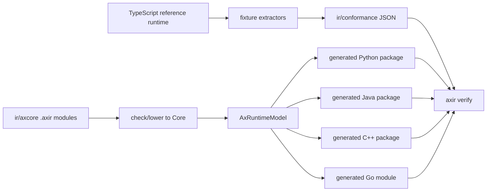

# AxIR Compiler

AxIR is the compiler-owned portability layer for Ax. It turns the shared Ax
runtime contract into native Python, Java, C++, and Go libraries without adding a
public TypeScript AxIR API.

TypeScript remains the behavioral reference implementation. Extractors read the
TypeScript runtime and write small conformance fixtures under `ir/conformance/`.
The compiler source of truth is the `.axir` bundle under `ir/axcore/`, plus the
fixtures and specs under `ir/spec/`.

## Pipeline

The lowering stages are:

1. parse and resolve `.axir` modules
2. check dialect declarations, public symbols, and Core body invariants
3. lower Ax dialect operations into Core
4. validate executable Core bodies
5. extract the language-neutral `AxRuntimeModel`
6. emit target packages and run `axir verify`

`axir verify` is the product gate. It compiles generated targets, runs examples,
executes fixture conformance, validates capability manifests, and smoke-tests
package metadata for Python, Java, C++, and Go.

## Layers

Ax dialects are MLIR-like semantic layers. They preserve Ax meaning until Core
lowering:

- `ax.signature`, `ax.schema`, `ax.validate`, and `ax.template` describe
  signatures, JSON schema, value validation, and prompt rendering.
- `ax.program` is the shared program contract for AxGen, AxAgent, and AxFlow:
  forward behavior, demos/examples, traces, usage, chat logs, optimizer
  components, and evaluation hooks.
- `ax.gen` owns structured generation, tool loops, retries, examples, memory,
  streaming folds, traces, and output parsing.
- `ax.ai` and `ax.provider` own provider descriptors, model catalog metadata,
  request mapping, response normalization, stream folding, usage normalization,
  audio/realtime event folding, provider routing, and balancer semantics.
- `ax.agent` owns the portable actor pipeline, runtime protocol envelopes,
  context budgets, checkpoint/tombstone summaries, policy vocabulary registry,
  traces, and state export/restore shape.
- `ax.flow` owns AxFlow as an Ax program graph: steps, planning barriers,
  control flow, cache keys, state merge, `.returns()`, child program
  aggregation, stop/abort checkpoints, and parallel merge errors.
- `ax.optimize` owns optimizer components, evaluator rows, artifacts,
  apply/rollback, evidence batches, and the engine boundary.

Core is lower level: records, functions, blocks, control flow, effects, values,
and portable intrinsics. Backends consume Core or `AxRuntimeModel`; they do not
reinterpret high-level Ax dialects.

## Ownership Boundary

Core-owned behavior is deterministic and language-agnostic:

- signature parsing, validation, prompts, schemas, and structured output rules
- AxGen orchestration, tool-call normalization, streaming folds, traces, usage,
  examples, demos, and retry ordering
- provider request/response/audio/realtime mapping and fake-transport
  normalization
- AxAgent runtime envelopes, lifecycle, context policy, checkpoint state,
  action logs, trace events, and actor-visible policy vocabulary
- AxFlow planning, control flow, cache behavior, state merge, trace/usage/chat
  aggregation, and return projection
- optimizer request/evaluator/artifact shape and generated `AxGEPA` algorithm
  state

Target-owned behavior is host integration:

- Python, Java, C++, and Go naming, constructors, exceptions/errors, builders, callbacks,
  packaging, and examples
- HTTP, SSE, WebSocket, auth, retries, binary upload, media conversion, clocks,
  timers, filesystem/process access, and live network execution
- native callback bodies for tools, metrics, judges, runtime host functions,
  provider transports, and child program execution
- interpreter/sandbox implementation, runtime profile dependency loading,
  hard cancellation, package loading, and permission policy

If a rule affects observable Ax semantics across languages, it belongs in Core.
If it touches external IO or host runtime mechanics, it belongs behind a
target-owned boundary with Core-owned envelopes and ordering.

## Generated Libraries

AxIR emits libraries, not one-off programs:

- Python: package import `axllm`, distribution metadata `axllm`,
  Python 3.10+, standard library runtime, and `py.typed`.
- Java: package `dev.axllm.ax`, Java 17, standard library runtime, Maven/Gradle base
  metadata, and optional QuickJS4J profile metadata outside the base compile.
- C++: namespace `axllm`, C++17, `axllm/axllm.hpp` plus
  `axllm/axllm.cpp`, CMake target `axllm::axllm`, and optional QuickJS
  sources outside the default build.
- Go: module `github.com/ax-llm/ax/go`, package `axllm`, Go 1.22+,
  `context.Context` on execution/client boundaries, standard `net/http`
  transport, and an opt-in generated `runtime/goja` package for built-in
  JavaScript actor execution.

Every generated package includes `axir-capabilities.json`, a README, runnable
examples, and a conformance runner when the target is executable.

The checked-in examples under `src/examples/python`, `src/examples/java`,
`src/examples/cpp`, and `src/examples/go` are run through
`npm run example -- <language> <file>`.
`npm run example -- list` groups the examples by language and marks no-key
deterministic examples separately from provider API examples. The runner
compiles the generated package into an ignored local cache before running the
example, so users do not need to call the compiler manually. The examples cover
signatures, AxGen, AxAgent, AxFlow, OpenAI Responses audio mapping,
Grok/Gemini realtime event folding, runtime adapters, optimizer artifacts, and
GEPA.

See [`docs/RELEASE.md`](./RELEASE.md) for the publishable package names,
versioning rule, and local release smoke workflow.

## Runtime Profiles

The TypeScript `AxJSRuntime` is the canonical JavaScript host runtime for
AxAgent. Generated runtime profiles are portability proofs behind the same
`AxCodeRuntime` / `AxCodeSession` boundary:

- `javascript-quickjs`: Java embeds QuickJS through QuickJS4J, C++ uses the
  QuickJS C API, and Python drives a QuickJS protocol server.
- `python-pyodide`: Python actor code runs in a Node-hosted Pyodide JSONL
  protocol server; generated Python, Java, and C++ clients all use the same
  process/protocol boundary.
- `javascript-goja`: Go-native JavaScript actor code runs through the generated
  `runtime/goja` package. The root Go package stays vendor-neutral; users opt
  in by importing `github.com/ax-llm/ax/go/runtime/goja`.

Runtime profiles are optional and dependency-bearing. Default package builds and
default `axir verify` stay dependency-light.

## Providers, Audio, And Realtime

Provider behavior is descriptor-backed. OpenAI-compatible, OpenAI Responses,
Gemini, Anthropic, Azure OpenAI, DeepSeek, Mistral, Reka, Cohere, and Grok
clients use shared Core operation descriptors rather than provider-specific
target templates.

Audio and realtime are modeled as provider operations. Core owns request shape,
audio metadata, event grammar folding, usage folding, error normalization, and
fake-transport conformance. Targets own real HTTP/SSE/WebSocket transport,
media devices, auth, reconnect policy, and binary audio IO. See
[`docs/AUDIO.md`](./AUDIO.md) for user-facing audio usage.

## Optimizer And GEPA

The optimizer contract is engine-agnostic: programs expose components,
evaluators score candidates, artifacts serialize changes, and engines call
`OptimizerEngine.optimize(request, evaluator)`.

Generated packages also ship `AxGEPA` as one concrete engine. GEPA owns
reflection, selection, Pareto metadata, bootstrapping, selector state, metric
budgets, and descendant component optimization while reusing the shared
optimizer evaluator/artifact boundary.

## Adding Or Changing Semantics

New portable behavior should follow this loop:

1. add or update TS-derived fixtures
2. encode the stable semantics in `.axir` Core helpers or descriptor data
3. keep target templates limited to idiomatic wrappers and host boundaries
4. run `go test`, `check`, `lower`, and `axir verify`

Do not add a public TypeScript AxIR API, do not hand-edit generated target
output, and do not add provider/runtime logic directly to Python, Java, C++, or Go
templates when it belongs in Core descriptors or Core helpers.
