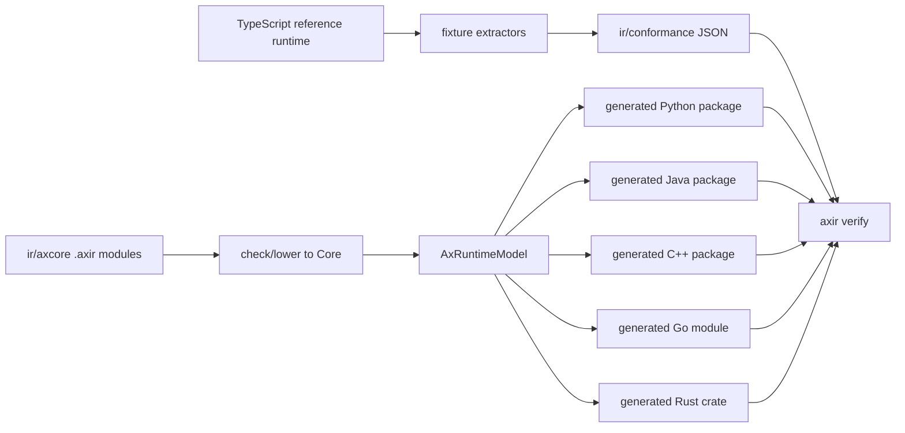

# AxIR Compiler

AxIR is the compiler-owned portability layer for Ax. It turns the shared Ax
runtime contract into native Python, Java, C++, Go, and Rust libraries without adding a
public TypeScript AxIR API.

TypeScript remains the behavioral reference implementation. Extractors read the
TypeScript runtime and write small conformance fixtures under `ir/conformance/`.
The compiler source of truth is the `.axir` bundle under `ir/axcore/`, plus the
fixtures and specs under `ir/spec/`.

## Pipeline



The lowering stages are:

1. parse and resolve `.axir` modules
2. check dialect declarations, public symbols, and Core body invariants
3. lower Ax dialect operations into Core
4. validate executable Core bodies
5. extract the language-neutral `AxRuntimeModel`
6. emit target packages and run `axir verify`

`axir verify` is the product gate. It compiles generated targets, runs examples,
executes fixture conformance, validates capability manifests, and smoke-tests
package metadata for Python, Java, C++, Go, and Rust.

## Layers

Ax dialects are MLIR-like semantic layers. They preserve Ax meaning until Core
lowering:

- `ax.signature`, `ax.schema`, `ax.validate`, and `ax.template` describe
  signatures, JSON schema, value validation, and prompt rendering.
- `ax.program` is the shared program contract for AxGen, AxAgent, and AxFlow:
  forward behavior, demos/examples, traces, usage, chat logs, optimizer
  components, and evaluation hooks.
- `ax.gen` owns structured generation, tool loops, retries, examples, memory,
  streaming folds, traces, and output parsing.
- `ax.ai` and `ax.provider` own provider descriptors, model catalog metadata,
  request mapping, response normalization, stream folding, usage normalization,
  audio/realtime event folding, provider routing, and balancer semantics.
- `ax.agent` owns the portable actor pipeline, runtime protocol envelopes,
  context budgets, checkpoint/tombstone summaries, policy vocabulary registry,
  traces, and state export/restore shape.
- `ax.flow` owns AxFlow as an Ax program graph: steps, planning barriers,
  control flow, cache keys, state merge, `.returns()`, child program
  aggregation, stop/abort checkpoints, and parallel merge errors.
- `ax.optimize` owns optimizer components, evaluator rows, artifacts,
  apply/rollback, evidence batches, and the engine boundary.

Core is lower level: records, functions, blocks, control flow, effects, values,
and portable intrinsics. Backends consume Core or `AxRuntimeModel`; they do not
reinterpret high-level Ax dialects.

## Ownership Boundary

Core-owned behavior is deterministic and language-agnostic:

- signature parsing, validation, prompts, schemas, and structured output rules
- AxGen orchestration, tool-call normalization, streaming folds, traces, usage,
  examples, demos, and retry ordering
- provider request/response/audio/realtime mapping and scripted-transport
  normalization
- AxAgent runtime envelopes, lifecycle, context policy, checkpoint state,
  action logs, trace events, and actor-visible policy vocabulary
- AxFlow planning, control flow, cache behavior, state merge, trace/usage/chat
  aggregation, and return projection
- optimizer request/evaluator/artifact shape and generated `AxGEPA` algorithm
  state

Target-owned behavior is host integration:

- Python, Java, C++, Go, and Rust naming, constructors, exceptions/errors, builders, callbacks,
  packaging, and examples
- HTTP, SSE, WebSocket, auth, retries, binary upload, media conversion, clocks,
  timers, filesystem/process access, and live network execution
- native callback bodies for tools, metrics, judges, runtime host functions,
  provider transports, and child program execution
- interpreter/sandbox implementation, runtime profile dependency loading,
  hard cancellation, package loading, and permission policy

If a rule affects observable Ax semantics across languages, it belongs in Core.
If it touches external IO or host runtime mechanics, it belongs behind a
target-owned boundary with Core-owned envelopes and ordering.

## Generated Libraries

AxIR emits libraries, not one-off programs:

- Python: package import `axllm`, distribution metadata `axllm`,
  Python 3.10+, standard library runtime, and `py.typed`.
- Java: package `dev.axllm.ax`, Java 17, standard library runtime, Maven/Gradle base
  metadata, and optional QuickJS4J profile metadata outside the base compile.
- C++: namespace `axllm`, C++17, `axllm/axllm.hpp` plus
  `axllm/axllm.cpp`, CMake target `axllm::axllm`, and optional QuickJS
  sources outside the default build.
- Go: module `github.com/ax-llm/ax/go`, package `axllm`, Go 1.22+,
  `context.Context` on execution/client boundaries, standard `net/http`
  transport, and an opt-in generated `runtime/goja` package for built-in
  JavaScript actor execution.
- Rust: crate `axllm`, Rust 1.74+, idiomatic `Result<T, AxError>` fallible
  boundaries, `serde_json::Value` for dynamic Ax values, blocking
  `reqwest`/rustls provider transport, process-protocol code runtime adapters,
  and an opt-in embedded QuickJS profile behind Cargo feature
  `runtime-quickjs`. The public top-level tool constructor is `tool(...)`
  because `fn` is reserved in Rust.

Every generated package includes `axir-capabilities.json`, `axir-api.json`,
`README.md`, `API.md`, runnable examples, and a conformance runner when the
target is executable. `API.md` and `axir-api.json` are emitted from
compiler-owned API metadata so package docs, future docs-site pages, and agent
docs can consume the same source without scraping generated code.

The npm-installed Claude Code skills in `@ax-llm/ax` stay focused on the
TypeScript package. Generated Python, Java, C++, Go, and Rust API docs ship with
their package trees instead of being auto-installed into user projects as npm
skills. The committed package output lives under `packages/python`,
`packages/java`, `packages/cpp`, `packages/go`, and `packages/rust`; AxIR
remains the source of truth.

Public examples remain under `src/examples/<language>/<group>/` and are
generated from each file's `ax-example` header. Generated Python, Java, C++,
Go, and Rust package fixtures remain canonical under
`packages/<language>/examples` for AxIR verification and can still run through
`npm run example -- <language> <file>`.
`npm run example -- list` groups only the public provider-backed catalog by
language. The runner uses the committed package source under
`packages/<language>` for non-TypeScript examples and writes only build scratch
data under `src/examples/.generated/`. Internal fixtures cover signatures,
AxGen, AxAgent, AxFlow, OpenAI Responses audio mapping,
Grok/Gemini realtime event folding, MCP scripted transports, runtime adapters,
optimizer artifacts, and GEPA.

When compiler output changes, run `npm run axir:generate-packages` and commit
the refreshed package trees. CI runs `npm run axir:check-packages` so stale
checked-in generated packages fail fast.

For local iteration, use the cached AxIR wrapper from the repo root:

```bash
npm run axir -- check ir/axcore/root.axir
npm run axir:verify:dev
npm run axir:verify:dev -- --targets python
```

`axir:verify:dev` keeps a stable temp workdir and build caches, runs target
verification in parallel, and skips downstream package-consumer smoke tests.
Use `npm run axir:verify:release` before release or when package metadata and
consumer wiring are part of the change.

See [`docs/RELEASE.md`](./RELEASE.md) for the publishable package names,
versioning rule, and local release smoke workflow.

## Runtime Profiles

The TypeScript `AxJSRuntime` is the canonical JavaScript host runtime for
AxAgent. Generated runtime profiles are portability proofs behind the same
`AxCodeRuntime` / `AxCodeSession` boundary:

- `javascript-quickjs`: Java embeds QuickJS through QuickJS4J, C++ uses the
  QuickJS C API, Rust uses `rquickjs` behind Cargo feature
  `runtime-quickjs`, and Python drives a QuickJS protocol server.
- `python-pyodide`: Python actor code runs in a Node-hosted Pyodide JSONL
  protocol server; generated Python, Java, and C++ clients all use the same
  process/protocol boundary.
- `javascript-goja`: Go-native JavaScript actor code runs through the generated
  `runtime/goja` package. The root Go package stays vendor-neutral; users opt
  in by importing `github.com/ax-llm/ax/go/runtime/goja`.
- Rust keeps the process JSONL runtime protocol through `ProcessCodeRuntime`.
  The embedded JavaScript profile is additive and feature-gated, so the base
  crate stays dependency-light while the public `AxCodeRuntime` /
  `AxCodeSession` boundary remains unchanged.

Runtime profiles are optional and dependency-bearing. Default package builds and
default `axir verify` stay dependency-light.

## Providers, Audio, And Realtime

Provider behavior is descriptor-backed. OpenAI-compatible, OpenAI Responses,
Gemini, Anthropic, Azure OpenAI, DeepSeek, Mistral, Reka, Cohere, and Grok
clients use shared Core operation descriptors rather than provider-specific
target templates.

Audio and realtime are modeled as provider operations. Core owns request shape,
audio metadata, event grammar folding, usage folding, error normalization, and
scripted-transport conformance. Targets own real HTTP/SSE/WebSocket transport,
media devices, auth, reconnect policy, and binary audio IO. See
[`docs/AUDIO.md`](./AUDIO.md) for user-facing audio usage.

## Optimizer And GEPA

The optimizer contract is engine-agnostic: programs expose components,
evaluators score candidates, artifacts serialize changes, and engines call
`OptimizerEngine.optimize(request, evaluator)`.

Generated packages also ship `optimize(...)`, `AxBootstrapFewShot`, and
`AxGEPA`. The helper composes BootstrapFewShot -> GEPA, preserves selected demos
in the artifact, disables GEPA-internal bootstrap for that wrapper path, and
leaves final application to the caller. Direct `AxGEPA` remains the lower-level
engine API and still owns reflection, selection, Pareto metadata, bootstrapping,
selector state, metric budgets, and descendant component optimization while
reusing the shared optimizer evaluator/artifact boundary.

## Adding Or Changing Semantics

New portable behavior should follow this loop:

1. add or update TS-derived fixtures
2. encode the stable semantics in `.axir` Core helpers or descriptor data
3. keep target templates limited to idiomatic wrappers and host boundaries
4. run the cached AxIR checks and `npm run axir:verify:dev`

Do not add a public TypeScript AxIR API, do not hand-edit generated target
output, and do not add provider/runtime logic directly to Python, Java, C++, Go, or Rust
templates when it belongs in Core descriptors or Core helpers.

Most TypeScript feature PRs do not need to complete the AxIR migration
immediately. If a PR changes portable behavior under `src/ax/ai/`,
`src/ax/dsp/`, `src/ax/agent/`, `src/ax/flow/`, or `src/ax/mcp/`, it must
either update AxIR/conformance or add a tracked backlog item:

```bash
npm run axir:backlog -- add --title "..." --surface axai --impact "..." --paths src/ax/ai/...
npm run axir:backlog:validate
```

`ir/axir-backlog.json` is the machine-readable source of truth, and
`docs/AXIR_BACKLOG.md` is generated from it. CI checks this ledger before the
full generated-backend verification so coding agents get a fast, command-first
failure when portable TS changes need AxIR follow-up.

When completing backlog work, update or add the TS-derived fixtures, update
Core/descriptor data, then run:

```bash
npm run axir:conformance:check
npm run test:axir
npm run axir:backlog -- done <id> --commit <sha> --verification "npm run test:axir"
```

For generated-backend integrity, use the three verification instruments in
[`docs/AXIR_VERIFICATION.md`](./AXIR_VERIFICATION.md): provenance confirms the
functions are emitted from IR, coverage confirms conformance executes them, and
perturbation confirms runners reject changed expected values.
