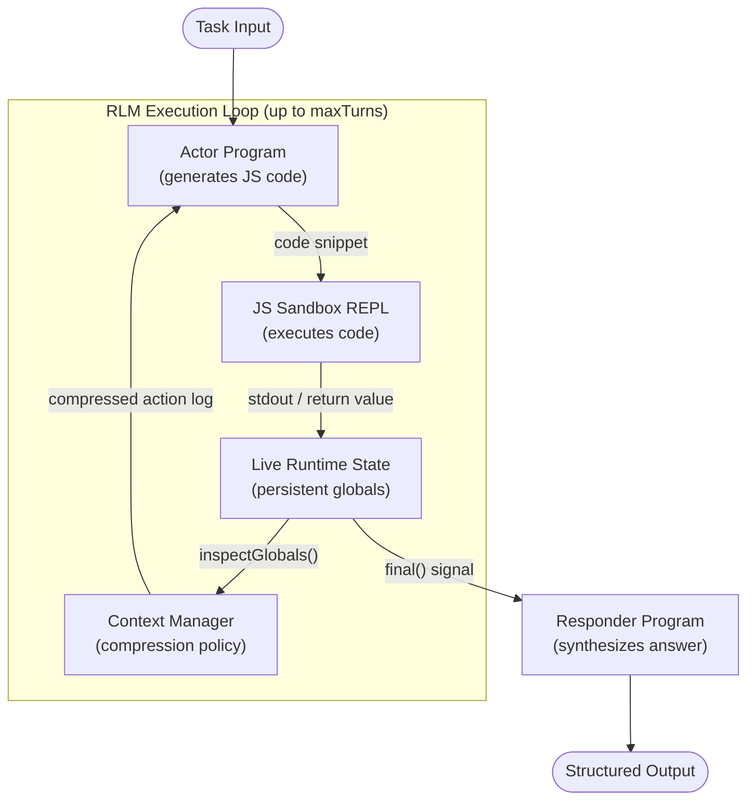
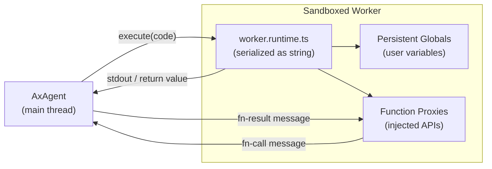
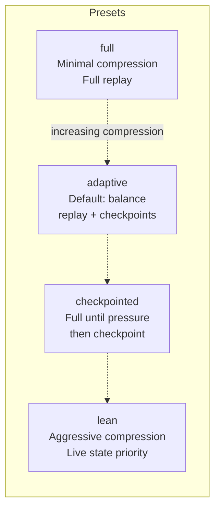
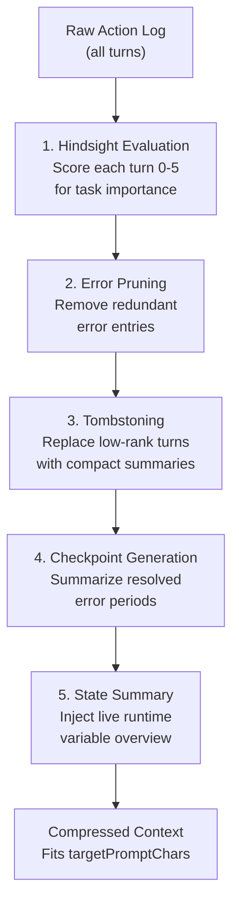
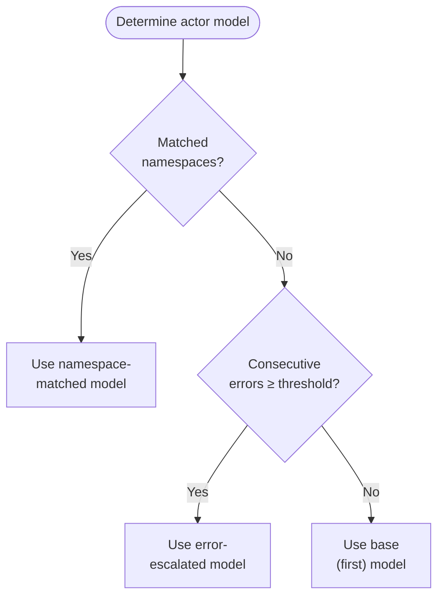
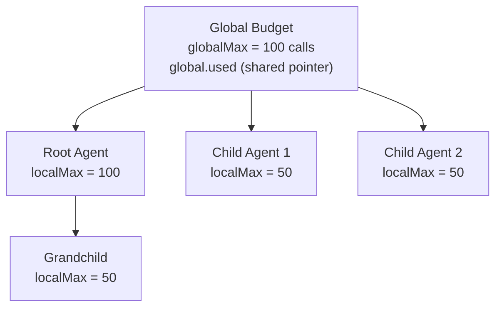
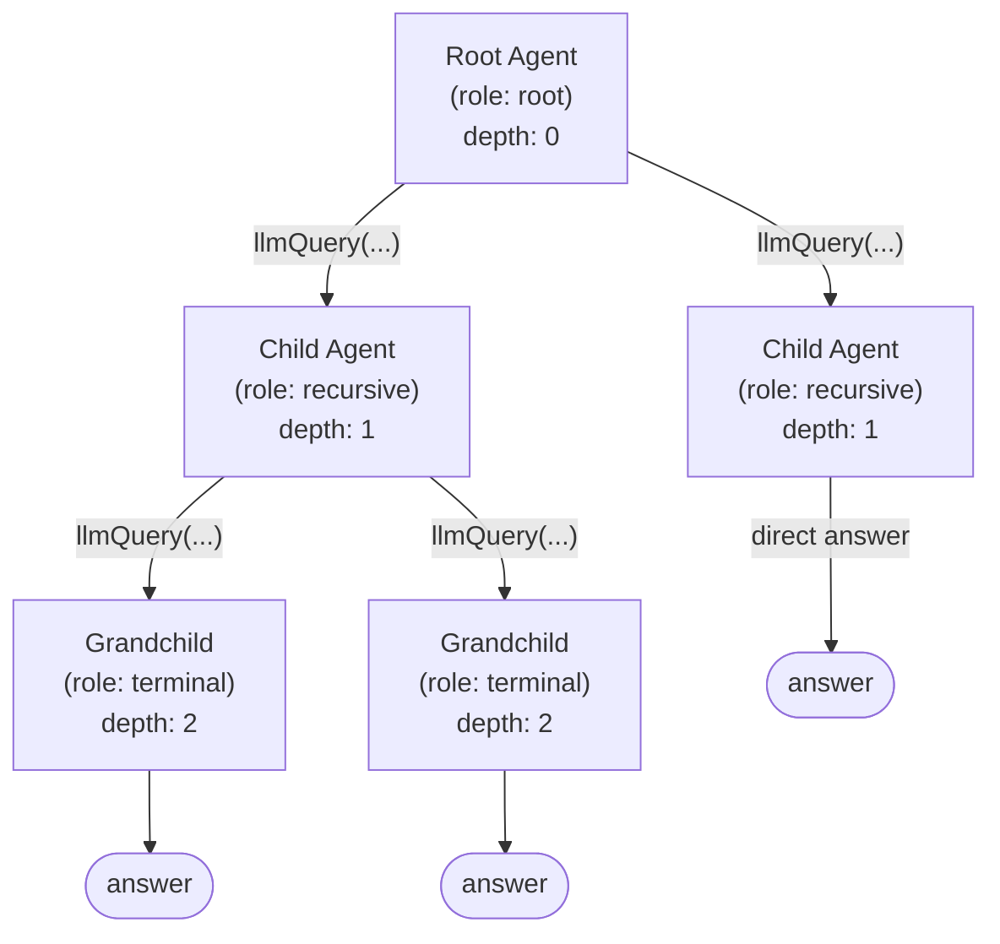
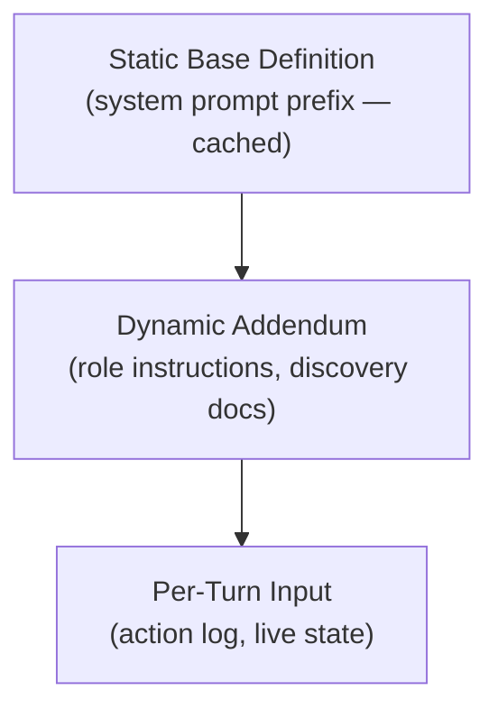
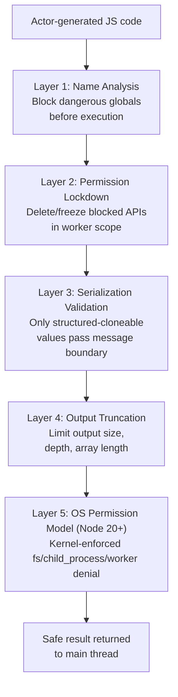

# AxAgent RLM: Design & Value Reference

> **RLM** — Recursive Language Model Agent
> A general-purpose agentic framework built around a sandboxed JavaScript REPL, sophisticated context management, and recursive delegation — engineered to work reliably with small models and long contexts.

---

## Table of Contents

1. [Why RLM?](#1-why-rlm)
2. [Architecture Overview](#2-architecture-overview)
3. [The JS REPL Runtime](#3-the-js-repl-runtime)
4. [Context Policy System](#4-context-policy-system)
5. [Model Upgrade Policy](#5-model-upgrade-policy)
6. [Budgeting](#6-budgeting)
7. [Recursive Modes](#7-recursive-modes)
8. [Live Runtime State](#8-live-runtime-state)
9. [System Prompt Caching](#9-system-prompt-caching)
10. [Safety Guardrails](#10-safety-guardrails)
11. [Optimization](#11-optimization)
12. [Comparison with Other Approaches](#12-comparison-with-other-approaches)

---

## 1. Why RLM?

### The Problem with Naive Agents

Standard LLM agents (ReAct, tool-call loops, CoT chains) suffer from compounding failures as task complexity grows:

| Failure Mode | Root Cause |
|---|---|
| Context blowout | Raw conversation history grows unbounded |
| Tool combinatorial explosion | Each capability needs a bespoke tool schema |
| Model lock-in | One model must handle both reasoning and execution |
| No persistence | State resets between turns; can't accumulate knowledge |
| Poor small-model performance | Rigid schemas overwhelm smaller models |
| No introspection | Agent can't inspect what it has already computed |

### What RLM Solves

AxAgent RLM is designed around one core insight: **a sandboxed JavaScript REPL is a better interface than a fixed tool catalog for general agentic work.** Instead of giving the model a list of tools, you give it a full computational environment. Instead of managing conversation history naively, you compress and checkpoint it intelligently. Instead of one monolithic model call, you split reasoning and synthesis and scale them independently.

The result is an agent that:

- Works with **small models** (7B–13B) because the REPL offloads computation
- Handles **long contexts** via adaptive compression, not truncation
- Scales to **complex multi-step tasks** via controlled recursion
- Maintains **persistent state** across turns via a live JS runtime
- Degrades **gracefully under pressure** via model escalation

---

## 2. Architecture Overview

### Split Actor / Responder Design



### Component Responsibilities

| Component | Role | Key File |
|---|---|---|
| **Actor Program** | Generates JavaScript code each turn | `AxAgent.ts` |
| **JS REPL** | Executes code in a sandboxed Worker | `jsRuntime.ts`, `worker.runtime.ts` |
| **Context Manager** | Compresses and checkpoints action log | `contextManager.ts` |
| **Responder Program** | Synthesizes final answer from accumulated state | `AxAgent.ts` |
| **Model Policy** | Escalates to stronger model on errors | `config.ts` |
| **Budget Tracker** | Enforces global and per-child LLM call limits | `config.ts` |

### State Object

The entire execution state is a single serializable object:

```typescript
type AxAgentState = {
  version: 1;
  runtimeBindings: Record<string, unknown>;       // JS global variables
  runtimeEntries: AxAgentStateRuntimeEntry[];     // Runtime snapshots
  actionLogEntries: AxAgentStateActionLogEntry[]; // Full turn history
  guidanceLogEntries?: AxAgentGuidanceLogEntry[];
  provenance: Record<string, RuntimeStateVariableProvenance>;
  actorModelState?: AxAgentStateExecutorModelState;  // Model escalation state
  checkpointState?: AxAgentStateCheckpointState;
  discoveryPromptState?: AxAgentDiscoveryPromptState;
};
```

This means state is portable — it can be saved, restored, forked, and replayed.

---

## 3. The JS REPL Runtime

### Why a REPL Instead of Tools?

Traditional agents expose capabilities as a fixed list of typed tool schemas. This approach has hard limits:

```
Tool-call Agent:
  Model → { tool: "search", query: "..." }
  Model → { tool: "fetch_url", url: "..." }
  Model → { tool: "parse_json", ... }
  (Each operation = one schema, one round-trip)

RLM Agent:
  Model → JS code block (multiple ops in one turn)
  const data = await search("...");
  const parsed = JSON.parse(await fetch_url(data.url));
  const filtered = parsed.items.filter(x => x.score > 0.8);
  console.log(filtered.length, "high-quality results");
```

**Key advantages of the REPL approach:**

| Dimension | Tool-call Agent | RLM REPL Agent |
|---|---|---|
| Schema overhead | O(n) schemas per capability | Zero — JS is the schema |
| Multi-step in one turn | No (one tool at a time) | Yes (arbitrary code) |
| Intermediate inspection | No | Yes (`console.log`) |
| Data transformation | Requires a tool | Native JS |
| State accumulation | Manual / external | Automatic (globals persist) |
| Error recovery | Re-call the tool | Catch/branch in JS |
| Model prompt size | Grows with tool count | Compact runtime instructions |

### Runtime Architecture

The JS sandbox runs in a Web Worker (browser/Bun), a module Worker (Deno), or `worker_threads` (Node.js), giving each session an **isolated V8 context**:



The worker is **pre-warmed** in a pool (Node.js) to reduce startup latency on the first call.

### console.log as the Inspection Interface

The REPL captures all `console.log`, `console.info`, `console.warn`, and `console.error` output and returns it as the turn result. This is intentional: the model uses `console.log` exactly as a human developer would use a debugger.

```javascript
// Actor turn — the model writes code like this:
const users = await llmQuery("fetch all premium users from the database");
console.log("Total users:", users.length);
console.log("Sample:", JSON.stringify(users[0], null, 2));

const churned = users.filter(u => u.lastLogin < Date.now() - 90 * 86400_000);
console.log("Churned users:", churned.length);

// Store for next turns
globalThis.churnedUsers = churned;
```

The output from `console.log` feeds back into the next actor turn as context. The model sees what it computed, just like a developer in a terminal.

**Output mode selection:**

| Mode | When Used | How to Output |
|---|---|---|
| `stdout` | Default | `console.log(value)` |
| `return` | Expression mode | Trailing expression or `return` |

### Cross-Runtime Support

| Runtime | Mechanism | Notes |
|---|---|---|
| **Browser** | `new Worker(blob)` | Native Web Worker |
| **Bun** | `new Worker(blob, { smol: true })` | Global Worker with reduced-memory heap |
| **Node.js** | `new Worker(source, { eval: true })` | worker_threads |
| **Deno** | Module worker with permission mapping | Permission-safe |

### Code Execution Pipeline

```
Actor produces code
        ↓
Variable capture injection (top-level let/const/var → globalThis)
        ↓
Async detection → AsyncFunction or Function wrapper
        ↓
Execute in Worker scope
        ↓
console output captured + return value extracted
        ↓
Structured-clone serialization (DataCloneError fallback to String)
        ↓
Result returned to actor as next turn input
```

---

## 4. Context Policy System

### The Problem

Multi-turn agents accumulate context. Without management, after 10+ turns the prompt becomes dominated by old code and outputs, leaving little room for current work.

RLM uses a **semantic context manager** that understands the *meaning* of each turn, not just its size.

### Context Policy Presets



| Preset | Action Replay | Checkpoint | Best For |
|---|---|---|---|
| `full` | Full replay always | Disabled | Debugging, audit trails |
| `adaptive` | Recent full, older compressed | On pressure | Default — general use |
| `checkpointed` | Full until `triggerChars`, then checkpoint | Aggressive | Very long tasks |
| `lean` | Minimal — tombstones only | Enabled | Small context windows |

### Budget Levels

| Level | Target Prompt Size | Use Case |
|---|---|---|
| `compact` | 12,000 chars | Small models, tight windows |
| `balanced` | 16,000 chars | Default |
| `expanded` | 20,000 chars | Large-context models |

### Resolved Context Policy Structure

```typescript
type AxResolvedContextPolicy = {
  preset: AxContextPolicyPreset;
  budget: AxContextPolicyBudget;
  actionReplay: 'full' | 'adaptive' | 'minimal' | 'checkpointed';
  recentFullActions: number;      // Keep last N turns fully expanded
  errorPruning: boolean;          // Remove redundant error entries
  hindsightEvaluation: boolean;   // Score turns for importance
  pruneRank: number;              // Prune turns scoring below this (0-5)
  rankPruneGraceTurns: number;    // Don't prune turns newer than this
  stateSummary: {
    enabled: boolean;
    maxEntries?: number;
    maxChars?: number;
  };
  stateInspection: {
    enabled: boolean;
    contextThreshold?: number;    // Inject live state when prompt fills to X%
  };
  checkpoints: {
    enabled: boolean;
    triggerChars?: number;        // Create checkpoint when log > X chars
  };
  targetPromptChars: number;
  maxRuntimeChars: number;
};
```

### Context Compression Flow



### Action Log Entry

Each turn is stored as a rich metadata object:

```typescript
type AxAgentStateActionLogEntry = {
  turn: number;
  code: string;                    // The JS code generated
  output: string;                  // stdout / return value
  tags: ActionLogTag[];            // 'error' | 'dead-end' | 'foundational'
                                   // | 'pivot' | 'superseded'
  summary?: string;                // Human-readable summary
  producedVars?: string[];         // Variables created this turn
  referencedVars?: string[];       // Variables read this turn
  stateDelta?: string;             // Description of state changes
  stepKind?: ActionLogStepKind;    // 'explore' | 'transform' | 'query'
                                   // | 'finalize' | 'error'
  replayMode?: 'full' | 'omit';
  rank?: number;                   // 0-5 importance score
  tombstone?: string;              // Compact replacement text
};
```

### Dynamic Runtime Char Budget

As the action log fills toward `targetPromptChars`, the allowed runtime output per turn shrinks linearly — preventing a single verbose output from blowing the budget:

```
maxRuntimeChars
      │
      │▓▓▓▓▓▓▓▓▓▓▓▓▓
      │             ▓▓▓▓▓
      │                  ▓▓▓▓
      │                       ▓▓▓
floor │                          ▓▓▓▓▓▓▓▓▓▓▓▓▓▓▓▓
      └──────────────────────────────────────────▶
      0%                                    100%
              Action log fills →
```

Floor = `max(400, maxRuntimeChars × 0.15)` — always enough for a meaningful output.

---

## 5. Model Upgrade Policy

### The Insight

Not every turn needs a large model. Routine data gathering, transformation, and filtering can be handled by a fast, cheap model. Only when the agent is confused, stuck, or calling specialized capabilities should it escalate.

### Policy Definition

The `executorModelPolicy` is an ordered array where **later entries take precedence**:

```typescript
type AxExecutorModelPolicy = readonly [
  AxExecutorModelPolicyEntry,
  ...AxExecutorModelPolicyEntry[]
];

type AxExecutorModelPolicyEntry =
  | { model: string; aboveErrorTurns: number }   // Escalate on errors
  | { model: string; namespaces: readonly string[] }; // Escalate on capability
```

### Example Policy

```typescript
const policy: AxExecutorModelPolicy = [
  { model: 'google:gemini-2.0-flash',  aboveErrorTurns: 0 },  // Default: fast
  { model: 'google:gemini-2.5-pro',    aboveErrorTurns: 3 },  // 3+ errors: escalate
  { model: 'anthropic:claude-opus-4',  namespaces: ['legal', 'medical'] }, // Specialized
];
```

### Selection Logic



### Escalation State Tracking

The `AxAgentStateExecutorModelState` object persists across turns:

```typescript
type AxAgentStateExecutorModelState = {
  consecutiveErrorTurns: number;   // Resets to 0 on success
  matchedNamespaces: string[];     // Namespaces seen in function calls
};
```

This means the system **remembers** how many errors have accumulated and **auto-recovers** (de-escalates) when the agent succeeds again.

---

## 6. Budgeting

### Two-Level Budget System

Budgets are tracked at two levels simultaneously:



```typescript
type AxLlmQueryBudgetState = {
  global: { used: number };  // Shared reference across ALL agents in the tree
  globalMax: number;         // Hard cap — tree stops when hit
  localUsed: number;         // Per-agent counter
  localMax: number;          // Per-agent soft cap
};
```

### Default Limits

| Parameter | Default | Description |
|---|---|---|
| `maxSubAgentCalls` | 100 | Global LLM call limit for entire tree |
| `maxTurns` | 8 | Actor turns per top-level call |
| `maxRuntimeChars` | 3,000 | Max output chars per turn |
| `maxBatchedLlmQueryConcurrency` | 8 | Parallel `llmQuery` calls |
| `maxRecursionDepth` | 2 | Maximum nesting depth |

### Budget Exhaustion Behavior

When a budget is exhausted, the agent signals completion rather than crashing:

```
Global budget hit → immediate stop, responder synthesizes from current state
Local budget hit  → child agent stops, parent continues with partial result
Turn limit hit    → responder synthesizes from what was gathered
```

---

## 7. Recursive Modes

### What is Recursion in RLM?

The actor can call `llmQuery(...)` — which spawns a **child AxAgent** with its own REPL session, context policy, and budget allocation. This enables:

- **Fan-out**: One parent, many parallel child investigations
- **Specialization**: Child agents inherit only the tools they need
- **Depth**: Grandchildren can spawn great-grandchildren (up to `maxDepth`)

### Recursion Tree Structure



### Node Roles

| Role | Description | Prompt Slot |
|---|---|---|
| `root` | Top-level agent | `root.actor.root` |
| `recursive` | Mid-tree agent with children | `root.actor.recursive` |
| `terminal` | Leaf agent at `maxDepth` | `root.actor.terminal` |

Each role gets **different actor instructions** via instruction slots — root agents are more strategic, terminal agents more focused.

### Recursive Trace

Every node in the tree is tracked:

```typescript
type AxAgentRecursiveTraceNode = {
  nodeId: string;
  parentId?: string;
  depth: number;
  role: 'root' | 'recursive' | 'terminal';
  taskDigest?: string;          // Compact summary of what was asked
  contextDigest?: string;       // Compact summary of context inherited
  completionType?: 'final' | 'askClarification';
  turnCount: number;
  childCount: number;
  actorTurns: AxAgentRecursiveTurn[];
  functionCalls: AxAgentRecursiveFunctionCall[];
  toolErrors: string[];
  localUsage: AxAgentRecursiveUsage;
  cumulativeUsage: AxAgentRecursiveUsage;  // Includes all descendants
  children: AxAgentRecursiveTraceNode[];
};
```

### Recursive Statistics

After execution, a rich stats object is available for analysis:

```typescript
type AxAgentRecursiveStats = {
  nodeCount: number;
  leafCount: number;
  maxDepth: number;
  recursiveCallCount: number;
  batchedFanOutCount: number;      // Nodes with >1 child (parallel fan-out)
  clarificationCount: number;
  errorCount: number;
  directAnswerCount: number;       // Leaves that answered directly
  delegatedAnswerCount: number;    // Nodes that used children
  rootLocalUsage: AxAgentRecursiveUsage;
  rootCumulativeUsage: AxAgentRecursiveUsage;
  topExpensiveNodes: AxAgentRecursiveExpensiveNode[];
};
```

### Tool Discovery Across Recursion

Child agents can **inherit tool documentation** from the parent via `inheritDiscovery: true`. This prevents re-discovering the same APIs at each level, saving tokens and turns.

---

## 8. Live Runtime State

### The Problem of Blind Agents

In a naive loop, the model generates code, gets output, generates more code — but has no structured view of what has been accumulated. As turns progress, the model must infer state from reading through logs.

RLM solves this with **live runtime state inspection**: a structured, always-fresh view of the worker's global scope.

### Two Inspection APIs

**`inspectGlobals()`** — Returns an ASCII table of current globals:

```
┌──────────────────┬───────────┬──────────────┬────────────────────────────────────────┐
│ Name             │ Type      │ Size         │ Preview                                │
├──────────────────┼───────────┼──────────────┼────────────────────────────────────────┤
│ users            │ array     │ 1,247 items  │ [{ id: 1, name: "Alice", score: 0.9 }… │
│ churnedUsers     │ array     │ 183 items    │ [{ id: 7, lastLogin: 1704067200000 }…  │
│ reportConfig     │ object    │ 5 keys       │ { format: "csv", includeHeaders: true… │
│ fetchDate        │ date      │ 24 chars     │ 2026-03-24T00:00:00.000Z               │
└──────────────────┴───────────┴──────────────┴────────────────────────────────────────┘
```

**`snapshotGlobals()`** — Returns machine-readable snapshot with actual values:

```typescript
type AxCodeSessionSnapshot = {
  version: 1;
  entries: AxCodeSessionSnapshotEntry[];   // Metadata (same as inspectGlobals)
  bindings: Record<string, unknown>;       // Actual restorable values
};

type AxCodeSessionSnapshotEntry = {
  name: string;
  type: string;         // 'array' | 'object' | 'map' | 'set' | 'date' | ...
  ctor?: string;        // Constructor name (e.g. "Map", "Set", "Error")
  size?: string;        // "247 items", "5 keys", "1.2 KB"
  preview?: string;     // Truncated preview (max 96 chars)
  restorable?: boolean; // Can be restored via structured clone
};
```

### Provenance Tracking

Every variable in the runtime has provenance metadata:

```typescript
type RuntimeStateVariableProvenance = {
  createdTurn: number;      // Which turn created this variable
  lastReadTurn?: number;    // Which turn last accessed it
  stepKind?: ActionLogStepKind;
  source?: string;          // Tool/function that produced it
  code?: string;            // Code snippet that created it
};
```

This enables the context manager to make **semantic decisions**: a variable created in turn 2 and last read in turn 3 is a candidate for pruning in turn 10.

### State Injection Into Prompts

When the action log fills past `stateInspection.contextThreshold`, the live runtime state table is automatically injected into the actor's system prompt. The model always knows what it has, even if older turns have been compressed away.

---

## 9. System Prompt Caching

### The Cache Hit Problem

LLM providers (Anthropic, Google) offer **prompt caching** — if the same prefix is sent twice, the second call is cheaper and faster. This is hugely valuable for agents that make dozens of LLM calls. The challenge: any non-determinism in the system prompt breaks the cache.

### Sorted Collections for Stable Hashing

Every collection in the actor definition is **sorted canonically** before being serialized into the prompt:

```typescript
axBuildExecutorDefinition(baseDefinition, contextFields, responderOutputFields, {
  agents: sortedByName(agents),                        // Deterministic order
  agentFunctions: sortedByNamespaceThenName(functions), // Deterministic order
  availableModules: sortedCanonically(modules),
  discoveredDocsMarkdown: sortedByIdentifier(docs),
  // ...
});
```

This means no matter what order capabilities are registered, the prompt prefix is **identical** across calls, maximizing cache hits.

### Two-Level Prompt Structure



The static base (tool definitions, runtime instructions, safety rules) is the **longest** part and changes least often. It sits at the top of the system prompt to maximize prefix match probability.

### Prompt Level Control

| Level | Description | When to Use |
|---|---|---|
| `default` | Compact instructions, minimal examples | Production — smaller models |
| `detailed` | Full examples, expanded explanations | Debugging — complex tasks |

---

## 10. Safety Guardrails

### Defense in Depth

RLM implements multiple layers of isolation and restriction:



### Blocked Global Names

The following are blocked from user code by default:

```
Prototype manipulation:  __proto__  prototype  constructor
Runtime access:          globalThis  global  self  window
Code injection:          eval  Function  Proxy  Reflect
Network:                 fetch  XMLHttpRequest  WebSocket  EventSource
Workers:                 Worker  SharedWorker
Storage:                 indexedDB  caches
Built-in constructors:   Array  Object  String  Number  Promise  ...
```

In addition to name-level blocks, dynamic `import()` is blocked by default at the vm layer and through installed `Function`/`AsyncFunction`/`GeneratorFunction`/`AsyncGeneratorFunction`/`eval` shims, and `ShadowRealm` is locked to `undefined`. These defenses are opt-out-able via `blockDynamicImport: false` and `blockShadowRealm: false` on `AxJSRuntime` — both are `true` by default and should stay that way unless the caller has a specific, well-understood reason to relax them. The `allowedModules` option provides a whitelist path for specifiers that should pass through while `blockDynamicImport` remains on.

### Permission System

Specific capabilities can be **explicitly granted**:

```typescript
enum AxJSRuntimePermission {
  NETWORK       = 'network',        // fetch, XMLHttpRequest, WebSocket
  STORAGE       = 'storage',        // indexedDB, caches
  CODE_LOADING  = 'code-loading',   // importScripts
  COMMUNICATION = 'communication',  // BroadcastChannel
  TIMING        = 'timing',         // performance
  WORKERS       = 'workers',        // Worker, SharedWorker
  FILESYSTEM    = 'filesystem',     // node:fs, node:fs/promises, node:path
  CHILD_PROCESS = 'child-process',  // node:child_process
}
```

Default: **deny all**. Each permission must be explicitly opted in.

### Node Permission Model (OS-level)

When running on Node 20+, `AxJSRuntime` can engage Node's Permission Model as a second defense layer that is enforced by the runtime itself rather than the language sandbox. The model was introduced in Node 20 under `--experimental-permission` and promoted to stable `--permission` in Node 23.5; `AxJSRuntime` emits the right flag for the detected runtime automatically. Controlled by `useNodePermissionModel`:

- `'auto'` (default): engage unconditionally on any supported Node (20+), regardless of which `permissions` are granted — so even a fully default `new AxJSRuntime()` gets kernel-enforced fs/child_process/worker denial. Silently skips on Node < 20, Bun, Deno, and browsers (language-level blocks still defend).
- `true`: engage unconditionally; hard-fail on Node < 20.
- `false`: never engage.

When engaged, the worker is spawned with `execArgv` including `--permission` (Node 23.5+) or `--experimental-permission` (Node 20–23.4), and per-capability flags are derived from `permissions` and `nodePermissionAllowlist`:

| Capability source | Derived flag(s) |
|---|---|
| `FILESYSTEM` in permissions, or `nodePermissionAllowlist.fsRead` | `--allow-fs-read=<path>` (defaults to `*` if permission granted without paths) |
| `FILESYSTEM` in permissions, or `nodePermissionAllowlist.fsWrite` | `--allow-fs-write=<path>` (defaults to `*` if permission granted without paths) |
| `CHILD_PROCESS` in permissions, or `nodePermissionAllowlist.childProcess` | `--allow-child-process` |
| `WORKERS` in permissions | `--allow-worker` |
| `nodePermissionAllowlist.addons` | `--allow-addons` |
| `nodePermissionAllowlist.wasi` | `--allow-wasi` |

The OS-level layer means that even if a language-level block is bypassed (for example through a VM escape or future API), kernel-enforced denial still prevents the worker from touching paths, spawning processes, or opening workers that were not explicitly allowed.

### Reserved Namespaces

The runtime injects these as API surfaces that actor code can call, but cannot override:

| Namespace | Purpose |
|---|---|
| `inputs.*` | Access to task input fields |
| `llmQuery(...)` | Spawn child agent |
| `final(...)` | Signal task completion |
| `askClarification(...)` | Request clarification |
| `inspectRuntime.*` | Runtime state inspection |
| `agents.*` | Named child agent calls |
| `discoverModules()` | Tool discovery |
| `discoverFunctions()` | Function discovery |

### Output Truncation

Large outputs are intelligently truncated to prevent context blowout:

| Data Type | Truncation Strategy |
|---|---|
| Arrays | First 3 + last 2 items + hidden count |
| Stack traces | First 3 + last 1 frames |
| Objects | Depth-limited (max 3 levels) |
| Strings | Byte-length capped |
| Circular refs | Detected and replaced with `[Circular]` |

---

## 11. Optimization

### Instruction Slot System

Each component of the recursive tree has a named **instruction slot** that can be tuned independently:

| Slot ID | Targets | Description |
|---|---|---|
| `root.actor.shared` | All actors at all depths | Common behavioral instructions |
| `root.actor.root` | Root actor only | Strategic planning instructions |
| `root.actor.recursive` | Mid-tree actors | Delegation-focused instructions |
| `root.actor.terminal` | Leaf actors | Focused execution instructions |
| `root.responder` | Responder | Synthesis and formatting instructions |

### Optimization Target Selection

```typescript
type AxAgentOptimizeTarget =
  | 'actor'              // Optimize all actor slots
  | 'responder'          // Optimize responder only
  | 'all'                // Optimize everything
  | readonly string[];   // Optimize specific slot IDs
```

### Judge-Based Evaluation

The optimizer uses a built-in judge program that evaluates output quality:

```
Optimizer Loop:
  1. Run agent with current instructions
  2. Judge evaluates output (reasoning + quality score)
  3. Update instruction slots based on score
  4. Repeat until convergence or max iterations
  5. Early stop if improvement < threshold
```

### Why Per-Slot Optimization Matters

Different roles need different prompting:

- **Root actor**: Should think broadly, avoid premature specialization
- **Terminal actor**: Should stay focused, avoid spawning unnecessary children
- **Responder**: Should synthesize crisply, not re-explain what the actor did

Optimizing them together (treating the agent as one unit) misses these structural differences. Per-slot optimization lets each component be tuned to its actual role in the recursion tree.

---

## 12. Comparison with Other Approaches

### Feature Matrix

| Feature | ReAct | CoT | Toolformer | Open-Claw | **AxAgent RLM** |
|---|---|---|---|---|---|
| Small model support | Partial | Poor | Good | Good | **Excellent** |
| Long context handling | Poor | Poor | Moderate | Good | **Excellent** |
| State persistence | No | No | No | Partial | **Yes (JS runtime)** |
| Intermediate inspection | No | No | No | Partial | **Yes (console.log)** |
| Context compression | No | No | No | Basic | **Semantic (hindsight)** |
| Model escalation | No | No | No | No | **Yes (error + namespace)** |
| Recursive delegation | No | No | No | Partial | **Yes (controlled tree)** |
| Budget enforcement | No | No | No | Partial | **Yes (2-level)** |
| Prompt cache optimization | No | No | No | Partial | **Yes (sorted stable)** |
| Sandboxed execution | N/A | N/A | No | No | **Yes (Worker isolation)** |
| Tool schema overhead | High | N/A | High | Moderate | **Near-zero (JS is schema)** |
| Optimization support | No | No | No | No | **Yes (per-slot)** |

### Why Better Than Open-Claw / Similar Systems

Open-Claw and similar long-context agent frameworks solve part of the problem — they handle long contexts by extending the window and using clever prompting. AxAgent RLM takes a different philosophy:

**Open-Claw approach**: Give the model a longer context, trust it to reason over more history.

**RLM approach**: Actively *manage* what goes in the context. Compress what's done, highlight what matters, expose live state, let the model accumulate results in code rather than prose.

The results:

```
Long task with 20 steps:

Open-Claw:  [step 1 full] [step 2 full] ... [step 20 full]
            → 40,000+ tokens, diminishing returns, expensive

RLM:        [step 1-5 tombstoned] [checkpoint: "found 3 valid sources"]
            [step 6-18 compressed] [live state: {data: [...], summary: {...}}]
            [step 19-20 full]
            → 8,000 tokens, model sees what matters, cheap
```

The REPL is the crucial enabler: instead of the model narrating what it found in prose (which must stay in context), it stores results in variables. The context shows *metadata* about variables; the actual data lives in the runtime. The model can always re-inspect with `console.log(globalThis.myData.length)` if needed — one line of code, no context cost.

### Small Model Performance

The REPL approach is particularly powerful for smaller models because:

1. **Computation offloaded to JS**: Filtering, sorting, transforming, counting — the model writes `data.filter(x => x.score > 0.5)` instead of reasoning through each item
2. **Clear success signals**: Code either runs or throws — the model gets unambiguous feedback
3. **Incremental progress**: Each turn is a small, verifiable step — not a leap of reasoning
4. **Error recovery**: A syntax error is precise feedback; the model corrects the code, not its worldview
5. **Compact prompt**: No giant tool schema list — just runtime usage instructions

A 7B model that can write basic JavaScript can be a surprisingly capable agent when given an RLM scaffold. The code is the reasoning trace.

---

## Quick Reference

### Key Defaults

```typescript
const RLM_DEFAULTS = {
  maxSubAgentCalls: 100,
  maxBatchedLlmQueryConcurrency: 8,
  maxTurns: 8,
  maxRuntimeChars: 3_000,
  maxRecursionDepth: 2,
  contextPolicy: 'adaptive',
  contextBudget: 'balanced',        // 16,000 target chars
};
```

### Configuration

```typescript
import { AxAgent } from '@ax-llm/ax';

const agent = new AxAgent({
  name: 'my-agent',
  description: 'Does something useful',
  signature: 'taskDescription -> result',

  // Context management
  contextPolicy: { preset: 'adaptive', budget: 'balanced' },

  // Model escalation
  executorModelPolicy: [
    { model: 'google:gemini-2.0-flash', aboveErrorTurns: 0 },
    { model: 'google:gemini-2.5-pro',   aboveErrorTurns: 3 },
  ],

  // Budgets
  maxSubAgentCalls: 100,
  maxTurns: 10,
  maxRuntimeChars: 3_000,

  // Recursion
  recursionOptions: { maxDepth: 2, inheritDiscovery: true },

  // Prompt detail
  promptLevel: 'default',
});
```

### File Reference

| File | Purpose |
|---|---|
| `src/ax/prompts/agent/AxAgent.ts` | Main agent class (5,670 lines) |
| `src/ax/prompts/agent/contextManager.ts` | Context compression engine |
| `src/ax/prompts/agent/config.ts` | Policy resolution, defaults |
| `src/ax/prompts/agent/rlm.ts` | Prompt building, type definitions |
| `src/ax/prompts/agent/agentRecursiveOptimize.ts` | Recursive trace & stats |
| `src/ax/prompts/agent/optimize.ts` | Instruction slot optimization |
| `src/ax/funcs/jsRuntime.ts` | JS sandbox runtime (main thread) |
| `src/ax/funcs/worker.runtime.ts` | Serialized worker runtime |
| `src/ax/funcs/worker.ts` | Worker creation & cross-runtime polyfills |
