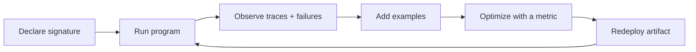

# DSPy

DSPy-style programming treats prompts as programs. Instead of writing one giant prompt and hoping the output format survives, you declare the shape of the task, run it against a model, observe failures, add examples, and optimize the program.

In Ax, the practical unit is a signature. A signature gives generation, validation, tools, traces, examples, optimizers, and generated language packages the same semantic contract.

```{{fence}}
{{dspyCode}}
```

That signature says the program receives `question` and must return both `answer` and `confidence`. Ax turns that contract into prompts, output parsing, validation, retries, traces, and optimization inputs.



## How Ax Splits The Work

Ax keeps the model boundary explicit:

- `ai()` owns provider setup, model selection, routing, streaming, media, embeddings, thinking, and usage.
- `s()` parses reusable signatures when you need to inspect or compose contracts.
- `ax()` runs a structured generation program from a signature.
- `agent()` runs an RLM agent where model-written actor steps use tools, child agents, discovery, memory, and a runtime session.
- `{{optimizeName}}` tunes programs with examples, metrics, GEPA, and Pareto-aware artifacts.

## Why It Matters

- Prompts become typed contracts instead of string piles.
- Examples and traces become reusable training and evaluation data.
- Validation failures are concrete, so retries can feed useful correction messages back into the model.
- Tools and agents share the same input/output vocabulary as generation.
- Generated language packages preserve the Ax semantic contract without pretending to transpile TypeScript.

## What Changes Compared To Prompt Strings

With a hand-written prompt, your app usually owns the fragile parts: output parsing, schema checks, retry prompts, examples, metrics, and logs. With Ax, those pieces attach to the program. The prompt is still there, but it is generated from a contract and can be optimized with measured feedback.

That is why Ax docs talk about programs instead of prompt templates. A program can be run, traced, tested, compiled with demos, and improved.

### From contract to generation

{{axToolsExample}}

### From examples to optimization

{{optimizeAxGenExample}}

## Where {{language}} Fits

TypeScript is the reference implementation. This {{language}} page swaps in language-specific install commands, snippets, and API names where the package surface differs. The goal is not to run the original TypeScript app in another language; generated packages expose native surfaces for the shared Ax semantic contract.

See [signatures]({{langRoot}}/concepts/signatures/) and [ax() generation]({{langRoot}}/subsystems/ax/).
