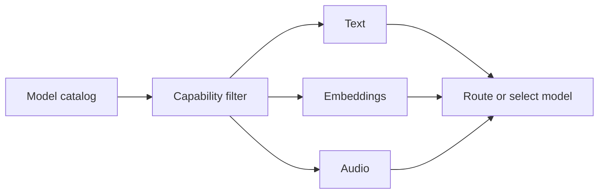
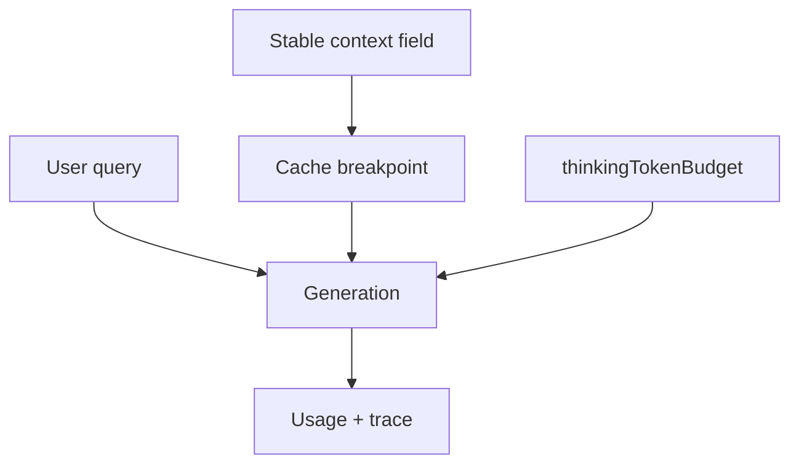

# LLMs

The `ai()` layer owns provider clients and model traffic. It keeps Ax programs focused on signatures while one provider surface handles chat, streaming, embeddings, media, usage normalization, thinking controls, routing, balancing, tracing, and provider-specific behavior.

```{{fence}}
{{llmCode}}
```



## Provider Setup

Create provider clients near the application boundary, keep keys in environment variables, and pass the client into `forward()`, agents, flows, or optimizers.

{{aiProviderExamples}}

## Model Catalog

Use the model catalog before runtime when a UI or router needs model choices, costs, and capabilities. It can filter for text, code, embedding, and audio models.

{{aiCatalogExample}}



## Routing And Balancing

Routers choose a provider by capability, model key, or app policy. Balancers retry across services while preserving the Ax request shape. Use them when latency, quota, cost, rate limits, or provider outages matter.

## Embeddings

Embeddings live on the same provider client surface. Use them for retrieval indexes, memory search, context lookup, and similarity workflows while keeping embedding model selection separate from generation model selection.

{{aiEmbeddingsExample}}

## Audio, Realtime, And Responses

Ax maps batch transcription, batch speech, conversational audio, OpenAI Responses audio, and realtime event folding where supported. Direct `ax(...)` programs can pass media to compatible models; agents usually transcribe audio before planner/executor/responder stages.

{{aiAudioExample}}

## Thinking And Context Caching

Thinking controls expose provider-specific reasoning budgets through one Ax option. Context caching marks stable prompt regions so providers with prefix caching can reuse expensive context.

{{aiThinkingExample}}



## Production Notes

- Keep provider keys outside source code.
- Prefer model aliases like `fast`, `smart`, or `cheap` when app callers should not know provider model IDs.
- Trace request latency, retries, token usage, cost, route choice, media mode, and model key.
- Keep provider-api examples separate from no-key examples.
- Use OpenAI-compatible clients for generated-language package examples when that is the supported provider path.

See [ai() LLM models]({{langRoot}}/subsystems/ai/) and [ai() API]({{langRoot}}/api/ai/).
