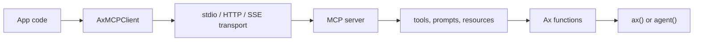

# MCP

Model Context Protocol is the clean boundary between Ax programs and external tool servers. An MCP server can expose tools, prompts, resources, and resource templates. Ax connects to the server, negotiates the protocol version, lists the available capabilities, and turns them into normal Ax functions.

That means MCP does not need a special prompt path. Once connected, MCP tools can be passed to `ax()` generation, grouped for `agent()` discovery, traced like other tools, and optimized as part of the same program behavior.



## Mental Model

MCP tools become typed host functions. Prompts get a `prompt_` prefix, resources get a `resource_` prefix, and resource templates become callable lookups. Function overrides let you rename or clarify server-provided names without editing the server.

## Local Stdio Servers

Use stdio for local MCP servers started as child processes. This is the common path for local memory, filesystem, or desktop-style tools.

{{mcpStdioExample}}

## Streamable HTTP Servers

Use streamable HTTP for remote services. This keeps Ax on the MCP wire protocol while the transport owns HTTP headers, session IDs, protocol headers, and provider-specific auth details.

{{mcpHttpExample}}

## OAuth-Capable Remote MCP

Remote MCP services can require OAuth. Keep client credentials in environment variables, use a real redirect endpoint in production, and persist tokens through the transport token store when the package surface supports it.

{{mcpOAuthExample}}

## No-Key Scripted Tests

Scripted transports are useful for deterministic examples, conformance, and docs. They exercise initialize, capability discovery, tool listing, tool calls, and `toFunction()` without hitting a network or needing provider credentials.

{{mcpScriptedExample}}

## Capabilities And Overrides

Capabilities tell you what the server exposed after initialization. Use them for diagnostics and for deciding whether the current server is usable for a workflow.

{{mcpCapabilitiesExample}}

Overrides let the application rename awkward MCP tool names, improve descriptions, or make a server fit an agent namespace without changing the MCP server.

{{mcpOverridesExample}}

## Use MCP With ax()

For direct structured generation, initialize the client and pass its functions to the program run. This is best when the task is one typed request and the model only needs a small tool set.

{{axMCPExample}}

## Use MCP With agent()

Agents can receive MCP tools directly or through grouped discovery modules. Use flat functions when the tool list is small. Use groups when a server exposes many tools and the actor should discover the right module before seeing every schema.

{{agentMCPFlatExample}}

{{agentMCPGroupedExample}}

## Production Notes

- Keep remote MCP endpoints on an allowlist and use SSRF protection for user-supplied URLs.
- Prefer narrow namespaces and clear selection criteria so small models can choose tools correctly.
- Treat MCP tools as side-effect boundaries: validate inputs, log calls, and make destructive operations explicit.
- Refresh capabilities when the server sends list-changed notifications.
- Trace MCP initialize, list, call, retry, error, and token-refresh behavior alongside model usage.
- Keep scripted MCP examples in the docs and test suite so package conformance does not depend on external servers.

See [Tools]({{langRoot}}/concepts/tools/), [ax() generation]({{langRoot}}/subsystems/ax/), [agent() agents]({{langRoot}}/subsystems/agent/), and [agent() API]({{langRoot}}/api/agent/).
