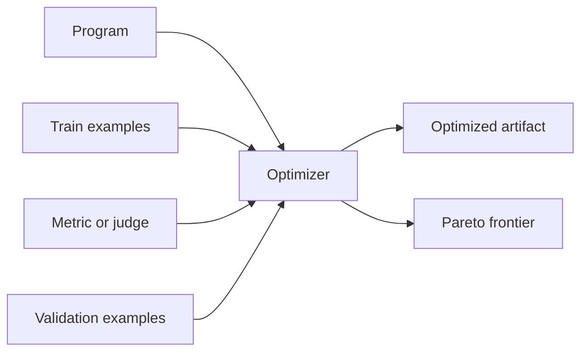

# Optimization

Optimization means measuring a program and improving the parts that affect quality: instructions, demos, tool descriptions, templates, component maps, or saved optimizer artifacts.

For TypeScript, use the top-level `optimize(...)` helper for normal AxGen and Flow tuning, and `agent.optimize(...)` for agent-specific tuning. Generated languages expose the AxIR-supported optimizer surface, usually around `AxGEPA` and artifact application.

```{{fence}}
{{optimizeCode}}
```

GEPA is useful when accuracy, cost, latency, brevity, tool-use quality, or policy quality are real tradeoffs. The output can be a Pareto frontier instead of one fake "best" prompt.



## What You Provide

- A program to tune.
- Training examples with the same input/output shape as the signature.
- A metric or judge that scores predictions.
- Optional validation examples for holdout selection.
- Student and teacher model settings where the language surface supports them.
- A `maxMetricCalls` bound so the optimizer cannot spend without limit.



## AxGen Example

Use this for a single structured generator. Keep the metric deterministic when the expected output is easy to score.

{{optimizeAxGenExample}}

## Flow Example

Flows expose multiple optimizable components. Use multi-objective metrics when a workflow must balance accuracy with brevity, cost, or latency.

{{optimizeFlowExample}}

## Agent Example

Use `agent.optimize(...)` for tool-use, clarification, delegation, and final-response behavior. The normal path starts with task records containing `input`, `criteria`, and optional `expectedActions` or `forbiddenActions`.

{{optimizeAgentExample}}

## Metrics And Judges

| Scoring path | Use when |
| --- | --- |
| Deterministic scalar metric | The expected answer or action is clear |
| Multi-objective metric | You need visible tradeoffs such as accuracy vs brevity |
| Plain typed `AxGen` judge | Non-agent qualitative scoring needs an LLM |
| Built-in `agent.optimize(...)` judge | Agent behavior needs holistic review |

Normalize scores to `0..1` when possible. Keep objective names stable across calls.

## Bootstrap And GEPA Together

Bootstrap demos are useful for small starter sets because they seed the model with concrete successful examples before GEPA mutates instructions/components. TypeScript `optimize(...)` composes the practical bootstrap-plus-GEPA path. Generated languages expose the optimizer primitives supported by their AxIR contract.

## Artifacts

Optimization output is model-adjacent configuration. Save it, version it, record the examples and metrics used, and apply it through the program or agent API rather than manually patching instructions.

{{optimizeArtifactExample}}

## Budget Discipline

- Always set `maxMetricCalls` in docs and examples.
- Use distinct validation examples when selecting a best candidate.
- Start with small `numTrials` and scale once the metric is stable.
- For trees, inspect optimized component keys so you know what changed.
- Persist artifacts only after a held-out or smoke run proves they help.

See [{{optimizeName}} GEPA]({{langRoot}}/subsystems/optimize/) and [optimize() API]({{langRoot}}/api/optimize/).
