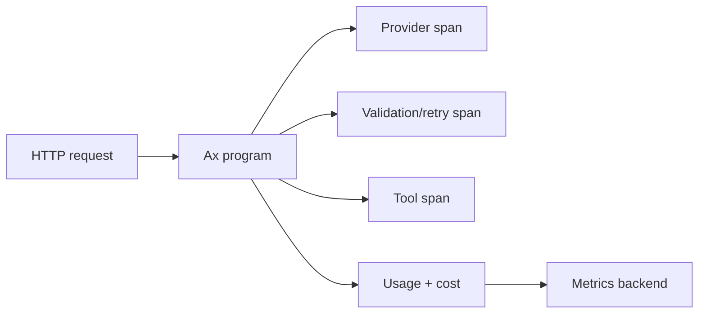

# Telemetry

Telemetry answers practical questions: what model was called, how long it took, how much it cost, what tools ran, where retries happened, and how optimization progressed.

```{{fence}}
{{telemetryCode}}
```

The TypeScript package has the richest OpenTelemetry surface. Generated packages expose the shared traces, usage, optimizer artifacts, and provider result data available in their AxIR contract.

## What To Track

- model calls and streaming events
- function/tool spans
- token usage and cost
- retries, failures, and provider routing choices
- optimizer rounds, Pareto candidates, and selected artifacts

## Tracing

Trace spans should answer where time went: provider calls, structured generation attempts, tool calls, agent actor turns, child-agent delegation, MCP calls, and optimizer rounds. Use trace labels to connect application routes, tenant IDs, model keys, and feature flags without burying that context inside prompts.



## Metrics

Metrics should answer whether production is healthy: request counts, latency histograms, error rates, token usage, estimated cost, validation failures, assertion retries, max-step exits, optimizer convergence, and Pareto front size.

## Usage And Cost

Usage is not just a provider response field. It becomes a program-level signal when a workflow retries, streams, calls tools, uses agents, or optimizes across examples. Track usage at the Ax layer so application owners see the full workflow cost instead of isolated model calls.

## Debugging Patterns

Use debug logs for local development, traces for request-level investigation, and metrics for aggregate health. When an output is wrong, inspect the signature, examples, validation feedback, tool calls, and final parsed object before changing provider settings.

### Agent observability

{{agentContextPolicyExample}}

Trace context pressure, actor turns, tool calls, discovery, recall, loaded skills, final typed outputs, and token usage together. The useful debugging question is not only "what did the model say?" but "what state, tools, evidence, and constraints did the agent act on?"

## Production Notes

Keep telemetry opt-in and configurable. Route traces and metrics to your existing OpenTelemetry backend when possible. Avoid logging secrets, raw API keys, or private user data in labels and span names.

See [ai() LLM models]({{langRoot}}/subsystems/ai/) and [{{optimizeName}} GEPA]({{langRoot}}/subsystems/optimize/).
