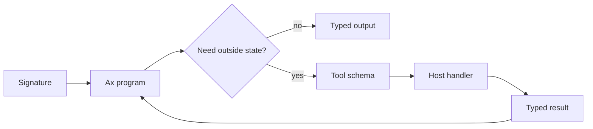
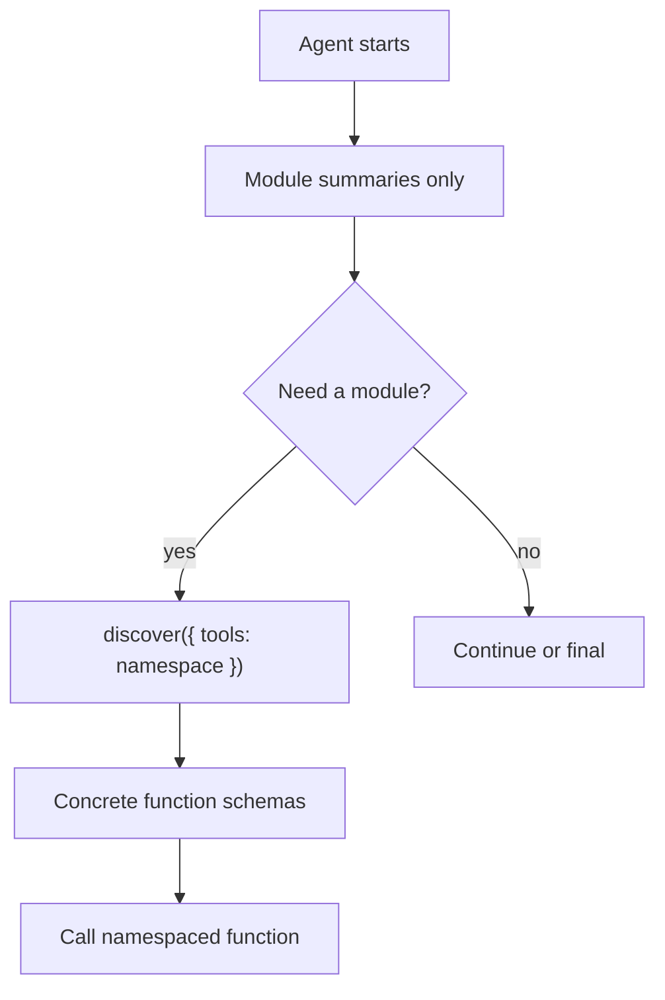

# Tools

Tools are typed host functions. They are how an Ax program reaches outside the model to search data, call APIs, write records, run code, invoke MCP servers, delegate to flows, or call child agents.

The useful rule is simple: keep the model responsible for choosing and composing actions, and keep real side effects in typed functions owned by your application.



## Basic Function Shape

In TypeScript, `fn()` is the reference builder for Ax tools. A function has a name, description, optional namespace, typed arguments, a typed return shape, optional examples, and a host-side handler.

{{toolsBasicExample}}

The builder methods map to the actual function contract:

| Method | Purpose |
| --- | --- |
| `.description(text)` | Explain when the model should use the tool |
| `.namespace(name)` | Put the tool under a runtime namespace such as `kb.search(...)` |
| `.arg(...)` | Add an input argument or whole object schema |
| `.returns(...)` | Return one value or an object schema |
| `.returnsField(...)` | Add named return fields one by one |
| `.example(...)` / `.examples(...)` | Show agent discovery examples for runtime calls |
| `.handler(fn)` | Run trusted host code |
| `.build()` | Produce the callable function object |

Descriptions matter. A tool named `lookup` with a vague description is hard for a small model to choose. A tool named `findPolicySnippets` with argument descriptions and examples gives the actor a narrow, testable move.

## Schemas And Validation

Tool schemas use the same field vocabulary as signatures. In TypeScript, arguments and returns can use Ax fluent fields or Standard Schema v1 validators such as zod, valibot, and arktype.

{{toolsStandardSchemaExample}}

Use fluent fields when you want the Ax-native vocabulary. Use Standard Schema when your application already owns a zod, valibot, or arktype contract and you want the handler argument type inferred from that schema.

## Namespaces

Namespaces keep the runtime surface readable. Instead of exposing one flat list of names, the actor can call `kb.findPolicy(...)`, `billing.lookupInvoice(...)`, or `team.writer(...)`.

{{toolsNamespacesExample}}

The default namespace is `utils` when no namespace is set. Avoid reserved agent runtime globals such as `inputs`, `llmQuery`, `final`, `askClarification`, `reportSuccess`, `reportFailure`, `inspectRuntime`, `discover`, and `recall`.

## Use Tools With ax()

Use direct `ax()` generation when the task is one structured request and the model only needs a small, obvious tool set.

{{toolsAxExample}}

Direct generation can call tools across multiple steps, validate tool outputs against the declared schema, retry malformed model output, and record usage/traces. It is not the right surface for a large changing tool catalog or a task that needs planning, memory, clarification, or delegation.

## Use Tools With agent()

Agents treat tools, child agents, MCP clients, and other function providers as callables. For a small stable set, pass them directly.

{{toolsAgentFlatExample}}

For large sets, use function groups and discovery. The actor starts with module summaries, then calls `discover(...)` to load the concrete schemas it needs.

{{toolsAgentGroupsExample}}



This is the reason Ax agents can handle very large tool catalogs. The prompt does not need every function definition up front. It can carry stable module-level selection criteria, load only the relevant functions, and keep the runtime state alive between actor turns.

## Function Groups

A function group is a module:

```text
{
  namespace,
  title,
  description,
  selectionCriteria,
  alwaysInclude,
  functions
}
```

Use groups when a catalog is big, generated, remote, or easier to reason about by domain. `selectionCriteria` tells the actor when to choose the module. `alwaysInclude: true` keeps a small group visible even when discovery is enabled. Keep `functions` either entirely flat or entirely grouped; the agent runtime rejects mixed shapes.

Child agents can be plain functions in the flat list. Inside a group, expose a child agent with `childAgent.getFunction()` so the group contains callable function objects.

## MCP, Runtimes, Flows, And Providers

Anything that can expose an Ax function can join the same callable surface:

- MCP clients convert server tools, prompts, resources, and templates into functions.
- `AxJSRuntime` can expose runtime functions for controlled code execution.
- Flows and child agents can be wrapped as callables for delegation.
- Application services can expose narrow host functions for database reads, writes, queues, payments, or email.

The model sees typed capabilities. Your host code owns credentials, authz, input validation, network policy, idempotency, retries, and audit logs.

## Production Notes

- Treat destructive tools as product APIs: validate arguments, authorize callers, log calls, and make irreversible actions explicit.
- Prefer narrow tools over one mega-tool with many modes.
- Give every tool a precise description and typed return shape.
- Use examples for agent-facing tools whose call shape is easy to misuse.
- Use discovery for large catalogs so small models choose modules before seeing detailed schemas.
- Trace tool calls, errors, retries, latency, token usage, and final typed outputs together.

See [Signatures]({{langRoot}}/concepts/signatures/), [ax() generation]({{langRoot}}/subsystems/ax/), [agent() agents]({{langRoot}}/subsystems/agent/), and [MCP]({{langRoot}}/concepts/mcp/).
