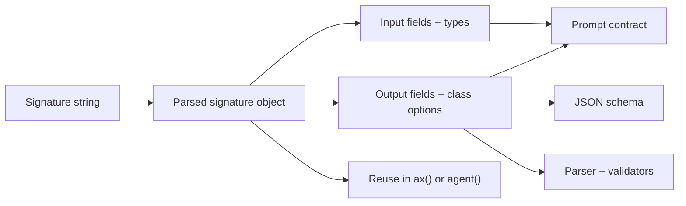

# s() Signatures

Use `s()` when you want a parsed signature object. Use the string form directly in `ax()` or `agent()` when you do not need to inspect or compose the signature.

```{{fence}}
{{signatureCode}}
```

Signatures are the contract shared by generation, tools, examples, validation, and optimizer traces.

## What It Does

`s()` parses the Ax signature grammar into a signature object. That object can be reused, inspected, extended, passed into `ax()`, passed into `agent()`, or combined with fluent/schema fields where the language surface supports it.



## Core Call Shape

```text
signature = s("input:type -> output:type")
program = ax(signature)
```

## Common Patterns

- Keep string signatures for simple contracts.
- Use parsed signatures when several programs share the same input/output shape.
- Use fluent/schema builders when field constraints matter.
- Use `class` fields for bounded labels instead of vague prose instructions.
- Use optional fields only when missing data is truly acceptable.
- Use internal outputs for model scratch structure that should not reach callers.

### Parsed string

{{signatureStringExample}}

### Fluent or native schema surface

{{signatureFluentExample}}

### Validation constraints

{{signatureValidationExample}}

## Production Notes

Treat signatures as API contracts. Renaming fields changes examples, traces, optimizer artifacts, and caller code. Prefer descriptive field names and validation over long prompt instructions.

See [s() API]({{langRoot}}/api/s/).
