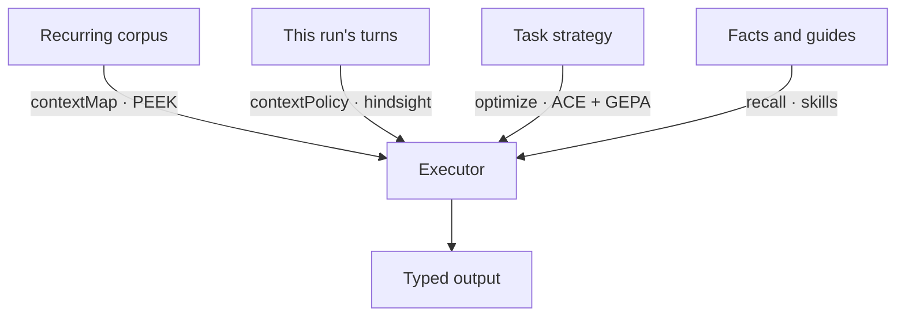

# Agent Internals

AxAgent is a small, opinionated runtime built from a handful of research ideas. This page explains how it works inside — the three-stage pipeline, the distinct *context objects* it manages, how trajectory compaction actually decides what the model sees again, and the papers each part comes from. For usage and patterns, start at [Agents]({{langRoot}}/agents/); this page is the "why it is shaped this way".

## The Three Stages

Every `forward()` runs three programs in sequence:



- **Distiller** normalizes the task and narrows large inputs down to the exact evidence the executor needs. It sees the executor's tool and skill catalogs (so it extracts the inputs those tools will consume) but cannot call them — reconnaissance, not execution.
- **Executor** runs the work: tool calls, discovery, memory recall, child agents, and the final envelope.
- **Responder** turns the executor's evidence into the declared output signature.

The handoff between stages is deliberately narrow. The completion primitive is `final(task, context?)` — exactly two arguments. Gathered evidence rides inside that optional `context` object; there is no separate side channel. Keeping the envelope to two positional arguments is what lets the same protocol run identically across every Ax language backend.

## The Shared Runtime Session

The distiller and executor run in **one runtime session**, not two. This is the difference between handing off a photocopy and handing off a shared drive: the distiller's `final(request, evidence)` leaves the evidence *in the session* and forwards only a compact shape summary. The executor reads the real values from `inputs.distilledContext` — they are already live — while its prompt carries just the summary (top-level keys, types, sizes, and the field names of array items). Generated language ports use the same prompt summary contract; JavaScript-capable runtimes share the session directly, and non-JavaScript runtimes preserve the same executor-facing shape with a fallback handoff.

Two consequences fall out of this:

- **Executor prompt size is decoupled from evidence size.** A 5-row slice and a 5,000-row slice produce the same small summary in the prompt; the data itself never inflates the context window. Whatever the distiller discovered (tool docs, loaded skills, recalled memories) carries forward too, so the executor starts warm instead of re-discovering.
- **The acting stage never has bulk untrusted context pasted into its prompt.** The stage that reads the raw long context has no tools; the stage with tools reads distilled values by reference. Untrusted content still reaches the model only through the one labeled, size-bounded action-log channel — the same guarantee, now structural.

Because the executor writes code against values it cannot see, the summary lists the real **field names** of the evidence (e.g. `item keys: id, vendorId, amountCents`). Without that, models guess field names — `amount` instead of `amountCents` — and silently produce zeros; with it they write against the actual shape. The same shape hints appear in `Context Metadata` for the raw context fields, which remain readable in the executor as a fallback when the distilled evidence is insufficient.

## The Context Objects

The most important internal idea is that "context" is not one thing. AxAgent manages four *distinct* objects, each with its own scope, lifetime, and mechanism — and each grounded in a different paper. Confusing them is the usual source of context-management mistakes.

| Object | Scope | Mechanism | Lineage | Ax surface |
| --- | --- | --- | --- | --- |
| **Context map** | a recurring external corpus (a repo, doc set, dataset) | persistent orientation cache, curated by distill → cartograph → evict | PEEK | `contextMap` |
| **Trajectory compaction** | one run's action log | hindsight ranking, tombstones, and checkpoints under a budget | RLM | `contextPolicy` presets |
| **Strategy playbook** | a task, learned offline | generation → reflection → curation into reusable bullets | ACE | `agent.optimize(...)` |
| **Instruction text** | a program, learned offline | reflective Pareto evolution of prompts | GEPA | `agent.optimize(...)` |
| **Retrieved facts & guides** | a turn | searched on demand, injected for one turn | — | `recall` / skills |

Two of these live at runtime (context map, trajectory compaction), two are offline optimizers (playbook, instructions), and one is per-turn retrieval. They compose rather than compete:

A useful rule of thumb: use a **context map** when many tasks ask different questions over the *same* large material; use a **context policy** when *one* long run needs its own history kept under control; use **optimization** to improve strategy or instructions offline; use **recall/skills** to pull in only what a single turn needs.

## Trajectory Compaction (Internals)

Within a single run, the executor's action log would grow without bound. The context policy decides what is replayed into the prompt each turn — without erasing runtime state, which stays alive in the session. The decision is made by **hindsight**: each step is scored *after it runs*, and the resulting plan keeps what still matters and compacts the rest.

- **Hindsight ranking** scores each completed step (foundational, pivot, dead-end, superseded) and ranks it 0–5. Low-value steps become eligible for compaction.
- **Tombstones** replace a resolved error (and its failed attempts) with one compact line, so the model remembers the lesson without re-reading the failure.
- **Checkpoints** summarize older trajectory into a structured ledger once the prompt crosses a budget threshold, while keeping recent working state verbatim.

Presets tune how aggressive this is:

| Preset | When to use |
| --- | --- |
| `full` | Short tasks, debugging, weaker models that need exact replay |
| `checkpointed` | General default for real multi-turn agent work |
| `adaptive` | Summarize older successful work sooner |
| `lean` | Very long runs with strong models and tight prompt pressure |

All of this is observable. The `onContextEvent` callback emits a `budget_check` every turn (with the live mutable prompt size and pressure level) plus `action_compacted`, `checkpoint_created`, and `tombstone_created` events. Aggregating that stream gives the headline numbers worth tracking: peak prompt size, compaction ratio, and cumulative tokens. Sweeping the presets on a long-horizon task is the cleanest way to see the tradeoff — raw replay keeps the most context but costs the most tokens, while the trimming presets cut peak size and token cost at some risk to answer completeness.

## Does It Hold Up?

Measured behavior — the reproducible grounded-audit example, the comparison against the prior pipeline, model guidance, and what we explicitly do not claim — lives on the [Performance]({{langRoot}}/agents/performance/) page.

## Lineage

- **DSPy** — declarative, typed model programs; the foundation for signatures and optimization.
- **RLM (Recursive Language Models)** — treat a long context as an external environment the model inspects through bounded, tool-mediated turns; the basis for runtime state and small-context turns.
- **PEEK** — context maps as persistent orientation knowledge about a recurring corpus.
- **ACE** — evolving context playbooks via generation, reflection, and curation; shipped as an optimizer alongside GEPA.
- **GEPA** — reflective prompt evolution over a Pareto frontier.

See the full [Research Map](/research/) for papers and how each maps to Ax.
