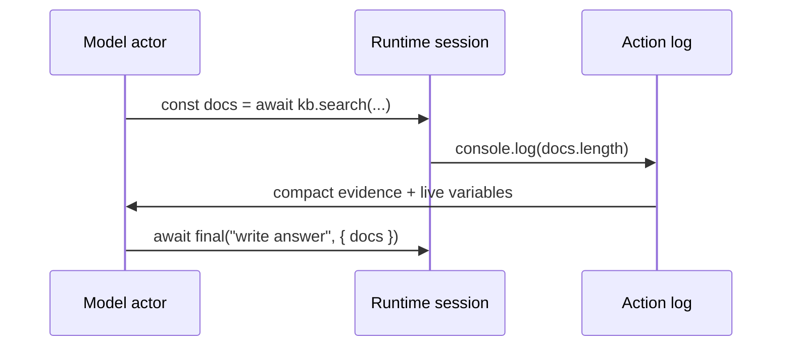
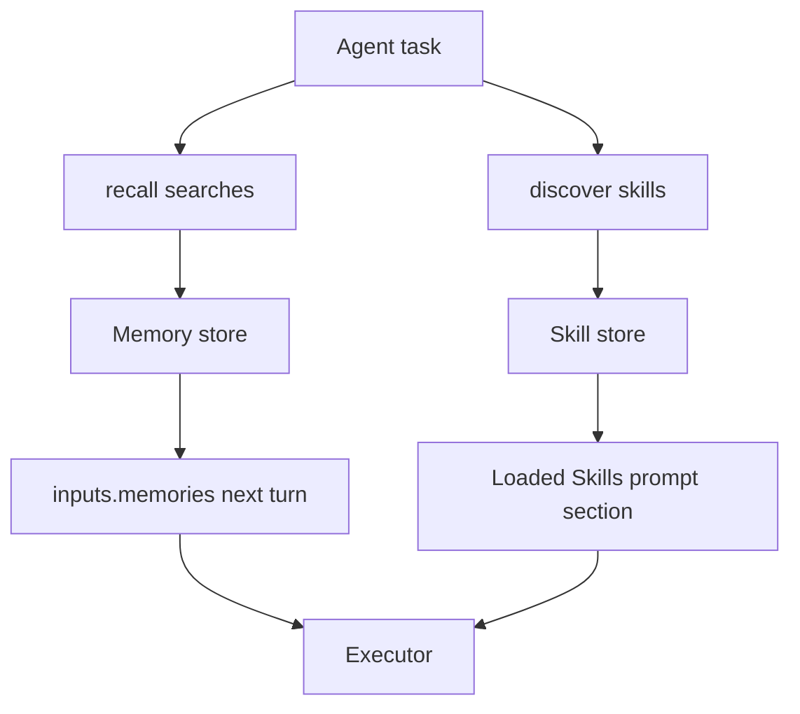

# Long-Horizon Agents

The full harness: bulky context that never bloats the prompt, runs that stay resumable, memory and skills loaded on demand, and behavior you can tune offline. Reach for this tier when the actor must inspect intermediate results, keep executable state alive, recover from failures, or answer many questions over the same large material.

{{agentLongHorizonExample}}

## Runtime-As-REPL

The defining move at this tier is RLM: the model does not emit one answer. It writes small runtime steps, Ax executes them in a persistent session, and the next turn sees compact evidence plus live variable state.



An actor turn should be one observable step: inspect, call a tool, log a result, or finish. Successful runtime values stay alive in the session even when older prompt replay is summarized.

## Context Fields: Data The Model Computes On, Not Reads

Declare bulky inputs as `contextFields` and they stay in the runtime session instead of the prompt. The distiller narrows them with code; its evidence passes to the executor **by reference** in the shared session when the runtime supports it, while the executor's prompt carries only a compact shape summary — real field names included, so the actor writes `t.amountCents`, not a guess. Generated language ports use the same executor prompt contract, with a fallback handoff for non-JavaScript runtimes. The prompt does not grow with your data, at any data size.

When the task needs no tools at all, the distiller can finish the run itself with `respond(task, evidence)` and the executor stage is skipped entirely — one fewer model round for pure read-and-synthesize questions (`directResponse`, ON by default; see [Internals]({{langRoot}}/agents/internals/)).

You don't have to catch every case by hand. `autoUpgrade` (ON by default) keeps any oversized input value runtime-only even when you forget to declare it — the prompt gets a truncated preview plus a shape summary while the full value stays live as `inputs.<field>`. Declare a field in `contextFields` when you want a specific inline policy, and set `autoUpgrade: false` to turn the automatic behavior off.

The Smart Defaults Agent in the [long-agent examples]({{langRoot}}/examples/long-agents/) shows that default-on path with runtime tools, relevance hints, and an oversized undeclared incident log in every generated language.

This is the property the [grounded-audit example](https://github.com/ax-llm/ax/blob/main/src/examples/agent-grounded-audit.ts) demonstrates end to end — a 250-row ledger the model never sees in its prompt, audited exactly. Measurements on the [Performance]({{langRoot}}/agents/performance/) page.

## Context Policy: Long Runs Under Control

Within one run, the action log would grow without bound. The context policy decides what gets replayed into the prompt each turn — without erasing runtime state.

| Preset | When to use |
| --- | --- |
| `full` | Short tasks, debugging, weaker models that need exact replay |
| `checkpointed` | General default for real multi-turn agent work |
| `adaptive` | Summarize older successful work sooner |
| `lean` | Very long runs with strong models and tight prompt pressure |

{{agentContextPolicyExample}}

Context maps are the complement for **repeated** runs: a persistent orientation cache over the same corpus (a repo, a document set, a system), so every new task starts oriented instead of exploring from scratch. Use a policy for one long run, a map for many runs over the same material.

## Memory And Skills

Memory and skill search let the actor load only what a task needs: memories are facts from an external store, recalled with `await recall([...])`; skills are procedural guides and runbooks, loaded with `await discover({ skills: [...] })`. Loaded/used callbacks tell you what the agent pulled in and what it claims it relied on.

{{agentMemoryExample}}

## Optimizing Agents

Long-horizon behavior is tunable offline. `agent.optimize(...)` evolves the actor's instructions against your metric on realistic task records — tool use, clarification behavior, delegation, and final quality all improve against examples that expose those tradeoffs.

{{agentOptimizeExample}}

Agents can also learn from their own failures at run time, with no dataset: attach a playbook at construction (TypeScript `playbook` option) and each run's error turns, dead-ends, and failing tool calls are curated into durable avoidance rules that ride the next run's prompt. See [Playbook]({{langRoot}}/concepts/playbook/).

## Observability

Everything above is observable: actor turns, tool calls, discovery, recalls, skill loads, child-agent calls, context pressure events, token usage, and costs. Long-horizon agents are production workflows; treat them like it. See [Telemetry]({{langRoot}}/concepts/telemetry/).

Runnable code: [long-horizon examples]({{langRoot}}/examples/long-agents/). How it works inside: [Internals]({{langRoot}}/agents/internals/). What we measured: [Performance]({{langRoot}}/agents/performance/).
