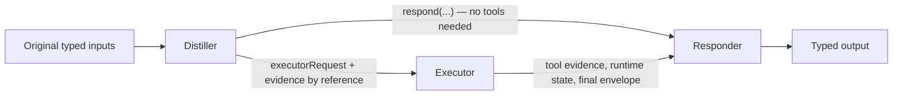

# Agents

Ax agents are typed programs that act: they use tools, child agents, a live runtime session, context policies, memory, skills, and discovery — then return a final response your code can trust, in the shape your signature declared.

```{{fence}}
{{agentCode}}
```

One harness scales across every size of job. `agent()` with nothing but a signature and a couple of tools already runs the full pipeline — including a runtime session — with zero configuration. The bigger tiers are the same harness with more of it switched on, so an agent grows by adding config, never by rewriting.

## Pick Your Size

| Tier | What it is | Reach for it when |
| --- | --- | --- |
| [Micro]({{langRoot}}/agents/micro/) | One signature, a few tools, typed reply | A single job with a couple of lookups or actions |
| [Standard]({{langRoot}}/agents/standard/) | Namespaced tools, child agents, discovery, clarification | Real workflows with growing tool catalogs and specialists |
| [Long-horizon]({{langRoot}}/agents/long-horizon/) | Large context, context policies, memory, skills, optimization | Bulky data, long runs, repeated work over the same material |

## Grounded By Construction

The design bet behind Ax agents is simple: **the model should compute on your data, not read it.** Bulky inputs live in a runtime session; the model writes small code steps against them; only compact evidence and live variable summaries enter the prompt. So the prompt does not grow with your data, grounding does not degrade as inputs get larger, and small, cheap models stay exact — a small Flash-class model reproduces a 250-row ledger audit to the cent, repeatably, in the checked-in [grounded-audit example](https://github.com/ax-llm/ax/blob/main/src/examples/agent-grounded-audit.ts). The [Performance]({{langRoot}}/agents/performance/) page shows the measurements and states exactly what we do and don't claim.

Grounding can also be made explicit: with `citations` enabled (TypeScript), the answer must cite which evidence entries support it, and the citations are validated against the ids that actually exist — an answer cannot point at evidence that was never collected.

## The Pipeline

Every `forward()` runs up to three stages:



- **Distiller** narrows large context down to the exact evidence the executor needs — reconnaissance, not execution.
- **Executor** runs the work: tool use, discovery, memory recall, child-agent calls, and final/clarification envelopes.
- **Responder** turns the executor evidence into the declared output signature.

The two runtime stages share one session, so evidence passes by reference and the executor's prompt carries only a compact shape summary of it. This is why Ax agents work well with smaller models: each turn is one observable step against live state, not a re-read of a long transcript. When a task needs no tools, the distiller answers directly and the executor stage is skipped (`directResponse`, on by default). [Internals]({{langRoot}}/agents/internals/) explains the stages, the context objects, and the research lineage.

## When Not To Use An Agent

Use `ax()` when one structured generation is enough — classification, extraction, a single transformation. Use an agent when the model must decide what to do next: call a tool, inspect a result, delegate, or ask for clarification.

## Where Next

- [Micro Agents]({{langRoot}}/agents/micro/) — the smallest thing that acts.
- [Standard Agents]({{langRoot}}/agents/standard/) — tools at scale, child agents, clarification.
- [Long-Horizon Agents]({{langRoot}}/agents/long-horizon/) — large context, policies, memory, skills, optimization.
- [Performance]({{langRoot}}/agents/performance/) — measured grounding and model guidance.
- [Internals]({{langRoot}}/agents/internals/) — how it works and why it is shaped this way.
- Runnable code: [agent examples]({{langRoot}}/examples/short-agents/), [long-horizon examples]({{langRoot}}/examples/long-agents/), and [Advanced Start]({{langRoot}}/advanced-start/).
