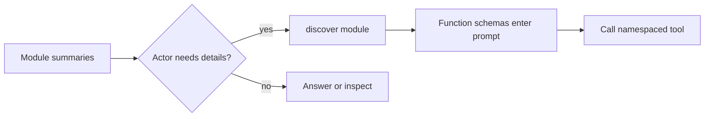

# Standard Agents

The workhorse tier: real workflows with namespaced tools, specialist child agents, structured outputs, and clarification when the request is ambiguous. Same harness as [micro]({{langRoot}}/agents/micro/), more of it switched on.

## Tools, Namespaces, And Child Agents

Host functions are tools. Child agents are also callables. Both live in the `functions` list, and namespaces keep the call surface readable: `kb.findPolicy(...)`, `email.sendEmail(...)`, `team.writer(...)`.

{{agentToolsExample}}

Use a child agent when a specialist should have its own signature, tools, runtime, or identity. Pass parent fields explicitly, or use input update callbacks when many child calls need shared values.



## Scaling The Tool Catalog

Small tool sets should stay flat — `functions: [findPolicy, writer, mcpClient]` — with every schema in the actor prompt. Flat inline tools are also the most reliable shape: the actor sees exact parameter names on every turn, which matters most on smaller models.

When the catalog grows past what belongs in one prompt, group tools into modules. A group has `namespace`, `title`, optional `description`, optional `selectionCriteria`, optional `alwaysInclude`, and `functions`. The actor sees module summaries first and calls `discover(...)` to load concrete schemas only when a module is actually needed.

{{agentDiscoveryExample}}

That is the trick behind very large Ax tool catalogs: the prompt carries the map, not every schema. This especially helps smaller models, which should not have to rank hundreds of function definitions in one prompt. An advisory relevance ranker flags the modules, skills, and memories most likely to matter for the current task, so the actor discovers the right module first. You usually don't set `functionDiscovery` yourself: `autoUpgrade` (ON by default) turns it on automatically once the inline tool docs get large. Set it explicitly to force the behavior either way.

The default ranker and smart-upgrade behavior are shared by the generated language packages as well as TypeScript; the Smart Defaults Agent in the [long-agent examples]({{langRoot}}/examples/long-agents/) is the copyable cross-language form.

Keep the top-level `functions` shape either flat or grouped — mixed plain functions and groups are rejected. In grouped mode, put `fn()` tools, MCP providers, and runtime providers inside groups; expose child agents with `childAgent.getFunction()`. MCP servers plug in as ordinary tools — see [MCP]({{langRoot}}/concepts/mcp/).

## Clarification And Resume

Agents ask instead of guessing. When required information is genuinely missing, `forward()` and `streamingForward()` throw a structured clarification error; the host saves state, asks the user, restores, and resumes. Use clarification when the missing fact changes the action, side effect, recipient, policy, or output contract.

## Chain-Of-Evidence Citations (TypeScript)

Answers can be required to point at the evidence that grounds them. With `citations: true`, the responder gains an optional `evidenceCitations` output listing the evidence ids the answer relies on — the keys of the evidence object the actor curated, plus the ids of loaded memories. Citations are validated against the ids that actually exist; an invalid citation re-prompts the responder through the standard validation-retry loop, and runs without evidence skip validation entirely. Use `citations: { surface: 'hidden', onCitations }` to keep the result shape pristine and read citations from the callback.

Be precise about the guarantee: validation proves every citation points at evidence that exists — the model cannot claim support from a source it never collected. It does not verify that the answer's claims match the cited evidence's content; that judgment stays with you (or a judge you add). Citation granularity follows how the actor curates evidence: one big `notes` blob yields one coarse citation, while separate keys per fact yield precise ones. TS-first: the five generated language ports do not ship citations yet.

Lineage: Self-RAG (citation-aware generation) and Attributed QA (attribution as a measurable property) — see the [Research Map](/research/).

## The Knobs That Matter Here

| Option | What it does |
| --- | --- |
| `functions` | Flat tools/child agents, or grouped discovery modules |
| `functionDiscovery` | Module summaries + on-demand `discover(...)` for big catalogs (auto-enabled by `autoUpgrade` for large catalogs) |
| `autoUpgrade` | Smart defaults, ON: auto-enable discovery for big catalogs, keep oversized inputs runtime-only |
| `citations` | Opt-in: answers must cite the evidence ids they rely on, validated in-pipeline |
| `agentIdentity` | Name, description, and namespace when this agent is someone's child |
| `maxTurns` | Upper bound on actor turns per forward |

## When To Graduate

Bulky input fields, long runs, repeated questions over the same material, or cross-run memory all point at the [long-horizon tier]({{langRoot}}/agents/long-horizon/) — context fields, context policies, maps, memory, and skills.

Runnable code: [agent examples]({{langRoot}}/examples/short-agents/), [Tools]({{langRoot}}/concepts/tools/), and the [agent() API]({{langRoot}}/api/agent/).
