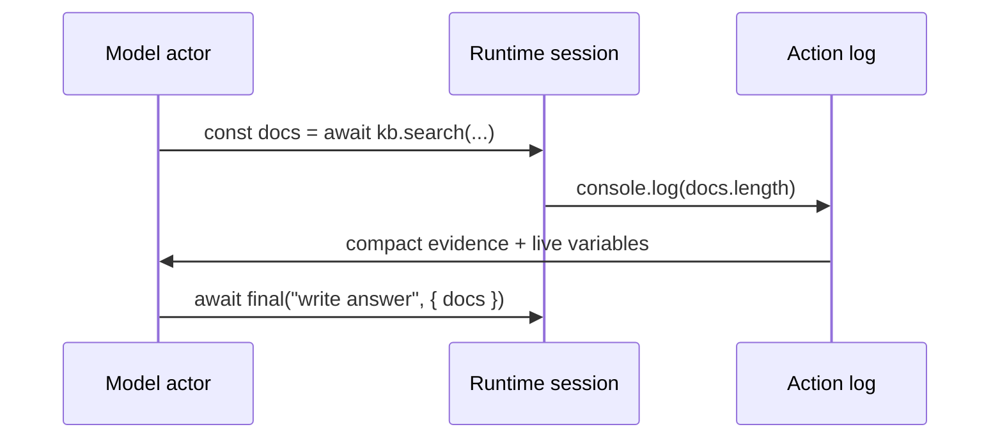
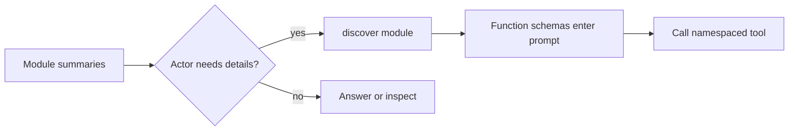
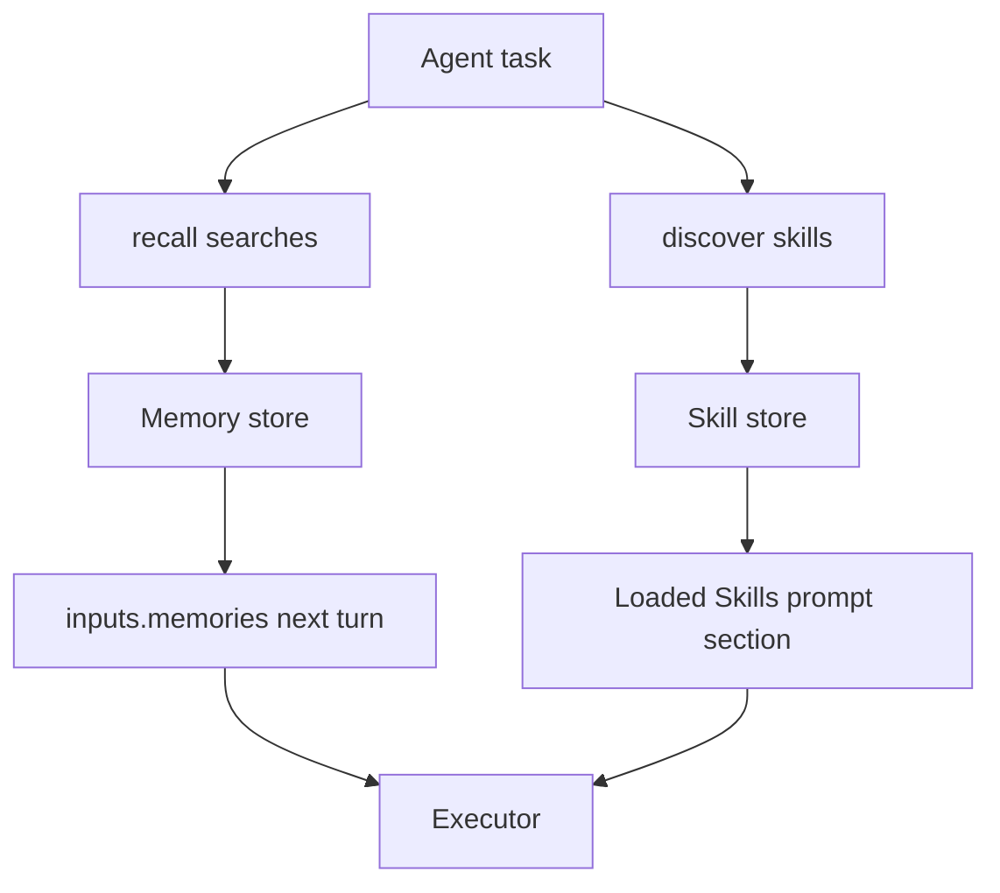

# Agents

Ax agents are typed programs that can use tools, child agents, runtime sessions, context policies, memory, skills, discovery, clarification, telemetry, and optimization before returning a final structured response.

```{{fence}}
{{agentCode}}
```

There are two common paths:

- **Short agents** compose a typed final answer with a small set of tools or child agents.
- **Long-horizon agents** use RLM runtime sessions, context policy, context maps, memory, skills, and optimizer artifacts to keep multi-step work resumable.

See [short agent examples]({{langRoot}}/examples/short-agents/) and [long-horizon agent examples]({{langRoot}}/examples/long-horizon-agents/).

The important design choice for long-horizon work is RLM: the model does not merely emit one answer. It writes small runtime steps, Ax executes those steps in a persistent session, and the next turn sees compact evidence plus live runtime state.



## The RLM Pipeline

Each `forward()` call runs three stages:


- **Distiller** normalizes the task and compresses large context into the exact executor request.
- **Executor** owns runtime state, tool use, discovery, memory recall, child-agent calls, and final/clarification envelopes.
- **Responder** turns the executor evidence into the declared output signature.

This is why Ax agents work well with smaller models. A smaller model can take one observable step, inspect a result, reuse live variables, and continue. It does not need to keep an entire long transcript in its immediate prompt.

## Short Agents

Use an agent when the model needs to decide what to do next. Use `ax()` when one structured generation is enough.

{{agentMinimalExample}}

Short agents should stay boring: one signature, a few tools or child agents, and a typed final response. Keep tool sets flat when every callable is obviously relevant.

## Long-Horizon Agents

Move to long-horizon agent patterns when the actor must inspect intermediate results, keep executable state alive, recover from tool/runtime failures, or answer many questions over the same large context.

## Runtime-As-REPL

An RLM actor turn should be one observable step: inspect, call a tool, log a result, or finish. Successful runtime values stay alive in the session even when older prompt replay is summarized.



Context policy controls what the actor sees again in the prompt. It does not erase runtime state.

{{agentContextPolicyExample}}

## Tools, Namespaces, And Child Agents

Host functions are tools. Child agents are also callables. Both can live in the `functions` list. Namespaces keep the runtime call surface readable: `kb.findPolicy(...)`, `email.sendEmail(...)`, `team.writer(...)`.

{{agentToolsExample}}

Use child agents when a specialist should have its own signature, tools, runtime, or identity. Pass parent fields explicitly or use input update callbacks when many child calls need shared values.



## Function Discovery

Small tool sets can be passed flat: `functions: [findPolicy, writer, mcpClient]`. That is best when every callable is obvious enough to keep in the actor prompt.

Large tool sets should be grouped into modules. A group has `namespace`, `title`, optional `description`, optional `selectionCriteria`, optional `alwaysInclude`, and `functions`. The actor sees module summaries first, then calls `discover(...)` to load concrete function definitions only when it needs them.

{{agentDiscoveryExample}}



That is the trick behind very large Ax agent tool catalogs: the prompt carries the map, not every tool schema. The model can choose a namespace from concise selection criteria, load only that module, call the concrete tool, and keep evidence in the runtime session. This is especially useful for smaller models because they do not have to rank hundreds of function definitions in one prompt.

Keep the top-level `functions` shape either flat or grouped. Mixed plain functions and groups are rejected. In grouped mode, put `fn()` tools, MCP providers, and runtime providers inside groups; expose child agents with `childAgent.getFunction()`.

## Clarification And Resume

Agents can ask for clarification instead of guessing. In public `forward()` and `streamingForward()` flows, clarification throws a structured clarification error. The host saves state, asks the user, restores the state, and resumes.

Use clarification when missing information changes the action, side effect, recipient, policy, or output contract. Do not burn context guessing.

## Context Management

Long-running agents need a context policy:

| Preset | When to use |
| --- | --- |
| `full` | Short tasks, debugging, weaker models that need exact replay |
| `checkpointed` | General default for real multi-turn agent work |
| `adaptive` | Summarize older successful work sooner |
| `lean` | Very long runs with strong models and tight prompt pressure |

Context maps are different: they are persistent orientation caches for repeated runs over the same long context, repository, document set, or system. Use them when many tasks ask different questions over the same material.

For concrete code, see [long-horizon agent examples]({{langRoot}}/examples/long-horizon-agents/).

## Memory And Skills

Memory and skill search let the actor load only what it needs.

{{agentMemoryExample}}



Memories are task-relevant facts from an external store. Skills are procedural guides, runbooks, or domain conventions. Loaded/used callbacks let the host trace what the agent loaded and what it claims it relied on.

## MCP And External Tools

MCP clients and other tool providers can be exposed as functions, either directly or inside grouped discovery modules. Put them under clear namespaces and selection criteria so the actor can choose them without seeing every schema on every turn.

## Observability

Trace actor turns, tool calls, discovery, memory recall, skill loads, child-agent calls, clarification, context pressure, token usage, costs, and final typed outputs. Agent behavior is production workflow behavior; it should be observable like one.

## Optimizing Agents

Agent optimization should use realistic task records. Tune tool use, clarification behavior, child-agent delegation, and final response quality against examples that expose those tradeoffs.

{{agentOptimizeExample}}

Use `agent.optimize(...)` for normal agent tuning. Use top-level `optimize(...)` for plain `ax()` programs and flows.

See [Tools]({{langRoot}}/concepts/tools/), [agent() agents]({{langRoot}}/subsystems/agent/), and [agent() API]({{langRoot}}/api/agent/).
