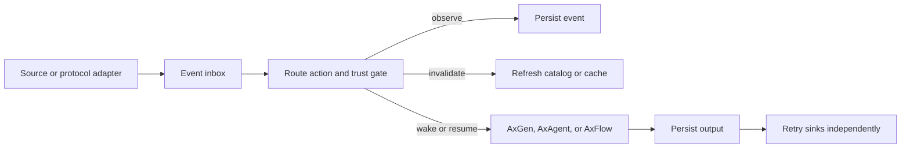

# Event Runtime

AxEventRuntime is the protocol-neutral layer for autonomous work:

`source → inbox → explicit route → AxGen/AxAgent/AxFlow → persisted output → sinks`

MCP subscriptions, UCP webhooks, timers, queues, and application events all use the same envelope, trust policy, continuation, cancellation, and tracing model. Source callbacks publish events; they never call a model directly.

## Wake

A `wake` route starts a typed target. `mapInput` is the only place event fields become program inputs; Ax never fabricates a user message from event data.

{{eventWakeExample}}

## Resume

A `resume` route atomically consumes an identity-scoped continuation. State envelopes carry schema and program versions; unsupported migrations dead-letter instead of crossing program versions silently.

{{eventResumeExample}}

## UCP Webhooks

The application owns HTTP hosting. `AxUCPWebhookEventSource.ingest(request)` verifies the signer profile, RFC 9421 signature, freshness, digest, and replay state before enqueue. Application identity mapping happens afterward and remains outside the business payload.

{{eventUCPExample}}

## Store Guarantees

`AxInMemoryEventStore` is volatile and single-worker. It is useful for development and retries within one process, but it makes no crash-recovery claim.

The Node-only SQLite store supplies transactional enqueue, output persistence, leases, fencing, compare-and-set state, and cooperating-process recovery for workers sharing a local SQLite file. It is not recommended on a network filesystem. Other stores must pass the event-store conformance kit before advertising persistent or multi-worker capability.

Output is persisted before sink dispatch. Sink retries use `(runId, sinkId)` idempotency keys and never repeat a completed model call. A possible post-side-effect crash becomes `outcome_unknown` rather than an automatic replay.

See [MCP]({{langRoot}}/concepts/mcp/) and the [Event Runtime maintainer guide](https://github.com/ax-llm/ax/blob/main/docs/EVENT_RUNTIME.md).
