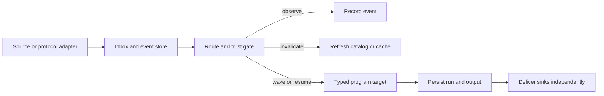

# Event Runtime

Things happen while your program is not running: an MCP resource changes, a
webhook arrives, a timer fires, or a queue delivers a message. `AxEventRuntime`
lets those events start or continue an Ax program without putting model calls
inside transport callbacks. For example, an inventory notification can enter
one durable pipeline, pass an authentication rule, and wake the one Agent that
is allowed to handle it.

`source → inbox → route → target → stored run → sinks`

```mermaid
flowchart LR
  Source["Source or protocol adapter"] --> Inbox["Inbox and event store"]
  Inbox --> Route["Route and trust gate"]
  Route -->|observe| Store["Record event"]
  Route -->|invalidate| Cache["Refresh catalog or cache"]
  Route -->|wake or resume| Target["Typed program target"]
  Target --> Run["Persist run and output"]
  Run --> Sinks["Deliver sinks independently"]
```

## The Pipeline At A Glance

A **source** receives activity from one transport and publishes it into the
runtime. MCP listeners, UCP webhook adapters, timers, queues, and application
code can all be sources. A source callback only publishes; it never invokes a
model itself.

Each source creates an **envelope**: a CloudEvents-style record with an ID,
source, type, optional subject and correlation values, plus JSON-only `data`.
The adapter attaches identity and trust after it authenticates the caller;
credentials and identity never come from the event's business data.

The **inbox and event store** accept the envelope before work begins. A
**route** then matches its type, source, identity, and optional instance key.
The route is the authorization boundary and chooses exactly one action:

- `observe` records or forwards telemetry without calling a model.
- `invalidate` refreshes a declared catalog or cache without calling a model.
- `wake` starts a new target run.
- `resume` continues the run that owns a matching continuation.

A **target** combines an AxGen, AxAgent, or AxFlow with its AI, input plan,
retry policy, and output sinks. The runtime writes a **run record** containing
the delivery state and final output before a **sink** sends that output to a
database, queue, callback, or other destination.

The core rule is simple: an event invokes a model only when a route you wrote
chooses `wake` or `resume`.

## Wake: Start A Program From An Event

A `wake` route starts a new run. This minimal assembly creates a source, maps
the event into the program's signature, and explicitly authorizes the wake:

{{eventWakeExample}}

Route matching should be as narrow as the application boundary requires. In
TypeScript, `.types()` matches event types, `.sources()` restricts producers,
`.authenticated()` rejects anonymous ingress, and `.instanceKey()` selects the
logical program instance. Generated packages express the same policy through
their route fields and builders.

The program signature is the destination contract. An input plan uses
`.project()` for same-name fields and `.field()` for explicit mappings.
`eventPath` values are **segment-safe descriptors**: typed path segments such
as event data, subject, or continuation metadata, not dotted JSONPath strings.
Generated packages expose equivalent path and input builders. If a required
field is missing or has the wrong type, the runtime creates a **dead letter**—a
stored delivery that cannot continue without inspection or correction—before
the program is invoked. It never fabricates a user message from raw event data.

If one event should wake several Agents, write several matching routes. Each
Agent then keeps independent authorization, ordering, retries, cancellation,
and run records.

## Resume: Continue A Paused Run

Some runs start external work and must wait for a later event. The first run
registers a **continuation**, which is durable correlation intent owned by that
run. A target can declare `.waitFor(...)`; code already running inside a target
can call `eventContext.registerContinuation(...)`. A later `resume` route uses
the event's correlation value to find and restore the owner.

{{eventResumeExample}}

Continuation matching is **identity-scoped**: a correlation value for one
tenant cannot resume another tenant's run. Consumption is atomic, so two
workers cannot fire the same continuation twice. A missing, ambiguous, or
expired continuation becomes a dead letter; it never turns into fresh work.

Targets may use separate `wakeInput` and `resumeInput` plans because the first
event and the returning event often carry different shapes. The action-specific
plan wins, and neither action silently falls back to the other. Stored program
state also carries schema and program versions; when a required migration is
missing, the runtime dead-letters the delivery instead of crossing versions
silently.

## Webhooks: Verify Before Enqueue

The application still owns the HTTP server and route. The TypeScript package
ships `AxUCPWebhookEventSource`: its `ingest(request)` method verifies the
signer profile, RFC 9421 signature, freshness window, body digest, key rotation,
and replay state before it enqueues anything. Only after verification does the
application map the order to a tenant or account identity.

{{eventUCPExample}}

The UCP source declares `requiresDurable`. Startup refuses a volatile store
unless the application explicitly sets `allowVolatile: true`, because a
webhook must not be acknowledged before the application has accepted the risk
of losing it. Generated packages expose the same host-owned source and publish
boundary; their snippet above is an illustrative adapter shape rather than the
TypeScript UCP client.

## Durability And Delivery

`AxInMemoryEventStore` is volatile and single-process. It is useful for local
development and process-lifetime retries. When its queue or payload limits are
reached, publication throws `AxEventBackpressureError` instead of silently
dropping the event.

The Node-only `AxSQLiteEventStore` provides transactional enqueue, output
persistence, and recovery for cooperating processes sharing one local SQLite
file. A **lease** gives one worker temporary ownership of a delivery. A
monotonically increasing **fencing token** prevents an older, stalled worker
from writing after a newer worker takes over. Do not place this store on a
network filesystem. Any other persistent or multi-worker store must pass the
event-store conformance kit before advertising those capabilities.

The runtime persists output before dispatching sinks. Sink retries use the
stable `(runId, sinkId)` key and redrive only the failed sink; they never repeat
a completed model call. If a worker crashes after a side effect may have
happened but before success was recorded, the run becomes `outcome_unknown`
instead of being replayed blindly.

Delivery is strictly ordered per target instance by default. Use `debounceMs`
to delay a route and add `coalesce: 'latest'` only when replacing intermediate
events is correct for that route. Declare `retrySafety: 'idempotent'` only when
stable delivery keys protect every possible side effect.

`cancelRun(runId)` aborts an active program and its nested calls. `close()`
stops sources, drains by default, and then aborts remaining workers; caller-owned
protocol clients must still be closed by the caller. For deterministic tests,
`AxManualEventClock` advances retries, debounce windows, and continuation
expiry without waiting for wall-clock time.

## Generated Languages

Generated Python, Java, C++, Go, and Rust packages use the same deterministic
single-worker state machine and conformance rules. Their runtime is inline:
`publish()` drains work due at the current clock, while the host schedules
`runDue()` from `nextDueAt()` for delayed retries, debounce, and expiry. There
is no hidden worker thread. The packages cover continuations, state restoration,
cooperative cancellation, dead letters, output-before-sink ordering, and
sink-only redrive; persistent multi-worker support requires a separately
conforming store.

See [MCP]({{langRoot}}/concepts/mcp/), [MCP Subscriptions]({{langRoot}}/concepts/mcp-subscriptions/), and the [Event Runtime maintainer guide](https://github.com/ax-llm/ax/blob/main/docs/EVENT_RUNTIME.md).
