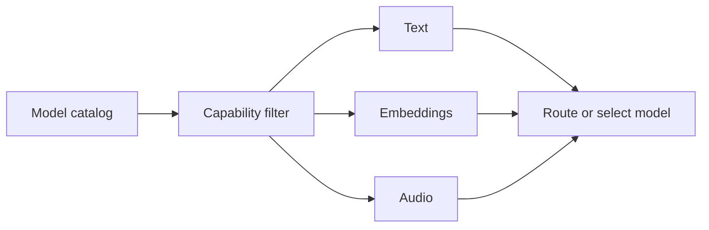
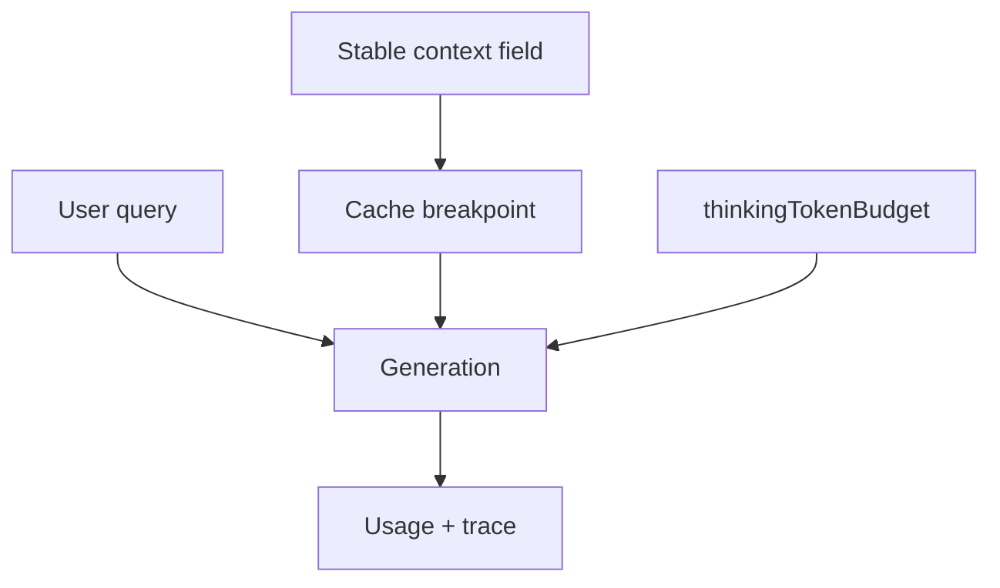

# LLMs

The `ai()` layer owns provider clients and model traffic. It keeps Ax programs focused on signatures while one provider surface handles chat, streaming, embeddings, media, usage normalization, thinking controls, routing, balancing, tracing, and provider-specific behavior.

```{{fence}}
{{llmCode}}
```



## Provider Setup

Create provider clients near the application boundary, keep keys in environment variables, and pass the client into `forward()`, agents, flows, or optimizers.

{{aiProviderExamples}}

## Model Catalog

Use the model catalog before runtime when a UI or router needs model choices, costs, and capabilities. It can filter for text, code, embedding, and audio models, and reports provider/model portable thinking levels plus verified explicit service tiers. Provider capabilities describe the default deployment profile; static model entries carry their resolved capability arrays.

{{aiCatalogExample}}



## Routing And Balancing

Routing has two distinct jobs. The multi-service router combines provider model lists and dispatches the model key the caller already chose; it does not select a model. `AxBalancer` handles equivalent services behind shared model aliases, preserving the Ax request shape while applying capability filters and provider failover.

`ProviderRouter` selects by request capability and degrades media only when the
selected provider cannot handle it. An image-capable provider receives native
image parts unchanged, including their payload, MIME type, detail level, cache
and optimization hints, alt text, and ordering with surrounding text.

Every supported language can opt into adaptive `AxBalancer` routing. It learns transient provider failure rate and successful latency, then weighs the probability of a failure or deadline miss against estimated request cost. This is operational provider selection, not semantic prompt-to-model selection, so every model behind an alias must be an acceptable substitute.

{{aiBalancerExample}}

## Embeddings

Embeddings live on the same provider client surface. Use them for retrieval indexes, memory search, context lookup, and similarity workflows while keeping embedding model selection separate from generation model selection.

{{aiEmbeddingsExample}}

## Audio, Realtime, And Responses

Ax maps batch transcription, batch speech, conversational audio, OpenAI Responses audio, and realtime event folding where supported. Direct `ax(...)` programs can pass media to compatible models; agents usually transcribe audio before planner/executor/responder stages.

{{aiAudioExample}}

## Thinking And Context Caching

Thinking controls expose provider-specific reasoning budgets through one Ax option. Context caching marks stable prompt regions so providers with prefix caching can reuse expensive context.

For OpenAI GPT-5.6 Chat, Ax emits explicit stable message breakpoints only when
caching is requested and forwards `promptCacheKey` from AxGen. Older models,
Azure, Responses, and uncached calls keep their existing request shape. For
Vertex Gemini and Anthropic, project and region select global, US/EU
multi-region, or regional routes; bearer-token lifecycle remains host-owned.

{{aiThinkingExample}}



## Production Notes

- Keep provider keys outside source code.
- Ax-managed Gemini caches recover from failed TTL refreshes by recreating or going uncached; a provider-rejected stale cache receives one bounded uncached retry.
- Use the same stable OpenAI prompt-cache key for one append-only conversation; changing the key or early message breakpoints forfeits reuse.
- Namespace external context-cache registry keys by a required tenant/account ID when cross-account sharing is unsafe; use the provider expiry for the backing-store TTL.
- Prefer model aliases like `fast`, `smart`, or `cheap` when app callers should not know provider model IDs.
- Trace request latency, retries, token usage, cost, route choice, media mode, and model key.
- Keep public provider examples separate from internal conformance fixtures.
- Use OpenAI-compatible clients for generated-language package examples when that is the supported provider path.

See [ai() LLM models]({{langRoot}}/subsystems/ai/) and [ai() API]({{langRoot}}/api/ai/).
