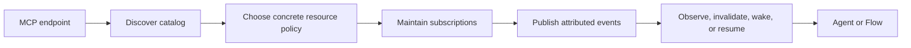

# MCP Catalog Discovery And Subscriptions

Suppose an MCP server owns a changing inventory resource and your Agent should
react when that resource changes. The endpoint URL alone does not tell the
application which resources exist, which ones this tenant may follow, or which
notification is allowed to start the Agent. Ax keeps those as three visible
decisions: discover the catalog, choose subscriptions, then route events.

`endpoint → catalog → subscription policy → maintained subscriptions → event runtime → explicit route`

The separation is deliberate: discovery does not subscribe, subscription does
not wake a model, and an MCP session does not prove application tenant
identity.

## Discover The Catalog

`inspectCatalog()` initializes or classifies the client once, follows bounded
pagination, and returns a deep-cloned snapshot. The snapshot includes the
namespace, protocol version, revision, server identity and capabilities, tools,
prompts, concrete resources, URI templates, and current logical subscriptions.
Modern snapshots also include catalog TTL and cache scope. Pass
`{ refresh: true }` (or the language equivalent) to force a round trip; use
`discover()` when TypeScript code specifically needs modern server-wide
discovery metadata.

{{mcpNativeExample}}

A **concrete resource** has a URI that can be selected immediately, such as
`inventory://warehouse/current`. A **URI template** describes a family, such
as `inventory://warehouse/{warehouseId}`. Ax never expands templates
automatically: application code must choose authorized arguments and construct
the concrete URI. MCP completion can suggest an argument value, but a
suggestion is not authorization to read or subscribe.

## Choose A Subscription Policy

Resource subscription policy defaults to **none**. That least-privilege default
avoids unexpected notification volume and prevents newly discovered resources
from silently entering the application. Task, progress, logging, and catalog
events can still flow when the server and listener support them.

- **All** selects every discovered concrete resource. Use it only when the
  endpoint is trusted and its entire concrete catalog is appropriate for the
  current application identity.
- **Selector** evaluates resource name, URI, description, MIME type,
  annotations, and the surrounding catalog. This is the normal production
  choice for a stable policy that follows catalog changes.
- **URI list** supplies dynamic or application-constructed concrete URIs. Use
  it when authorization has already selected exact resource instances.
- **None** receives non-resource MCP events without owning resource
  subscriptions.

Neither all nor selector policies expand URI templates. If a selector throws
during a catalog change, Ax reports the error and keeps the prior known-good
selection. If only part of a wire update succeeds, Ax retains those successful
transitions and retries the incomplete work on the next change or reconnect.

{{mcpResourceWakeExample}}

## Route Notifications To Your Agent

`AxMCPEventSource` publishes attributed but untrusted envelopes into
`AxEventRuntime`; it never invokes a model or turns a notification into a user
message. In TypeScript, `axMCPEventRoutes({ client })` supplies safe defaults:
progress and logs are observed, catalog changes invalidate the cached catalog,
and task events resume only a continuation owned by that task. Generated
packages express the same actions with explicit route records.

Resource updates intentionally have no default wake. Add an authenticated
`mcp.resource.updated` route and a signature-aware input plan for every Agent
that should run. The [Event Runtime]({{langRoot}}/concepts/event-runtime/) page
explains route matching, input validation, identity-scoped continuations,
ordering, retries, and sinks.

## Subscription Lifecycle

Each manual subscription, event source, and restored intent is a separate
**logical owner** of a resource URI. Ownership lets several components share
one client safely: the first acquisition adds the URI to the wire selection,
and the final release removes it. In the legacy era those transitions send
`resources/subscribe` and `resources/unsubscribe`; in the modern era they
update the desired `subscriptions/listen` filter. Closing one source releases
only its ownership and cannot break another source or manual subscriber.

After `notifications/resources/list_changed`, a managed source:

1. refreshes the catalog;
2. recomputes its concrete resource selection;
3. subscribes to additions and unsubscribes from removals;
4. publishes the catalog-change event to the runtime.

Reconnect preserves intent. A legacy GET/SSE listener resumes with
`Last-Event-ID` when available and restores currently owned URIs exactly once.
A modern client closes the previous response stream and starts a fresh
`subscriptions/listen` POST with a new request ID, no `Last-Event-ID`, and its
current catalog, resource, and known-task interests.

Close the runtime or source before the caller-owned client. That order leaves
the connection available for final legacy unsubscribe requests or modern
listen-filter updates. The [MCP concept page]({{langRoot}}/concepts/mcp/)
explains the legacy and modern protocol eras in detail.

## Tasks Are Independent Of Resource Policy

Resource policy does not control MCP task notifications. When an event-driven
tool call creates a task, Ax qualifies it as `namespace:taskId` and records the
continuation that owns it. Progress is observed without a model call;
`input_required` and terminal task states can resume that owner.

{{mcpTaskResumeExample}}

Keep polling with the MCP task APIs as a fallback. Task notifications are
optional, so a server may require `tasks/get` until the task reaches a terminal
state.

## Identity And Network Safety

Derive event identity from verified application authentication, such as an
OAuth token-to-account mapping, not from the MCP session ID. Without that
mapping, notifications stay anonymous and cannot match authenticated routes.
Treat catalog metadata, resource contents, annotations, and notifications as
untrusted remote content even after subscription.

Secure HTTP and SSRF defaults remain enabled for remote endpoints. A controlled
localhost demo may explicitly allow loopback HTTP; never copy that relaxation
to an arbitrary endpoint.

## Troubleshooting

### The Catalog Is Empty

Force a refresh, inspect the negotiated capabilities and authentication scopes,
and check whether the server exposes URI templates but no concrete resources.

### Templates Exist But No Subscription Starts

Templates are never auto-expanded. Construct an authorized concrete URI and
pass it through a URI-list policy.

### Ax Reports That Resource Subscriptions Are Unsupported

The server lists resources but does not advertise resource subscription
support. Ax rejects the explicit policy instead of pretending notifications
will arrive; catalog, task, logging, and progress events may still work.

### Notifications Never Arrive

Confirm that runtime startup completed, the legacy GET/SSE or modern
`subscriptions/listen` path is connected, the server emits notifications, the
resource policy selected the expected URI, and the route source, type, identity,
and localhost network policy all match. On shutdown, close the runtime or
source before the client.

### A Notification Arrives But No Agent Runs

That is the safe default. Add an explicit authenticated wake route and input
plan. Progress and logs default to observe, catalog changes to invalidate, and
only task events with a matching owned continuation to resume.

See [MCP]({{langRoot}}/concepts/mcp/), [Event Runtime]({{langRoot}}/concepts/event-runtime/), and the [complete maintainer guide](https://github.com/ax-llm/ax/blob/main/docs/MCP_SUBSCRIPTIONS.md).
