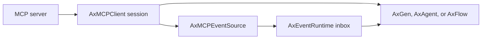

# MCP

MCP is a native Ax execution surface. Attach a live `AxMCPClient` with `mcp`; AxGen, AxAgent, and AxFlow retain the owning session, qualified tool identity, structured content, tasks, cancellation, and tracing. The compatibility-only function adapter is lossy and is not used by native execution.



## Native Tools

The client negotiates capabilities once and Ax maps native tool definitions at each model step. Catalog-change notifications refresh only the affected definitions.

{{mcpNativeExample}}

## Subscriptions Can Wake Programs

`AxMCPEventSource` converts protocol notifications into normal event ingress. A notification is durable before acknowledgement when the configured store supports it. Nothing wakes a model until an explicit authenticated route selects `wake`.

{{mcpResourceWakeExample}}

MCP sessions do not establish application tenant identity. Supply identity from the OAuth-token or account mapping. Unmapped notifications remain anonymous and cannot match routes requiring authentication.

## Tasks Resume Continuations

Task progress and logs default to `observe`. An `input_required` or terminal task event correlates as `namespace:taskId` and can atomically consume the continuation owned by a prior AxFlow or Agent run. Polling remains available because MCP task notifications are optional.

{{mcpTaskResumeExample}}

## Transports, Authentication, And Server Requests

Ax supports stdio, Streamable HTTP, legacy HTTP/SSE, resumable SSE, and custom WebSocket transports. Native clients also expose prompts, resources, templates, subscriptions, completions, roots, sampling, elicitation, progress, cancellation, experimental tasks, OAuth, MCP Apps, client credentials, and enterprise-managed authorization.

Transport listeners are supervised and nonblocking. Reconnect restores logical subscriptions; caller-owned clients remain caller-owned and must be closed.

## Safety

- Treat prompt and resource content as attributed, untrusted context.
- Require application identity for tenant routes; never derive it from an MCP session id.
- Authorize side-effecting tools from annotations, arguments, task context, and caller identity.
- Do not blindly replay an uncertain post-side-effect failure.
- Use recording/replay or a sandbox for optimization and evaluation.

See [Event Runtime]({{langRoot}}/concepts/event-runtime/), [Tools]({{langRoot}}/concepts/tools/), [ax() generation]({{langRoot}}/subsystems/ax/), and [agent() agents]({{langRoot}}/subsystems/agent/).
