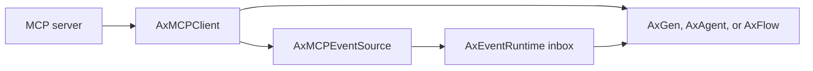

# MCP

MCP is a native Ax execution surface. Attach a live `AxMCPClient` with `mcp`; AxGen, AxAgent, and AxFlow retain the owning protocol state, qualified tool identity, structured content, tasks, cancellation, and tracing. The compatibility-only function adapter is lossy and is not used by native execution.



```mermaid
flowchart LR
  Server["MCP server"] --> Client["AxMCPClient"]
  Client --> Program["AxGen, AxAgent, or AxFlow"]
  Client --> Events["AxMCPEventSource"]
  Events --> Inbox["AxEventRuntime inbox"]
  Inbox --> Program
```

## Stateful And Stateless Eras

The TypeScript client supports both stateful MCP `2025-11-25` and stateless
MCP `2026-07-28`. Automatic era classification is the default. Legacy servers
initialize a session; modern servers answer `server/discover` and receive the
protocol version, method, operation name, client metadata, and tracing context
on every request.

The generated Python, Java, C++, Go, and Rust packages use the same automatic
dual-era classification and modern discovery boundary. Their language-specific
snippet below shows the native spelling.

{{mcpEraExample}}

`discover()` performs classification but returns only for a modern endpoint.
Use `inspectCatalog()` for code that must work in either era.

## Native Tools

The client negotiates capabilities and Ax maps native tool definitions at each
model step. Modern catalog results carry TTL and cache scope. A tool may map
schema properties to request headers with `x-mcp-header`; Ax validates those
annotations and keeps the body and headers synchronized.

{{mcpNativeExample}}

## Multi Round-Trip Input

Modern operations may pause with `input_required`. TypeScript can fulfill
roots, sampling, and elicitation through host handlers. The generated Python,
Java, C++, Go, and Rust clients fulfill roots automatically and elicitation
through a host callback; they deliberately do not advertise sampling and reject
a truthy sampling option during initialization.

{{mcpMRTRExample}}

## Subscriptions Can Wake Programs

`AxMCPEventSource` converts protocol notifications into normal event ingress. A notification is durable before acknowledgement when the configured store supports it. Nothing wakes a model until an explicit authenticated route selects `wake`.

The endpoint is only the address. `inspectCatalog()` discovers server-owned
resource names and URIs, while an explicit none/all/URI/selector policy decides
what the source maintains. Legacy clients use subscription requests and
resumable GET/SSE; modern clients put their interests in a long-running
`subscriptions/listen` POST. See [MCP Subscriptions]({{langRoot}}/concepts/mcp-subscriptions/) for catalog selection, URI templates, ownership, reconnect, and troubleshooting.

{{mcpResourceWakeExample}}

MCP sessions do not establish application tenant identity. Supply identity from the OAuth-token or account mapping. Unmapped notifications remain anonymous and cannot match routes requiring authentication.

## Tasks Resume Continuations

Modern Tasks v2 work is server-directed. `callTool()` auto-awaits an unsolicited
task by default; applications can expose it, submit requested input with
`provideTaskInput()`, or cancel it. Task progress and logs default to `observe`.
An `input_required` or terminal task event correlates as `namespace:taskId` and
can atomically consume the continuation owned by a prior AxFlow or Agent run.
Polling remains available because MCP task notifications are optional.

{{mcpTaskResumeExample}}

## Transports, Authentication, And Server Requests

Ax supports stdio, Streamable HTTP, legacy HTTP/SSE, and custom WebSocket
transports. Native clients also expose prompts, resources, templates,
subscriptions, completions, roots, elicitation, multi round-trip requests
(MRTR), progress, cancellation, Tasks v2, OAuth, MCP Apps, client credentials,
and enterprise-managed authorization. Sampling and legacy inbound elicitation
remain TypeScript-only.

Transport listeners are supervised and nonblocking. Legacy reconnect resumes
with `Last-Event-ID` when available and restores logical subscriptions. Modern
reconnect issues a fresh `subscriptions/listen` request without session or
resume headers. Caller-owned clients remain caller-owned and must be closed.

## Safety

- Treat prompt and resource content as attributed, untrusted context.
- Require application identity for tenant routes; never derive it from an MCP session id.
- Authorize side-effecting tools from annotations, arguments, task context, and caller identity.
- Treat schema-derived request headers as routing data, not authorization.
- Do not blindly replay an uncertain post-side-effect failure.
- Use recording/replay or a sandbox for optimization and evaluation.

See [MCP Subscriptions]({{langRoot}}/concepts/mcp-subscriptions/), [Event Runtime]({{langRoot}}/concepts/event-runtime/), [Tools]({{langRoot}}/concepts/tools/), [ax() generation]({{langRoot}}/subsystems/ax/), and [agent() agents]({{langRoot}}/subsystems/agent/).
