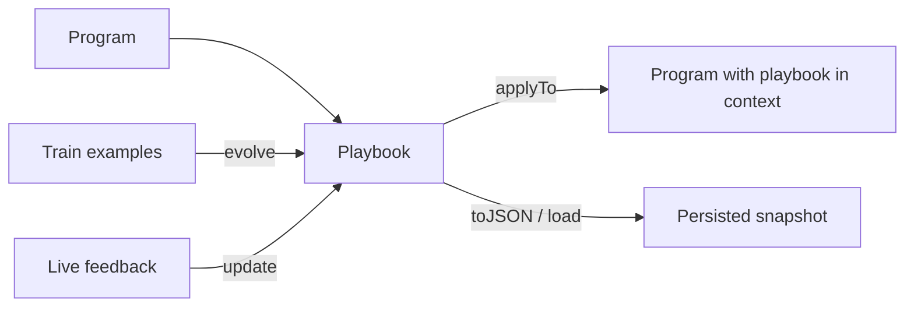

# Playbook

A playbook is an evolving body of task knowledge that Ax grows for you and renders into a program's context. Unlike `optimize(...)`, which tunes a program's instructions and demos once, a playbook keeps accumulating concrete, structured guidance — offline from labeled examples, and online from live feedback — then injects it into the prompt at run time.

> The evolution engine (the Agentic Context Engineering loop) is an implementation detail hidden behind `playbook(...)`, just as `optimize(...)` hides its optimizer — so it can be improved or swapped without changing your code. Playbooks are available across the Ax languages.

```{{fence}}
{{playbookCode}}
```

Reach for a playbook when the task has accumulated, reusable lessons — edge cases, policy rules, recurring pitfalls — that you would otherwise hand-write into the prompt and maintain by hand. Reach for [`{{optimizeName}}`]({{langRoot}}/concepts/optimization/) instead when you want to tune the instruction text and few-shot demos themselves.



## What A Playbook Is

A playbook is a structured set of bullets grouped into sections (guidelines, pitfalls, strategies). It carries its own statistics and history, is serializable, and is rendered into the program's description as a `## Context Playbook` block when applied.

- A program to attach it to.
- A `studentAI` model that runs the program; an optional `teacherAI` that reflects and curates.
- Training examples (for `evolve`) and/or live interactions (for `update`).
- A metric for offline `evolve`; no metric is needed for online `update`.

## Evolve Offline

`evolve(examples, metric)` runs the program over labeled examples, reflects on where it went wrong, and curates the playbook. It returns `{ bestScore, playbook }` and renders the result into the bound program.

## Update Online

`update({ example, prediction, feedback })` refines the playbook from a single live interaction — the part `optimize(...)` cannot do. Use it to let an agent or generator keep learning from production signals.

## Apply, Persist, Restore

`applyTo(program)` injects the current playbook into a program's context. `toJSON()` returns a portable snapshot; `playbook(otherProgram, opts).load(snapshot)` restores it into a fresh program (for example, evolve in a training job and load in production).

## Playbook vs optimize()

| Use | When |
| --- | --- |
| `playbook(...)` | Accumulate reusable task knowledge; keep improving from live feedback |
| [`{{optimizeName}}`]({{langRoot}}/concepts/optimization/) | Tune instruction text and few-shot demos offline to a best/Pareto result |

The two are complementary: tune instructions with `optimize(...)`, and grow situational guidance with `playbook(...)`.

## Agents

`agent.playbook({ target })` binds a playbook to an agent stage (the actor by default, or the responder). The evolved playbook is injected into the live stage prompt, so an agent can keep a strategy playbook current from real runs via `update(...)`. For tuning agent instructions and demos, use `agent.optimize(...)` ([Optimization]({{langRoot}}/concepts/optimization/)).

### Learn From Failures (TypeScript)

TypeScript agents can also attach a playbook at construction and let it learn from the agent's own failures — no examples, metric, or extra wiring:

```typescript
const support = agent('ticket:string -> reply:string', {
  ai: llm,
  functions: [crmTools],
  playbook: {
    playbook: savedSnapshot, // optional seed from a previous session
    onUpdate: ({ snapshot }) => save(snapshot), // persist new lessons
  },
});
```

After each completed run that produced failure signals — error turns, repeated dead-ends, failing tool calls — one bounded playbook update (a single reflection + curation call; zero on clean runs) curates durable avoidance rules, and the refreshed playbook rides the actor prompt on the next run. Signatures already curated are skipped deterministically, so repeated failures do not re-spend LLM calls. Read the live handle via `agent.getPlaybook()`; tune gating with `learn: { minSignals, dedupe }` or disable with `learn: false`. TS-first: the five generated language ports do not ship the construction-time `playbook` option yet.

Lineage: Reflexion (reflect on failures, retry better) and ExpeL (persist lessons across tasks) — see the [Research Map](/research/).

### Verified Evolve (TypeScript)

`agent.playbook().evolve(dataset, options)` grows the same playbook from a task set instead of live traffic. It runs the train tasks, clusters the failures deterministically, mines each cluster for a grounded weakness (evidence quotes must literally appear in the failing runs — fabricated diagnoses are dropped), and proposes one playbook bullet per weakness. With `verify` (default on) a bullet is kept only when the train score improves by `minHeldInGain` AND the held-out (`validation`) score does not drop by more than `epsilon` — otherwise it rolls back exactly. `verify: false` applies the mined lessons without the gate.

```typescript
const result = await support.playbook().evolve(
  { train, validation },
  { metric, runsPerTask: 2 },
);
// result.baseline / result.final hold-in & held-out, result.outcomes per bullet
```

Mining and judging need strong models. On small task sets set `runsPerTask: 2` or `3` so accept decisions compare averaged scores, not a single lucky run. Lineage: Self-Harness, STOP, and the Darwin Gödel Machine (keep only what provably improves) — see the [Research Map](/research/).

### One Playbook, Three Ways To Grow It

| Mode | Call | Trust or proof |
| --- | --- | --- |
| Continuous | the construction `playbook` option — automatic per-run failure harvest | trust |
| On-demand | `agent.playbook().update({ example, prediction, feedback })` | trust |
| Batch verified | `agent.playbook().evolve(dataset)` — grow from a task set, keep only what verifies | proof |

All three curate the one playbook the agent renders into its prompt; `agent.getPlaybook()` reads it, `getState()`/`load()` persist it. For tuning instructions and demos (not the playbook), use `agent.optimize(...)`.

See [Agents]({{langRoot}}/agents/) and [agent() API]({{langRoot}}/api/agent/).
