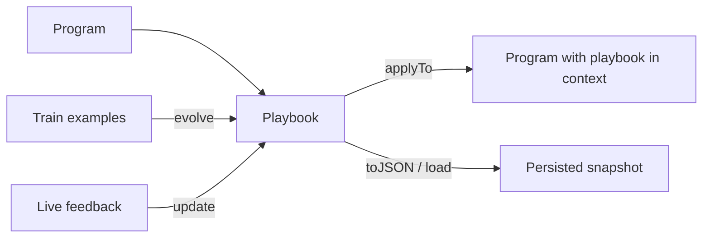

# Playbook

A playbook is an evolving body of task knowledge that Ax grows for you and renders into a program's context. Unlike `optimize(...)`, which tunes a program's instructions and demos once, a playbook keeps accumulating concrete, structured guidance — offline from labeled examples, and online from live feedback — then injects it into the prompt at run time.

> Playbooks are currently a TypeScript feature. The evolution engine (the Agentic Context Engineering loop) is an implementation detail hidden behind `playbook(...)`, just as `optimize(...)` hides its optimizer — so it can be improved or swapped without changing your code.

```{{fence}}
{{playbookCode}}
```

Reach for a playbook when the task has accumulated, reusable lessons — edge cases, policy rules, recurring pitfalls — that you would otherwise hand-write into the prompt and maintain by hand. Reach for [`{{optimizeName}}`]({{langRoot}}/concepts/optimization/) instead when you want to tune the instruction text and few-shot demos themselves.



## What A Playbook Is

A playbook is a structured set of bullets grouped into sections (guidelines, pitfalls, strategies). It carries its own statistics and history, is serializable, and is rendered into the program's description as a `## Context Playbook` block when applied.

- A program to attach it to.
- A `studentAI` model that runs the program; an optional `teacherAI` that reflects and curates.
- Training examples (for `evolve`) and/or live interactions (for `update`).
- A metric for offline `evolve`; no metric is needed for online `update`.

## Evolve Offline

`evolve(examples, metric)` runs the program over labeled examples, reflects on where it went wrong, and curates the playbook. It returns `{ bestScore, playbook }` and renders the result into the bound program.

## Update Online

`update({ example, prediction, feedback })` refines the playbook from a single live interaction — the part `optimize(...)` cannot do. Use it to let an agent or generator keep learning from production signals.

## Apply, Persist, Restore

`applyTo(program)` injects the current playbook into a program's context. `toJSON()` returns a portable snapshot; `playbook(otherProgram, opts).load(snapshot)` restores it into a fresh program (for example, evolve in a training job and load in production).

## Playbook vs optimize()

| Use | When |
| --- | --- |
| `playbook(...)` | Accumulate reusable task knowledge; keep improving from live feedback |
| [`{{optimizeName}}`]({{langRoot}}/concepts/optimization/) | Tune instruction text and few-shot demos offline to a best/Pareto result |

The two are complementary: tune instructions with `optimize(...)`, and grow situational guidance with `playbook(...)`.

## Agents

`agent.playbook({ target })` binds a playbook to an agent stage (the actor by default, or the responder). The evolved playbook is injected into the live stage prompt, so an agent can keep a strategy playbook current from real runs via `update(...)`. For tuning agent instructions and demos, use `agent.optimize(...)` ([Optimization]({{langRoot}}/concepts/optimization/)).

See [Agents]({{langRoot}}/concepts/agents/) and [agent() API]({{langRoot}}/api/agent/).
