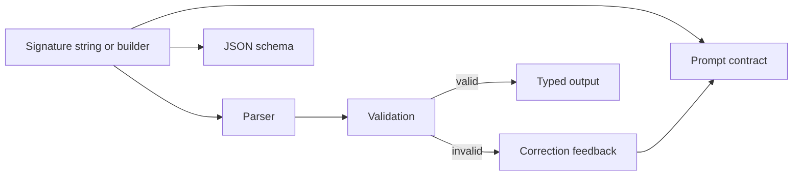

# Signatures

Signatures are the contract between your application and the model. They name the inputs, name the outputs, define field types, attach field descriptions, and give Ax enough structure to generate prompts, parse results, validate values, retry failures, expose tools, trace usage, and optimize examples.

```{{fence}}
{{signatureCode}}
```



## Grammar

The compact form is:

```text
inputField:type, optionalField?:type -> outputField:type, listField:type[]
```

Everything before `->` is input. Everything after `->` is output. Field descriptions can be attached as quoted text, and narrow `class` fields make enum-style output explicit.

Types accept an optional modifier bag in parentheses, and objects can declare
structured fields inline — the string form expresses everything the fluent
API can (except Standard Schema fields):

```text
userAge:number(min 0, max 120),
contactEmail:string(format email, cache),
codeSnippet:code(python)
->
userName:string(pattern "^[a-z_]+$" "lowercase name"),
tagList:string(item "a short tag")[] "all tags",
profileList:object{ fullName:string, userAge?:number(min 0) }[] "matched profiles"
```

Modifiers that don't apply to a type are hard errors — the string API is the
strict surface, whereas the fluent API silently ignores a `.min()` on a
boolean.

{{signatureStringExample}}

## Field Types

| Type | Example | Notes |
| --- | --- | --- |
| `string` | `question:string` | General text |
| `number` | `score:number` | Parsed numeric value |
| `boolean` | `approved:boolean` | True/false |
| `json` | `metadata:json` | Structured object |
| `date` / `datetime` | `dueDate:date` | Strict date-like values |
| `dateRange` / `datetimeRange` | `window:dateRange` | `{ start, end }` range values |
| `url` / `code` | `site:url`, `script:code` | Specialized strings |
| `class` | `priority:class "high, normal, low"` | Output class with known choices |
| `image` / `audio` / `file` | `photo:image` | Media fields where provider/language supports them |
| `type[]` | `tags:string[]` | Arrays |
| `object{ ... }` | `profile:object{ name:string, age?:number }` | Nested structured fields, recursively; also `object{ ... }[]` |
| `type(modifiers)` | `score:number(min 0, max 10)` | Constraint/metadata bag, see below |

Modifier bag entries (comma-separated, order-free):

| Modifier | Applies to | Effect |
| --- | --- | --- |
| `min N` / `max N` | `string`, `number` | Length constraints on strings, value bounds on numbers |
| `format email\|uri\|date\|date-time` | `string` | Format validation |
| `pattern "regex" ["description"]` | `string` | Regex validation with an optional human-readable description |
| `cache` | top-level inputs | Marks the field for provider context caching |
| `item "description"` | arrays | Per-item description, e.g. `tags:string(item "a short tag")[]` |
| `<language>` | `code` | Programming language, e.g. `snippet:code(python)` |

Good signatures use domain names: `customerEmail`, `policyQuestion`, `riskScore`. Avoid `input`, `data`, `output`, and other names that force the model to infer intent from prose.

## Fluent API

The fluent builder is the best option when a signature needs constraints, descriptions, cache hints, internal fields, or programmatic composition. In TypeScript this is the `f()` builder. Generated language packages expose the AxIR-supported signature surface available in that package.

{{signatureFluentExample}}

Chainable field modifiers are deliberately simple:

| Modifier | Use |
| --- | --- |
| `.optional()` / `?` | Field can be absent |
| `.array()` / `[]` | Field is a list |
| `.internal()` / `!` | Output scratch field, stripped from final output |
| `.cache()` | Stable input prefix suitable for provider caching |

## Validation And Retries

A signature is not just documentation. Ax validates parsed field values and can retry with correction feedback when the model returns malformed JSON, an invalid class value, a bad email, a reversed date range, or a value that violates schema constraints.

{{signatureValidationExample}}

Validation happens after parsing complete fields. For streaming generation, streaming assertions can fail fast at field boundaries and feed correction feedback into the next attempt.

{{standardSchemaSection}}

## Media, Cache, And Internal Fields

Media fields let a program receive images, audio, or files when the provider supports them. In agent flows, audio inputs are usually transcribed before planner/executor/responder stages; direct `ax(...)` programs can pass native media to compatible providers.

Cache hints mark stable context so provider prefix caching can reuse expensive prompt regions. Internal fields let a program ask the model to produce private scratch structure without exposing it in the final typed output.

## Reuse And Composition

Start with a string signature, then graduate to parsed or fluent signatures when you need reuse.

{{signatureHybridExample}}

## Production Notes

- Keep fields small and typed. Split unrelated jobs into separate signatures or a flow.
- Use `class` or schema validation for narrow domains instead of prose-only instructions.
- Put stable context in cacheable inputs rather than repeating it in every field description.
- Use internal outputs for model scratch fields that should not become API response data.
- Treat generated JSON schema as a public contract when tools, SDKs, or external callers rely on it.

See [Tools]({{langRoot}}/concepts/tools/), [s() signatures]({{langRoot}}/subsystems/s/), and [s() API]({{langRoot}}/api/s/).
