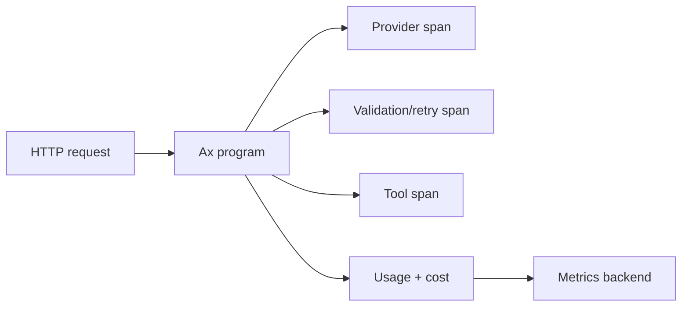

# Telemetry

Telemetry answers practical questions: what model was called, how long it took, how much it cost, what tools ran, where retries happened, and how optimization progressed.

{{telemetryExample}}

The TypeScript package has the richest OpenTelemetry surface. All generated packages also expose the portable global usage observer shown above, plus shared traces, optimizer artifacts, and provider result data from their AxIR contract.

## What To Track

- model calls and streaming events
- function/tool spans
- token usage and cost
- retries, failures, and provider routing choices
- optimizer rounds, Pareto candidates, and selected artifacts

## Tracing

Trace spans should answer where time went: provider calls, structured generation attempts, tool calls, agent actor turns, child-agent delegation, MCP calls, and optimizer rounds. Use trace labels to connect application routes, tenant IDs, model keys, and feature flags without burying that context inside prompts.

## Metrics

Metrics should answer whether production is healthy: request counts, latency histograms, error rates, token usage, estimated cost, validation failures, assertion retries, max-step exits, optimizer convergence, and Pareto front size.

## Usage And Cost

Usage is not just a provider response field. It becomes a program-level signal when a workflow retries, streams, calls tools, uses agents, or optimizes across examples. Track usage at the Ax layer so application owners see the full workflow cost instead of isolated model calls.

### Centralized usage observer

Install one process-wide observer at application startup, then attach `usageContext` to service defaults and individual calls. Per-call fields override service defaults; custom `attributes` are shallow-merged. This lets a large API attribute the same normalized stream by tenant, user, request, run, parent run, feature, and low-cardinality application labels without maintaining counters on every program or agent.

Each completed chat or embedding operation emits at most one isolated snapshot containing the provider, model, normalized token counts, attribution context, available local/provider correlation IDs, and whether the operation streamed. Calls with no provider token data emit nothing. A stream emits only after it is fully consumed.

The observer is deliberately best-effort and fail-open: an exception or rejected asynchronous callback never fails the model call, and Ax does not wait for observer delivery before returning. Keep the callback tiny—synchronously enqueue the event into your application’s durable queue, then aggregate it in a worker or telemetry backend. The observer is process-local, so multi-process or multi-service deployments should forward events to a shared store.

Usage events intentionally contain facts reported by the provider, not currency estimates. Compute cost downstream from the event’s model and token fields against a versioned pricing table. Do not put secrets or unnecessary personal data in usage context; prefer opaque IDs and bounded-cardinality attributes.

## Adaptive Routing Events

Adaptive balancers can publish `ranked`, `selected`, `fallback`, `observation`, and `store-error` events through the language-native routing-event hook. These events expose route keys, sanitized failure categories, cost, and deadline-risk scores without prompts, responses, or raw provider errors.

Treat the event hook as best-effort observability. Centralized routing decisions must use `AxBalancerStatsStore`; do not reconstruct authoritative state from telemetry delivery. Keep route namespaces and slices low-cardinality and avoid putting private user data in either value.

The cataloged [adaptive-balancer example]({{langRoot}}/examples/generation/) for this language shows a shared stats store and routing-event hook together.

## Debugging Patterns

Use debug logs for local development, traces for request-level investigation, and metrics for aggregate health. When an output is wrong, inspect the signature, examples, validation feedback, tool calls, and final parsed object before changing provider settings.

### Agent observability

{{agentContextPolicyExample}}

Trace context pressure, actor turns, tool calls, discovery, recall, loaded skills, final typed outputs, and token usage together. The useful debugging question is not only "what did the model say?" but "what state, tools, evidence, and constraints did the agent act on?"

## Production Notes

Keep telemetry opt-in and configurable. Route traces and metrics to your existing OpenTelemetry backend when possible. Avoid logging secrets, raw API keys, or private user data in labels and span names.

See [ai() LLM models]({{langRoot}}/subsystems/ai/) and [{{optimizeName}} GEPA]({{langRoot}}/subsystems/optimize/).
