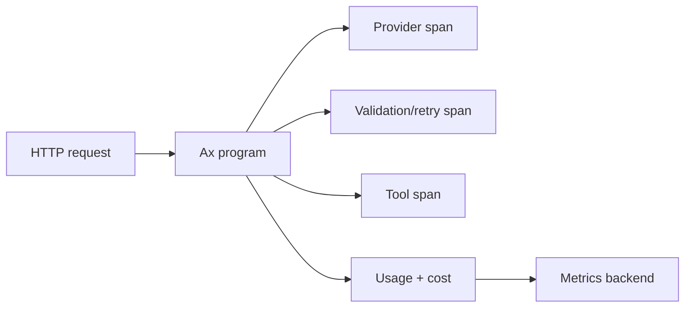

# Telemetry

Telemetry answers practical questions: what model was called, how long it took, what tools ran, where retries happened, and how optimization progressed. The portable runtime-hook surface is available in TypeScript, Python, Java, C++, Go, and Rust.

{{telemetryExample}}

The example registers a process-wide rate limiter, tracer, and meter, then overrides them for one agent and flow invocation. The override reaches the agent's internal generators and direct model calls, and every flow node, branch, loop, parallel group, and nested program. The existing focused usage-observer example remains the recommended accounting reference.

## Runtime Hooks

`AxRuntimeHooks` contains optional `rateLimiter`, `tracer`, and `meter` values. Register globals during application startup and clear them during test teardown or shutdown. A global snapshot is taken when an operation starts, so replacing a global affects later operations without changing a run already in progress.

Resolution is: forward or direct-call hooks, enclosing program defaults, child program defaults, AI-service hooks, then live globals. Hook objects stay in a native run-scoped frame: Ax never writes them into JSON program state, cache keys, exported runtime state, optimizer artifacts, or portable traces. Concurrent and re-entrant runs can therefore use different hooks without mutating shared child programs.

The limiter wraps chat and embedding provider execution, including streaming chat and the provider retry path. A balancer applies it independently to each selected service. It may delay, reject, skip, or invoke `next` more than once; any limiter error fails the model call. A resolved service binding prevents the same request from being wrapped twice.

Tracer, meter, and usage-observer failures are fail-open. Limiter failures are deliberately fail-closed. Spans are ended once on success or failure, and streaming spans end when the returned stream is consumed, fails, or is cancelled.

## What To Track

- model calls and streaming events
- function/tool spans
- token usage and cost
- retries, failures, and provider routing choices
- optimizer rounds, Pareto candidates, and selected artifacts

## Tracing

Trace spans should answer where time went: provider calls, structured generation attempts, tool calls, agent actor turns, child-agent delegation, MCP calls, and optimizer rounds. Use trace labels to connect application routes, tenant IDs, model keys, and feature flags without burying that context inside prompts.

Runtime-hook telemetry is metadata-only: it can include operation, provider, model, streaming state, program identity, timing, status, counts, and token usage, but excludes prompts, generated outputs, tool arguments, and tool results. Preserve the Flow → nested program → AxGen → provider/tool parent chain when adapting `AxTracer` to OpenTelemetry.

```mermaid
flowchart LR
  A[HTTP request] --> B[Ax program]
  B --> C[Provider span]
  B --> D[Validation/retry span]
  B --> E[Tool span]
  B --> F[Usage + cost]
  F --> G[Metrics backend]
```

## Metrics

Metrics should answer whether production is healthy: request counts, latency histograms, error rates, token usage, estimated cost, validation failures, assertion retries, max-step exits, optimizer convergence, and Pareto front size.

`AxMeter`, `AxCounter`, `AxHistogram`, and `AxGauge` are dependency-neutral interfaces shaped like OpenTelemetry instruments. A thin application adapter can delegate them to an OpenTelemetry meter. Ax caches instruments per meter identity and switches caches when the effective meter changes. These external instruments are separate from a balancer's local `getMetrics()` routing snapshot; neither is derived from the other.

## Usage And Cost

Usage is not just a provider response field. It becomes a program-level signal when a workflow retries, streams, calls tools, uses agents, or optimizes across examples. Track usage at the Ax layer so application owners see the full workflow cost instead of isolated model calls.

### Centralized usage observer

Install one process-wide observer at application startup, then attach `usageContext` to service defaults and individual calls. Per-call fields override service defaults; custom `attributes` are shallow-merged. This lets a large API attribute the same normalized stream by tenant, user, request, run, parent run, feature, and low-cardinality application labels without maintaining counters on every program or agent.

Each completed chat or embedding operation emits at most one isolated snapshot containing the provider, model, normalized token counts, attribution context, available local/provider correlation IDs, and whether the operation streamed. Calls with no provider token data emit nothing. A stream emits only after it is fully consumed.

The observer is deliberately best-effort and fail-open: an exception or rejected asynchronous callback never fails the model call, and Ax does not wait for observer delivery before returning. Keep the callback tiny—synchronously enqueue the event into your application’s durable queue, then aggregate it in a worker or telemetry backend. The observer is process-local, so multi-process or multi-service deployments should forward events to a shared store.

Usage events intentionally contain facts reported by the provider, not currency estimates. Compute cost downstream from the event’s model and token fields against a versioned pricing table. Do not put secrets or unnecessary personal data in usage context; prefer opaque IDs and bounded-cardinality attributes.

## Adaptive Routing Events

Adaptive balancers can publish `ranked`, `selected`, `fallback`, `observation`, and `store-error` events through the language-native routing-event hook. These events expose route keys, sanitized failure categories, cost, and deadline-risk scores without prompts, responses, or raw provider errors.

Treat the event hook as best-effort observability. Centralized routing decisions must use `AxBalancerStatsStore`; do not reconstruct authoritative state from telemetry delivery. Keep route namespaces and slices low-cardinality and avoid putting private user data in either value.

The cataloged [adaptive-balancer example]({{langRoot}}/examples/generation/) for this language shows a shared stats store and routing-event hook together.

## Debugging Patterns

Use debug logs for local development, traces for request-level investigation, and metrics for aggregate health. When an output is wrong, inspect the signature, examples, validation feedback, tool calls, and final parsed object before changing provider settings.

### Agent observability

{{agentContextPolicyExample}}

Trace context pressure, actor turns, tool calls, discovery, recall, loaded skills, final typed outputs, and token usage together. The useful debugging question is not only "what did the model say?" but "what state, tools, evidence, and constraints did the agent act on?"

## Production Notes

Keep telemetry opt-in and configurable. Route traces and metrics to your existing OpenTelemetry backend with a small implementation of the portable interfaces; generated packages do not require a native OpenTelemetry dependency. Avoid logging secrets, raw API keys, prompts, outputs, tool payloads, or private user data in labels and span names.

See [ai() LLM models]({{langRoot}}/subsystems/ai/) and [{{optimizeName}} GEPA]({{langRoot}}/subsystems/optimize/).
