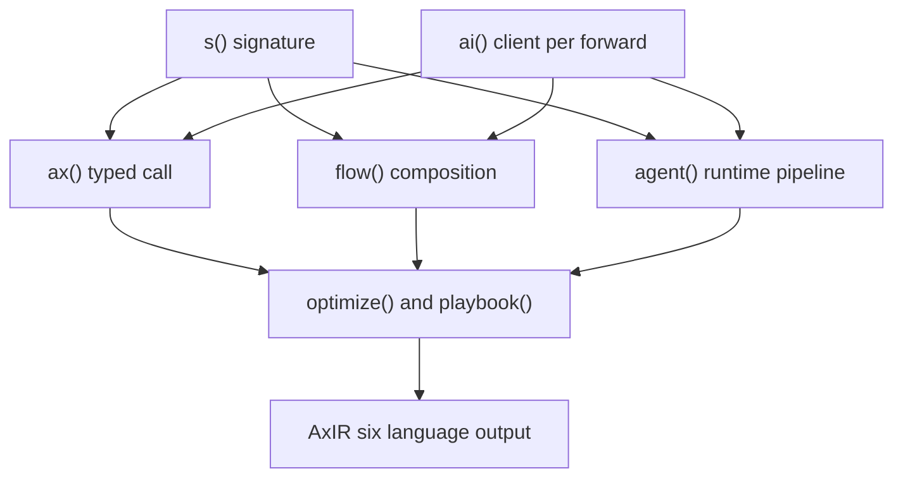
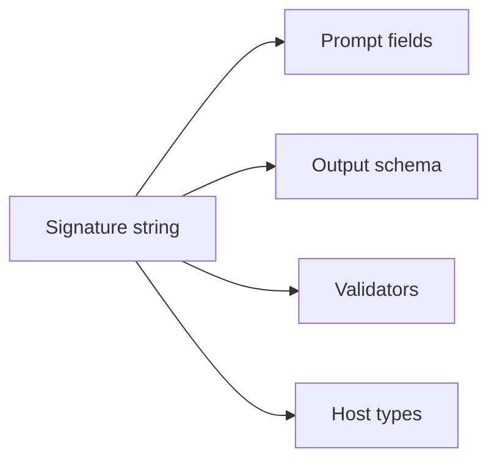
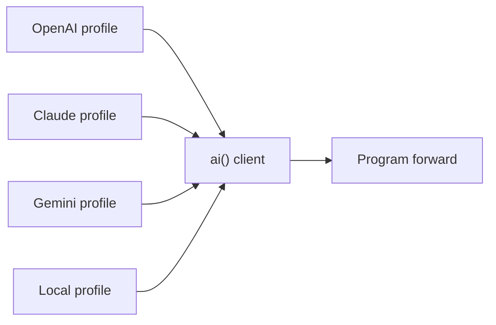
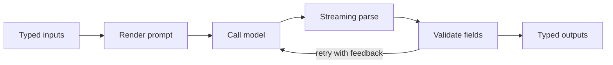
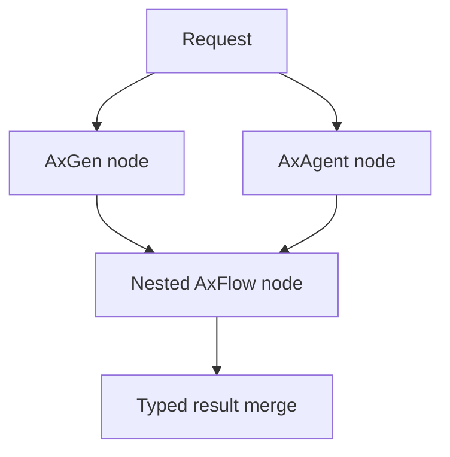
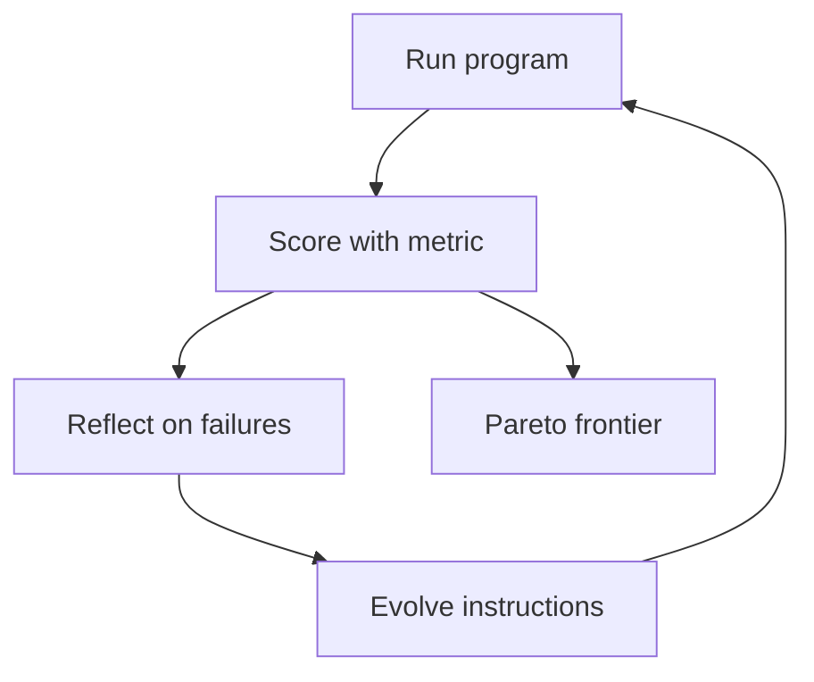
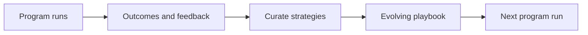
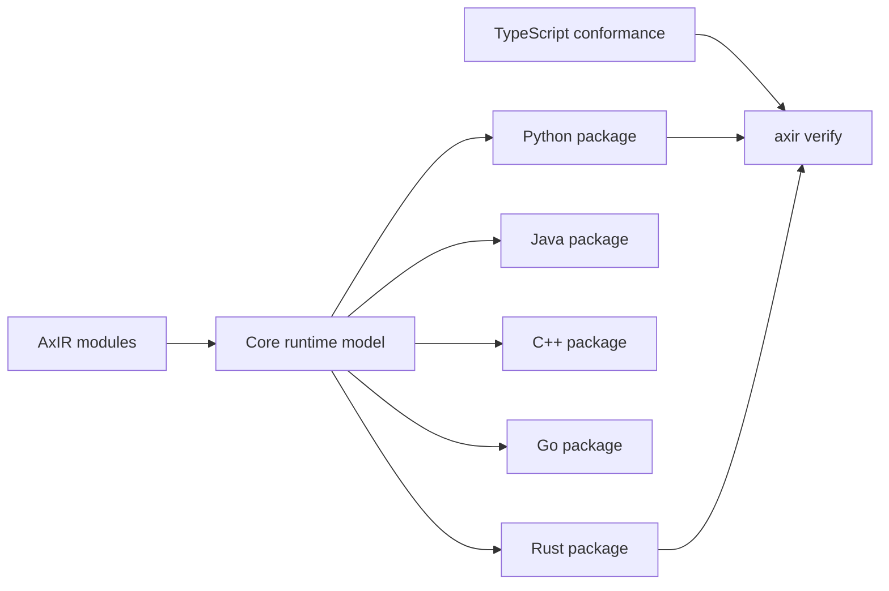

# How Ax Fits Together

Ax starts with one signature and lets you add only the machinery the job needs. A typed call can become a workflow, a workflow can include agents, and an agent can become a tool for another agent. The model client stays a forward argument, so the same program can use a different provider on another call—or a different provider at each agent stage. Optimizers and playbooks can wrap any of those programs, while AxIR carries the shared contract into every supported language.

## The Map

The stack is compositional rather than a set of competing APIs. Signatures define the boundary. `ai()` supplies a model when a program runs. `ax()`, `flow()`, and `agent()` are programs that can be nested and forwarded through the same interface. `{{optimizeName}}` and `playbook()` improve those programs without changing their public input and output contract.



Every layer shares one programming contract: typed inputs go in, typed outputs come back, and the caller chooses the model client at run time.

## s() — One Signature

A signature is the compact contract at the center of Ax. The same string is parsed at runtime and, in TypeScript, at the type level. Ax turns it into the prompt fields, output schema, validators, and host-language types used by the rest of the program.



Use [`s()`]({{langRoot}}/subsystems/s/) when you want to inspect, reuse, or build that contract directly.

## ai() — Any Model Behind One Client

`ai()` selects a provider, model, credentials, and deployment profile behind one client boundary. Programs do not have to own that choice: the client is supplied to `forward()`, which lets one program move between providers, routers, local models, and test clients without rewriting its signature.



See the [`ai()` subsystem]({{langRoot}}/subsystems/ai/) for models, profiles, routing, media, and usage.

## ax() — A Typed Call

`ax()` is the smallest executable Ax program. It renders a prompt from the signature, calls the supplied model, parses the response as it streams, validates every declared field, and returns typed output. If validation fails, Ax can retry with the exact error as model feedback.



Start with the [`ax()` subsystem]({{langRoot}}/subsystems/ax/) when one model call can do the job.

## flow() — Programs Composed Of Programs

`flow()` connects programs into an explicit graph. A node can run any AxProgrammable: an `ax()` generator, an `agent()`, or another nested flow. Inputs and outputs move through named state rather than a pile of ad hoc callbacks.

The flow grammar is text-complete, so `flow(mermaidString)` compiles a Mermaid diagram into a running program. The diagrams on this page use the same notation you can use to describe a flow.



See [`flow()` composition]({{langRoot}}/subsystems/flow/) for branches, parallel nodes, nested programs, and Mermaid compilation.

## agent() — Three Stages On A Runtime

`agent()` adds a runtime-backed loop for work that needs tools, large data, or multiple steps. A distiller narrows the task and evidence, an executor writes small code steps against a runtime session, and a responder turns the gathered evidence into the declared typed output.

Data lives in the runtime session: a web-worker JavaScript runtime in TypeScript, goja in Go, and QuickJS-backed profiles in the other native packages. The model receives compact descriptors and tool results instead of raw datasets.

```mermaid
flowchart LR
  distiller["Distiller AxGen"] --> executor["Executor AxGen"]
  executor --> runtime["Runtime session"]
  runtime --> executor
  executor -->|evidence descriptor only| responder["Responder AxGen"]
  distiller -->|respond() skip executor| responder
  responder --> output["Typed result"]
```

The reveal is literal: the agent pipeline is itself an AxFlow of three AxGens. Agents also expose `getFunction()`, so one agent can become a typed tool of another. Read [Agent Internals]({{langRoot}}/agents/internals/) for the full boundary.

## {{optimizeName}} — Improve With Evals

Optimization means running a program against examples, scoring the results with a metric, reflecting on failures, and evolving instructions or demonstrations. GEPA keeps a Pareto frontier instead of hiding quality, cost, latency, and brevity behind one score.



Because the optimizer accepts a programmable root, it can improve a generator, flow, or agent. See [Optimization]({{langRoot}}/concepts/optimization/).

## playbook() — Evolving Context

`playbook()` grows a curated set of strategies from program runs and feedback. Instead of replaying a raw history, it keeps verified, reusable guidance and injects the relevant part into later runs of any program.



Use [Playbooks]({{langRoot}}/concepts/playbook/) when the system should learn durable operating guidance from experience.

## AxIR — Compiled Six-Wide

TypeScript is the behavioral reference runtime. AxIR extracts and lowers the shared semantics into one core model, then emits native {{packageName}}-style APIs for Python, Java, C++, Go, and Rust. The result is not transpiled TypeScript: each package keeps native names, errors, builders, callbacks, transports, and runtime boundaries.



`axir verify` compiles targets, runs generated examples, checks capability manifests, and exercises conformance fixtures before a backend earns its place on the site.

## Where To Go Next

- [Run the Quick Start]({{langRoot}}/quick-start/)
- [Build an agent]({{langRoot}}/agents/)
- [Read the FAQ]({{langRoot}}/faq/)
- [Browse runnable examples]({{langRoot}}/examples/)
