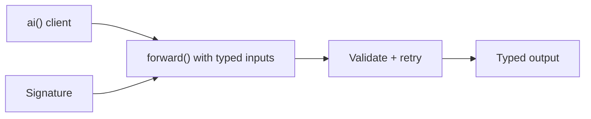

# Quick Start

Ax gives {{language}} one typed contract for LLM programs: signatures for data shape, `ai()` for model access, `ax()` for structured generation, `agent()` for tool-using runtime loops, and {{optimizeName}} for improving programs with examples.

## Install

```{{shellFence}}
{{install}}
```

## Set Your API Key

The first program uses OpenAI. Export the key in the same terminal where you will run it.

```{{shellFence}}
{{quickStartSetup}}
```

## First Program

Start with a small typed task. The signature declares the fields the model receives and the fields Ax must parse back out. Save this as `{{quickStartFile}}`.

```{{fence}}
{{quickStartCode}}
```

That is the core loop:

- create a provider client
- declare the input and output contract
- run the program with typed inputs
- read typed outputs instead of scraping prose



## Run It

```{{shellFence}}
{{quickStartRunCommand}}
```

You should see:

```text
{{quickStartOutput}}
```

The model's wording can vary, but the declared class shape is guaranteed.

The rest of the site keeps the same concepts but swaps install commands, imports, examples, and API names for {{language}}.

## Where To Go Next

Use [Examples]({{langRoot}}/examples/) when you want runnable files. Use [Concepts]({{langRoot}}/concepts/dspy/) when you want the mental model. Use [Subsystems]({{langRoot}}/subsystems/ax/) when you know which surface you are trying to use and want the practical call shape.

## What To Read Next

- [Examples]({{langRoot}}/examples/)
- [How Ax fits together]({{langRoot}}/how-ax-fits-together/)
- [FAQ]({{langRoot}}/faq/)
- [DSPy concepts]({{langRoot}}/concepts/dspy/)
- [ai() LLM models]({{langRoot}}/subsystems/ai/)
- [ax() generation]({{langRoot}}/subsystems/ax/)
- [{{optimizeName}} GEPA]({{langRoot}}/subsystems/optimize/)
