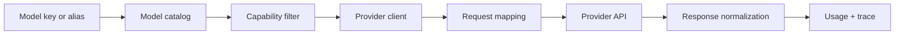

# ai() LLM Models

Use `ai()` to create provider clients and keep model traffic behind one Ax request shape.

```{{fence}}
{{llmCode}}
```

## What It Does

`ai()` selects a provider implementation from configuration and returns a client that Ax programs can call. The client handles chat, streaming, embeddings, media where supported, usage normalization, provider options, model keys, routing hooks, tracing, and runtime defaults.



## Core Call Shape

Create the client once near the application boundary, then pass it into `forward()`, `streamingForward()`, agents, flows, or optimizers.

```text
client = ai(provider options)
result = program.forward(client, inputs)
```

## Common Patterns

- Use a provider `name` and environment-backed API key.
- Set a default model in provider config when the app has one obvious model.
- Define model aliases when callers should choose `fast`, `smart`, or `cheap` instead of provider model IDs.
- Use OpenAI-compatible `apiURL` for compatible providers.
- Use model catalog helpers before runtime when the UI needs provider/model selectors.
- Use routers or balancers when provider fallback is part of the product.

### Provider clients

{{aiProviderExamples}}

### Embeddings and audio

{{aiEmbeddingsExample}}

{{aiAudioExample}}

## Practical Notes

- Prefer provider factories over direct provider classes in new code.
- Use model catalog and provider-scoring helpers when choosing between providers.
- Use routers/balancers when a workflow can fall back or split traffic.
- Keep public provider examples separate from internal conformance fixtures.
- Trace provider requests, token usage, estimated cost, and routing decisions in production.

See [ai() API]({{langRoot}}/api/ai/).
