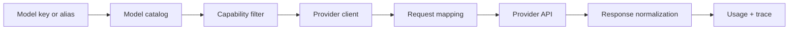

# ai() LLM Models

Use `ai()` to create provider clients and keep model traffic behind one Ax request shape.

```{{fence}}
{{llmCode}}
```

## What It Does

`ai()` selects a provider implementation from configuration and returns a client that Ax programs can call. The client handles chat, streaming, embeddings, media where supported, usage normalization, provider options, model keys, routing hooks, tracing, and runtime defaults.

The `name` is a deployment profile. The model ID is resolved only inside that
profile, so a DeepSeek model hosted by Together uses Together's rules and never
inherits DeepSeek's native wire format by name. Unknown profiles fail; use the
explicit `openai-compatible` profile plus `apiURL` for an unlisted endpoint.
Verified reasoning rules in DeepSeek, Together, Fireworks, OpenRouter, Grok,
Groq, Cerebras, and DeepInfra default an omitted thinking level to logical
`max`, then map it to each deployment's strongest documented effort. An
explicit `none` is sent only where the selected model and deployment support
disabling reasoning; otherwise Ax fails before network I/O. Hugging Face Router
stays conservative because a routing policy can change the underlying provider.
DeepSeek V4 preserves logical `medium` as provider `medium`; it is not promoted
to `high`.


```mermaid
flowchart LR
  A["Model key or alias"] --> B["Model catalog"]
  B --> C["Capability filter"]
  C --> D["Provider client"]
  D --> E["Request mapping"]
  E --> F["Provider API"]
  F --> G["Response normalization"]
  G --> H["Usage + trace"]
```

## Core Call Shape

Create the client once near the application boundary, then pass it into `forward()`, `streamingForward()`, agents, flows, or optimizers.

```text
client = ai(provider options)
result = program.forward(client, inputs)
```

## Common Patterns

- Use a provider `name` and environment-backed API key.
- Set a default model in provider config when the app has one obvious model.
- Define model aliases when callers should choose `fast`, `smart`, or `cheap` instead of provider model IDs.
- Use the named profile for a documented deployment. Reserve
  `openai-compatible` plus `apiURL` for an unlisted custom endpoint.
- Use model catalog helpers before runtime when the UI needs provider/model selectors.
- Use routers or balancers when provider fallback is part of the product.

`ProviderRouter` selects a provider by request capability and degrades media only
when the selected provider cannot handle it. For an image-capable provider,
native image parts retain their payload, MIME type, detail level, cache and
optimization hints, alt text, and ordering with surrounding text.

Provider/model capability metadata exposes an ordered `native`, `function`, and
`json_object` list. `auto` follows that order, while the singleton string/code
optimization can choose validated `json_object` when native schema is absent.
An explicit unsupported mode fails before transport. `structuredOutputs`
remains the compatibility alias for native JSON Schema support, not for every
JSON response format. The selected rung is recorded with the chat log so runs
remain comparable and debuggable.

### Renewable credentials

Use the language's `credentialProvider` / `credential_provider` callback for
expiring deployment tokens. It receives the profile, operation, method, and URL
for every request attempt. Returned headers override static authentication;
callback failures stop before transport. Ax refreshes on retries but does not
automatically replay a completed 401 or 403. Keep ADC or cloud-SDK token sources
in the host application rather than Ax core.

### Vertex routing and OpenAI prompt caching

Gemini and Anthropic Vertex clients accept a project, location, and optional
endpoint. Ax resolves global, US/EU multi-region, and regional hosts; an
explicit base URL takes precedence. Generated packages accept a renewable
credential callback, leaving ADC acquisition and refresh to the host
application.

The OpenAI-compatible `vertex-ai` profile keeps unknown models conservative.
Documented Gemini MaaS IDs prefer native schema. The exact
`google/gemma-4-26b-a4b-it-maas` rule prefers JSON-object output, excludes native
schema, defaults thinking to `max`, writes nested `enable_thinking`, and
extracts/replays `reasoning_content`.

GPT-5.6 OpenAI Chat requests can opt into stable explicit prompt-cache
breakpoints. Give AxGen a stable `promptCacheKey` plus `contextCache`; those
forward options reach the provider in every language. Cache reads and writes
are normalized separately for usage and catalog-backed cost estimates.

### Gemini inference service tiers

Gemini GenerateContent supports `standard`, `flex`, and `priority` service
tiers in every language package. Configure the tier in the Gemini provider
options; the normalized model usage reports the tier that actually handled the
request. An `unspecified` provider response becomes `standard`. Ax rejects a
configured tier for Vertex AI and Gemini Live before transport. The Generation
example catalog contains a provider-backed Gemini Flex example with exact
language-native setup and response syntax.

{{aiServiceTierExample}}

### Adaptive balancing

`AxBalancer` keeps its existing ordered failover behavior by default. Set `strategy.type` to `adaptive` to rank equivalent providers per chat request using learned reliability, successful latency, a deadline, and estimated cost. Configure `badOutcomeCost` in the same currency or unit as the route cost estimate.

{{aiBalancerExample}}

Use the native stats-store option for authoritative decision state. The built-in in-memory store can be shared by balancers in one process; multi-process applications can implement `AxBalancerStatsStore` with an atomic Redis or database update. The routing-event hook is best-effort telemetry, not routing state. Stable route keys are required with a shared store, and `namespace` plus `slice` keep unrelated traffic from learning from each other.

Adaptive balancing does not inspect prompt meaning or decide which model is best for a task. The application defines acceptable substitutes through shared logical aliases.

### Provider clients

{{aiProviderExamples}}

### Deployment profile matrix

This matrix is generated from `ir/axcore/data/provider-profiles.json`. Defaults
are conservative; exact or pattern rules apply only inside the selected profile,
and callers can supply explicit model metadata for a deployment they have
verified.

{{aiProfileMatrix}}

### Major-version migration

Profile-only branded clients were removed. Keep genuine transport clients when
you need a low-level transport boundary; otherwise replace a branded constructor
with the language's named factory (`NewAI("deepseek", options)` in Go,
`ai("deepseek", ...)` where that factory shape is exposed, and
`ai({ name: 'deepseek', ... })` in TypeScript). Model enum/catalog exports remain
available.

### Embeddings and audio

{{aiEmbeddingsExample}}

{{aiAudioExample}}

## Practical Notes

- Prefer the named deployment-profile factory over direct provider classes in new code.
- Use model catalog and provider-scoring helpers when choosing between providers.
- Use a multi-service router to dispatch caller-selected model keys; use a balancer for fallback or adaptive operational routing across equivalent services.
- Keep public provider examples separate from internal conformance fixtures.
- Trace provider requests, token usage, estimated cost, and routing decisions in production.

See [ai() API]({{langRoot}}/api/ai/).
