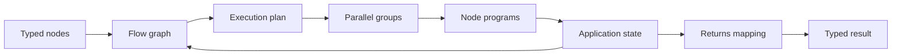

# flow() Workflows

Use `flow()` to compose typed programs into a multi-step workflow the application owns: explicit nodes, explicit state, deterministic branching, loops, and parallel execution.

```{{fence}}
{{flowCode}}
```

Each node is a typed program built from a signature. The flow graph — not the model — decides what runs next, and independent steps run in parallel automatically when their state reads and writes do not conflict.

## What It Does

`flow()` builds a workflow from typed nodes and mappings. Node results land in application-owned state, an execution planner groups independent steps for parallel execution, and the final mapping selects the public result.



## Core Call Shape

```text
wf = flow(options)
  .node(name, signature)
  .execute(name, stateToInputs)
  .returns(stateToOutput)
result = wf.forward(aiClient, inputs)
```

## Common Patterns

- Give every node a typed contract; auto-wiring and parallelism both come from field names and declared reads/writes.
- Use `class` decision outputs to branch; downstream nodes consume the decision as a plain `string`.
- Keep loops capped: feedback edges and while loops both take an explicit max.
- Expose a finished workflow as a tool with `toFunction()`, and tune the whole flow with the shared optimizer surface.

### Rich node contracts

Node signatures accept the full string grammar — constraint bags, class decisions, optional fields, and nested objects:

```text
triage: ticketText:string -> ticketClass:class "bug, billing, question", severityScore:number(min 1, max 5)
draft: ticketText:string, ticketClass:string, severityScore:number -> replyText:string(max 400)
audit: replyText:string -> approved:boolean, flaggedSpans:object{ spanText:string, reasonNote:string }[]
```

## Mermaid Source

A whole flow can be written as — or exported to — a mermaid flowchart. Node contracts travel in `%%ax` comment directives (any mermaid renderer ignores them), data auto-wires by field name to the nearest upstream producer, labeled edges out of a decision diamond become branches, and a back-edge is a capped loop.

Decision branch — a class diamond routes to per-branch responders, then re-joins:

```text
flowchart TD
  %%ax classify: requestText:string -> routeClass:class "support, sales"
  %%ax supportReply: requestText:string -> replyText:string(max 300)
  %%ax salesReply: requestText:string -> replyText:string(max 300)
  %%ax send: replyText:string -> deliveredReply:string

  classify{routeClass}
  classify -->|support| supportReply
  classify -->|sales| salesReply
  supportReply --> send
  salesReply --> send
```

Fan-out / fan-in — two perspectives run in parallel, then a judge joins them:

```text
flowchart TD
  %%ax outline: topicText:string -> questionText:string
  %%ax proponent: questionText:string -> proArgument:string
  %%ax skeptic: questionText:string -> conArgument:string
  %%ax judge: proArgument:string, conArgument:string -> verdictSummary:string

  outline --> proponent & skeptic
  proponent & skeptic --> judge
```

Ticket triage, end to end — classify, draft, review with a capped revise loop, then send:

```text
flowchart TD
  %%ax triage: ticketText:string -> ticketClass:class "bug, billing, question", severityScore:number(min 1, max 5)
  %%ax draft: ticketText:string, ticketClass:string, severityScore:number -> replyText:string(max 400)
  %%ax review: replyText:string -> verdict:class "approve, revise", reviewNote?:string
  %%ax finalize: replyText:string, reviewNote?:string -> finalMessage:string

  triage[Triage ticket] --> draft --> review{verdict}
  review -->|approve| finalize
  review -->|revise, max 2| draft
```

In TypeScript, passing the diagram to `flow()` compiles it into a runnable flow, and `String(wf)` renders any flow back to the same dialect — so `flow(String(wf))` round-trips. `flow.fromMermaid()` is the explicit alias, and `toMermaid({ direction: 'LR' })` gives render options. Because the signature grammar is text-complete, the diagram is the entire program — writable by hand, by an LLM, or exported from a design doc.

## Production Notes

Keep node contracts small and name fields by domain — auto-wiring and the execution plan both key off field names. Cap every loop. Trace flows like any program: node order, mappings, model calls, and tool activity all land in the shared telemetry surface. For work the model should plan itself, use `agent()`; keep `flow()` for orchestration the application must own.

See [flow() API]({{langRoot}}/api/flow/), [s() Signatures]({{langRoot}}/subsystems/s/), and [Optimization]({{langRoot}}/concepts/optimization/).
