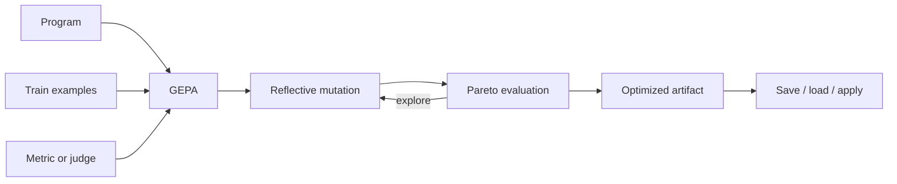

# {{optimizeName}} GEPA

{{optimizeIntro}}

```{{fence}}
{{optimizeCode}}
```

The optimizer runs a program against examples, scores predictions, searches for better instructions/demos/component settings, and returns an artifact that can be applied immediately or serialized.

## What It Does

GEPA explores changes and keeps tradeoffs visible through Pareto-aware results. The TypeScript helper also runs bootstrap demos for small starter sets before GEPA, which gives the optimizer concrete examples to work with.



## Core Call Shape

```text
result = optimize(program, examples, metric, options)
program.applyOptimization(result.optimizedProgram)
```

Generated language packages expose the optimizer surface available in their AxIR API, usually as an `AxGEPA` engine.

## Common Patterns

- Start with deterministic eval fixtures for the metric.
- Keep `maxMetricCalls` explicit.
- Use scalar metrics for one clear objective.
- Use multi-objective metrics for tradeoffs such as accuracy/cost or quality/brevity.
- Keep validation examples separate when the optimizer surface supports them.
- Save artifacts with enough metadata to explain the examples and metric that produced them.

### AxGen

{{optimizeAxGenExample}}

### Flow

{{optimizeFlowExample}}

### Agent

{{optimizeAgentExample}}

### Artifact

{{optimizeArtifactExample}}

## Production Notes

Optimization is a build-time or evaluation-time workflow, not something to hide in every request path. Track score history, cost, token usage, selected Pareto point, and the final artifact version.

See [optimize() API]({{langRoot}}/api/optimize/).
