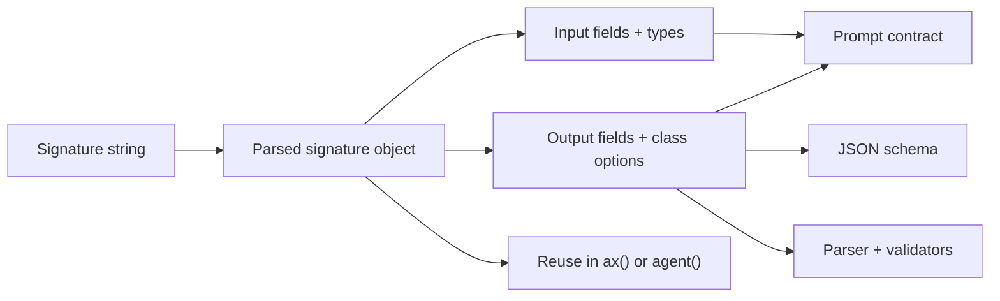

# s() Signatures

Use `s()` when you want a parsed signature object. Use the string form directly in `ax()` or `agent()` when you do not need to inspect or compose the signature.

```{{fence}}
{{signatureCode}}
```

Signatures are the contract shared by generation, tools, examples, validation, and optimizer traces.

## What It Does

`s()` parses the Ax signature grammar into a signature object. That object can be reused, inspected, extended, passed into `ax()`, passed into `agent()`, or combined with fluent/schema fields where the language surface supports it.



## Core Call Shape

```text
signature = s("input:type -> output:type")
program = ax(signature)
```

## Common Patterns

- Keep string signatures for simple contracts.
- Use parsed signatures when several programs share the same input/output shape.
- Use fluent/schema builders when Standard Schema (zod/valibot) fields matter; everything else — constraints, nested objects, caching — is expressible in the string form.
- Use `class` fields for bounded labels instead of vague prose instructions.
- Use optional fields only when missing data is truly acceptable.
- Use internal outputs for model scratch structure that should not reach callers.

Constraints and nested objects fit in the string form directly:

```text
s('userAge:number(min 0, max 120), contextText:string(cache) -> profileList:object{ fullName:string, userAge?:number }[] "matched profiles"')
```

More contracts in the same grammar — moderation, extraction, retrieval:

```text
postText:string -> moderationVerdict:class "allow, review, block", flaggedSpans:object{ spanText:string, reasonNote:string }[]
invoiceText:string -> invoiceNumber:string(pattern "^INV-\\d+$" "INV- then digits"), totalAmount:number(min 0), lineItems:object{ description:string, quantity:number(min 1), unitPrice:number }[]
corpusText:string(cache), userQuestion:string -> answerText:string, citedChunks:string(item "verbatim quote")[]
```

The string API is strict: a modifier that does not apply to its type (say `min` on a boolean) is a parse error, where the fluent API would silently ignore it. `AxSignature.toString()` renders every construct back to this grammar losslessly, which is what lets flows serialize their node contracts into mermaid `%%ax` directives.

### Flows as mermaid diagrams

Because every signature renders back losslessly, a whole flow can be written as — or exported to — a mermaid flowchart, with each node's contract in a `%%ax` directive:

```text
flowchart TD
  %%ax classify: ticketText:string -> ticketClass:class "bug, billing"
  %%ax reply: ticketText:string, ticketClass:string -> replyText:string
  classify --> reply
```

In TypeScript, `flow(diagram)` compiles that string into a runnable flow and `String(flow)` renders any flow back, so `flow(String(flow))` round-trips. `flow.fromMermaid()` is the explicit alias, and `toMermaid({ direction: 'LR' })` gives render options.

### Parsed string

{{signatureStringExample}}

### Fluent or native schema surface

{{signatureFluentExample}}

### Validation constraints

{{signatureValidationExample}}

## Production Notes

Treat signatures as API contracts. Renaming fields changes examples, traces, optimizer artifacts, and caller code. Prefer descriptive field names and validation over long prompt instructions.

See [s() API]({{langRoot}}/api/s/).
